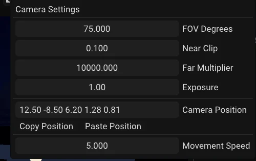
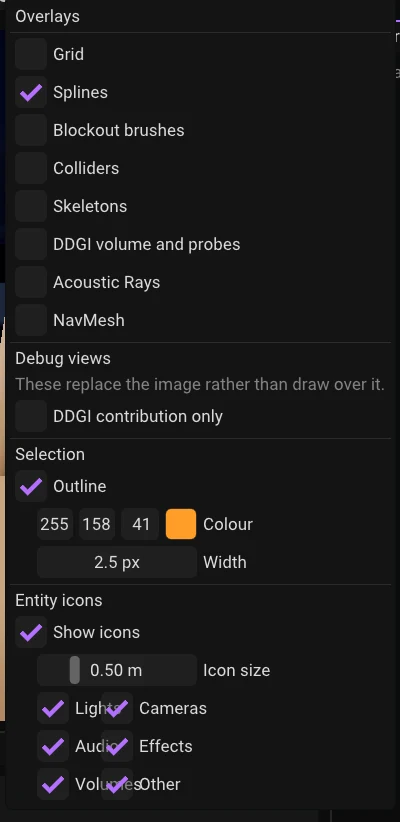

## The editor camera

The camera is a free-flying one. It only responds while the pointer is over the viewport.

| Input | Action |
|---|---|
| Right-drag | Look around (orbit) |
| Middle-drag | Pan |
| Scroll wheel | Adjust fly speed (clamped to 0.5 – 50) |
| `W` / `S` | Fly forward / back |
| `A` / `D` | Fly left / right |
| `E` / `Q` | Fly up / down |
| `F` | Frame the current selection |

The left mouse button is deliberately left free for selection — that is why the camera
lives on right and middle.

The camera's position, pitch and yaw are also shown read-only in the **Diagnostics**
panel's *Editor state* section. A **Camera** button in the viewport toolbar opens the
camera's own settings — lens, exposure and movement speed — in a popup.

The viewport **Camera** popup also exposes **Exposure**. It is a display-exposure control
for the editor camera: increase it to lift a dark HDR scene, or lower it to preserve bright
highlights. It affects editor view only; Play mode uses the exposure on the active scene
camera.

*The Camera popup: lens, Exposure, the camera's position (with Copy Position and Paste Position) and Movement Speed.*

## Selecting

| Gesture | Result |
|---|---|
| Left-click an object | Select it |
| Left-click the same point again | Cycle to the next thing under the cursor |
| `Shift`- or `Ctrl`-click | Add to the selection |
| Left-drag on empty space | Marquee: select everything inside the rectangle |
| `Shift`/`Ctrl` + marquee | Add the rectangle's contents to the selection |
| `Ctrl+A` | Select all |
| `Esc` | Clear the selection |

**Repeated clicks walk an ordered candidate list.** Clicking a part of a placed object
selects the object as a whole first, then the individual part that was hit, then whatever is
behind it. Drilling into an object and cycling past it are the same gesture — you just keep
clicking.

There are two things in a selection: the **primary** (what the Properties panel shows and
what the gizmo pivots on) and the whole set. Everything moves together; the primary is the
one the gizmo is attached to.

A short left-drag that does not travel far enough to become a marquee is treated as a
click, not a gesture — a few pixels of slip on a trackpad will not lose your selection.

**Picking reads the mesh geometry the renderer has already parsed.** A mesh that has never
been drawn cannot be picked. In practice this only matters for things hidden off-screen from
the moment the scene loaded.

A script picks the same way, through `scene.pick` and `scene.screen_ray`, which is what a
click-driven game uses to find what is under the pointer. See
[Picking](../06-scripting/02-lua/api/scene/03-picking.md).

**A hidden or locked entity cannot be picked at all**, whether by its mesh or by its icon
(see *Entity icons* below). The Scene Hierarchy panel's eye and lock icons toggle both, per
entity; a hidden entity also stops rendering, while a locked one still renders but refuses
every click. Neither state is saved with the scene or goes through undo — it is a per-session
focus aid, not scene data. `H` hides the current selection and `Alt+H` clears every hidden
entity at once; see [Keyboard Reference](05-keyboard-reference.md) for the rest of the
shortcuts.

## Entity icons

Anything with no mesh of its own to click gets a small icon in the viewport, drawn from the
editor's icon set: each light kind (directional, point, spot, ambient), cameras and scene
captures, audio sources and listeners, particle emitters, fog, the sky and HDRI, reflection
captures, DDGI volumes, renderer settings, navmesh volumes and nav links. A point light's
icon takes the light's own colour. A collider, trigger, rigid body, constraint, character
controller, nav agent, AI controller, spline, script or plugin component gets one too, but only
when there is no mesh on the same entity to click instead, and a bare entity with no children
(the usual stand-in for a marker or spawn point) shows the empty-entity icon. An entity with
several of these shows one icon, the most telling: a lamp with a mesh and a script shows its
light. UI components, Blockout brushes and models, and components that only decorate
something visible (material, animator, ragdoll) have no icon.

Icons have a size in the world, half a metre by default, so they get smaller as the camera
moves away like any object, but never below a readable size or above one that would cover the
view up close, and both limits follow the UI scale. Far away they fade out. A nearer icon is
drawn over a farther one, and a click on an overlap picks the nearer. The icon you click is
the square you see: any part of it selects the entity, through the same picking path a mesh
click uses, and it wins over a mesh behind it. Selected icons are tinted with the selection
outline colour and ringed, the one under the cursor lights up and shows the entity's name, and
an icon whose component is switched off (a light with no intensity, a paused particle emitter,
a disabled DDGI volume, a muted audio source) is drawn dimmed.

Like the selection outline, icons draw over the rendered image rather than being depth tested:
a lamp inside a ceiling or a probe inside a room is exactly what you need to find through the
wall. Icons only appear while editing, not in Play mode.

The **Overlays** popup has an **Entity icons** section: **Show icons**, an **Icon size** slider
(0.1 to 2 m), and a switch per kind: Lights, Cameras, Audio, Effects, Volumes and Other. They are
saved per user, like the outline. **Overlays > Entity Icons** in the command palette flips the
whole set. An agent can hide them for a clean shot without touching the saved setting (the
`set_overlays` tool's `entity_icons`).

## The gizmo

The transform gizmo appears on the primary selection.

| Key | Toolbar | Mode |
|---|---|---|
| `T` | **T** | Translate |
| `R` | **R** | Rotate |
| `Y` | **S** | Scale |
| `G` | — | No gizmo |

(The gizmo uses `T`/`R`/`Y` rather than the more usual `W`/`E`/`R` because `W` and `A`/`S`/`D`
are the camera.)

*The viewport toolbar. Play and Stop come first; the buttons after them set the gizmo mode and frame, snapping, and open the Camera and Overlays popups.*

**Local / World** switches the gizmo's frame. The gizmo always *manipulates* in world space,
so dragging a child moves it where the mouse says rather than in its parent's rotated frame;
what gets stored is still a local transform, rebased against the parent.

**Alt-drag the gizmo to duplicate.** The original stays where it is and a copy comes away
under the cursor. This is two undo steps — the duplicate, then the move — both labelled.

With several things selected, the gizmo drags the primary and everything else moves by the
same world-space delta, so the arrangement is preserved. An entity whose parent is also
selected is skipped, so it does not move twice.

### Snapping

The **Snap: on/off** toolbar button opens a popup with the step sizes — translation,
rotation and scale each get their own, and only the one matching the current gizmo mode is
used. The button label tells you the current state at a glance.

## Overlays

The **Overlays** button in the viewport toolbar — its label carries a live count, so an
overlay left on is not a silent surprise — opens a popup with:

- **Grid** — the ground-plane grid.
- **Colliders** — wireframe physics shapes. While playing these are Jolt's own live
  shapes, including any clamping the shape builder applied to a degenerate size; stopped,
  it previews the authored components instead. Green awake, amber asleep, blue authored,
  pink selected.
- **DDGI volume and probes** — draws every active DDGI volume in cyan and its probes as
  crosses coloured by irradiance (red = not warmed up yet). See
  [Lighting & Shadows](../03-rendering/02-lighting.md).
- **Debug views**, which *replace* the image rather than draw over it — currently just
  **DDGI contribution only**, which shows nothing but the diffuse light coming from the
  active DDGI volume.
- **Entity icons** — the icons described above: on or off, their size, and which kinds show.
- **Selection → Outline** — the ring around selected objects, with adjustable colour and
  width. It draws through occluders on purpose, so you can see a selection behind a wall;
  turn it off when you are lining up a shot. The setting is stored per user and survives a
  restart.

*The Overlays popup: the overlay switches, a debug view, the selection outline and the entity icons.*

## Dropping assets

Drag a model, texture or `.Lobj` from the Asset Browser into the viewport. It lands where
the cursor points, projected onto the ground plane. Objects cannot be dropped while play
mode is running — the copy being simulated is about to be discarded, so the drop would
appear to fail.

## The play controls

Leftmost in the toolbar, so they read as the mode switch for everything to their right:
**Play / Pause**, **Stop**, and a status word. See [Play Mode](04-play-mode.md).

While an object is open for editing, the toolbar shows an **OBJECT** badge plus **Save
Object** and **Close Object**, and Play is unavailable — see [Objects](../02-building-worlds/03-objects.md).
