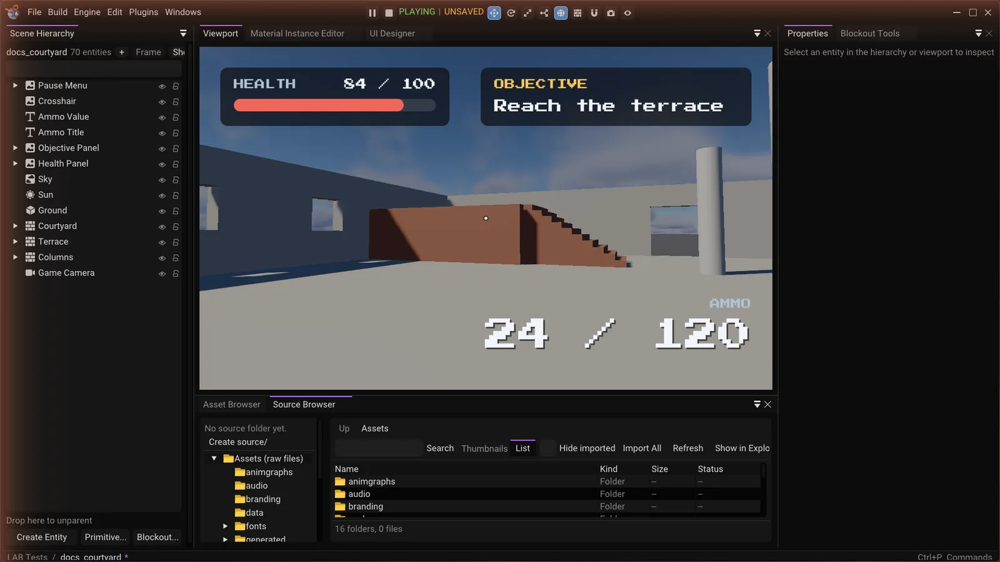

Play mode runs your scene: scripts execute, physics simulates, and the view switches to the
game camera.

*Playing inside the editor. The toolbar shows PLAYING, and the viewport switches to the game camera and HUD.*

## The controls

They are leftmost in the viewport toolbar, so they read as the mode switch for everything to
their right.

| Button | Does |
|---|---|
| **Play** | Start simulating |
| **Pause** | Freeze the simulation but keep viewing through the game camera |
| **Stop** | End the simulation and restore the authored scene |

A status word next to them reads **PLAYING** or **PAUSED**.

## Nothing you do while playing is kept

Play mode simulates a **copy** of your scene. Move something while playing, let physics
scatter it, have a script destroy half of it — pressing Stop restores exactly what you
authored.

This is why some editor operations are disabled while playing:

- **Undo and redo** — they would edit something about to be thrown away.
- **Copy, paste, duplicate, delete** — same reason.
- **Dropping objects into the viewport** — the drop would vanish on Stop, which reads as it
  having failed.

If you built something during play that you want to keep, you cannot — build it in edit mode
instead.

## The game camera

Play mode renders through the entity whose **Camera** component has **Primary** ticked. Its
aspect ratio comes from the viewport.

A scene with no primary camera has nothing to render through. Add a Camera component to an
entity and tick Primary.

The editor camera is untouched: pressing Stop puts you back exactly where you were flying.

## What starts on Play

| | |
|---|---|
| **Scripts** | `on_create` runs on every script, then `on_update` each frame |
| **Physics** | The Jolt world is built from every entity with both a Rigid Body and a Collider |
| **Input** | Scripts start reading the keyboard, mouse and gamepad |

The log reports how the script pass went — for example `Scripts started: 2 running, 0
failed` — plus anything the scripts themselves print. A script that fails to load says so
by name.

[Lua Scripting](../06-scripting/02-lua/index.md) is the script API, and
[C++ Scripting](../06-scripting/03-cpp/index.md) is the compiled form of the same thing.
Two things are worth knowing here. An entity a script spawns while playing belongs to the
play-mode copy, so it is gone when you stop. And an entity marked `Persistent` is a
different idea: that one is about surviving a *scene change* during play, not a Play/Stop
(see [Streaming](../06-scripting/02-lua/api/scene/02-streaming.md)).

Physics bodies appear in the **Performance** panel's *Physics bodies* count, which is
non-zero only while playing. **Colliders** in the viewport's **Overlays** popup draws them.

## Pausing

Pause freezes the simulation without leaving play mode. You keep looking through the game
camera, and pressing Play again resumes from where it stopped. Useful for catching a physics
state mid-flight, or for reading the Performance panel without the numbers moving.

## Play mode versus the standalone runtime

Play mode is the fast iteration loop. It is not quite the shipping experience:

| | Play mode | Standalone runtime |
|---|---|---|
| Window | Inside the editor's viewport | Its own window, configured in Project Settings |
| Starts | Whatever scene is open | The project's start scene |
| Editor UI | Present | Absent |

For anything that depends on the window, on startup ordering, or on the project's start
scene, build a standalone and run that. See [Projects & Builds](../07-projects-and-tools/01-projects-and-builds.md).

## Test scene

`Dev/Tests/assets/scenes/playmode_test.Lscene` has a primary camera set up. Pressing Play must switch the
viewport to it; moving something while playing and pressing Stop must leave the authored
scene untouched.

Navigation runs in here too. A behaviour tree is evaluated at the top of each frame's update,
ahead of the scripts, so an AI Controller's first tick happens before that frame's `on_update`
has run. See [Navigation and AI](../04-gameplay/03-navigation-and-ai.md).
