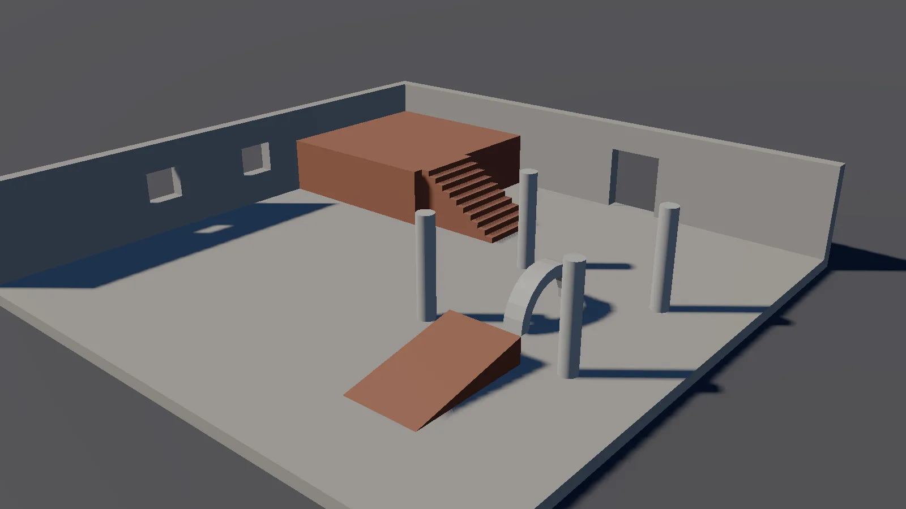
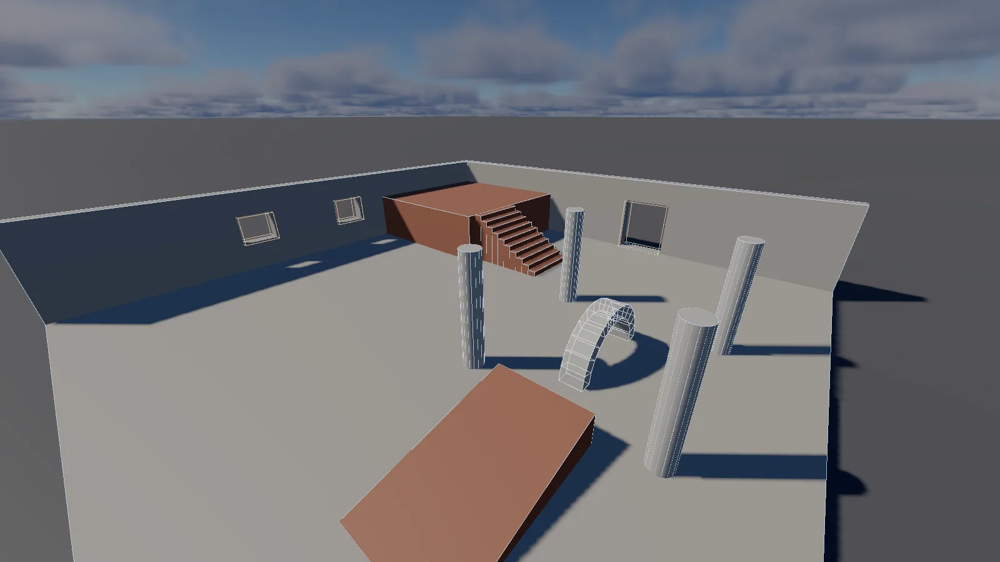
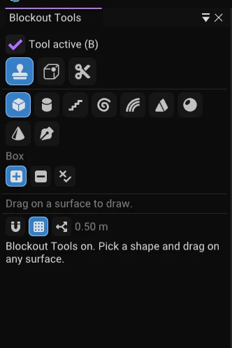

Blockout Tools build level geometry out of **convex brushes**: boxes, cylinders, stairs, arches and
anything else that is a solid with flat faces. Brushes add, subtract or intersect, and the result is
baked to one ordinary mesh. It is how you rough out a level quickly, and because the brushes stay
editable you can keep reshaping it afterwards.


*A courtyard roughed out with brushes. The doorway and windows are subtractive boxes, and the stairs and arch are multi-brush shapes.*

Everything here can also be driven by an AI agent; see [the tools below](#mcp-tools). This chapter
covers the data model, the interactive Place, Edit and Clip tools and the agent tools.

## The pieces


*With the **Blockout** viewport overlay on, every brush shows its outline over the baked mesh.*

There are three components.

**Blockout Model** sits on a root entity. It owns the result: the baked mesh goes on this entity's
Mesh Component, so it renders, casts shadows, traces rays and can carry a collider like any other
mesh. Its settings:

| Field | Meaning |
|---|---|
| UV scale | Metres per texture repeat. Textures are projected in model space, so they line up across adjacent faces and across brushes. Default 1 |
| Smooth angle | Faces marked Smooth (the sides of cylinders and spheres) blend their normals across edges up to this angle |
| Generate collider | Adds a static Rigid Body and a mesh Collider built from the baked mesh |

The model renders with its own Material Component, so one model is one material. Faces carry a
material slot number for later, but the bake does not split by slot yet.

**Blockout Brush** sits on a child entity. It holds one convex solid, its **control mesh**: vertices
and faces in the entity's local space, and per face a texture offset, scale, rotation, a material
slot and a Smooth flag. Brushes do not remember which primitive made them; once created, a brush is
its control mesh. A brush also has an **Operation**:

- **Additive** adds its volume.
- **Subtractive** removes its volume from everything that came before it.
- **Intersect** keeps only where it overlaps what came before it.

**Blockout Operation** sits on a group entity inside a model. The group's children are combined, in
order, into one solid, and that solid is then applied to what came before the group with the group's
own operation. This is how stairs, arches and curved walls, which are several convex brushes, behave
as a single object: a subtractive group of two boxes cuts one L-shaped hole.

## The hierarchy is the shape

A model evaluates every brush beneath it, at any depth, **in hierarchy order**, top to bottom and
depth first. Later siblings apply on top of earlier ones:

- A subtractive brush only removes what is above it in the list. A wall that comes after the
  doorway brush is not cut by it.
- An additive brush after a subtractive one fills the space back in.

So reordering brushes in the Hierarchy panel changes the geometry.

**A group folds its children from empty.** Inside a group, each child is applied to what the children
before it built, starting from nothing. A subtractive or intersect brush that comes before every additive
one in its group therefore has nothing to cut and does nothing, and a subtractive group made only of
subtractive brushes is an empty solid that cuts nothing at all. The way to build a cutter from several
brushes is a subtractive group of *additive* brushes: the members add up to the cutter and the group
subtracts it. The same applies to the model itself, whose children are folded the same way, so a
subtractive brush listed before the first additive one in a model does nothing either.

Any brush or group whose operation has no effect for that reason is flagged: the inspector shows a
**! No effect** badge on its Operation (hover it for the reason), `blockout_get_model` marks it
`no_effect` and lists it under `warnings`, and the bake log names it. `blockout_group` guards against
the common mistake: when it makes a subtractive or intersect group it sets the members that are not
additive to additive and says which ones in its reply; pass `keep_member_operations: true` to keep their
own operations.

Plain entities between a model and its brushes are transparent: their transform applies, and their brushes count as direct children of
the model. A Blockout Model nested inside another model bakes itself separately.

A brush with no Blockout Model above it (and no brush or group above it) is its own model, so a lone
brush still renders. The bake goes on the brush's own Mesh Component.

Moving, rotating or scaling a brush's entity with the normal gizmo rebakes the model. A negative
scale mirrors the brush and the bake corrects the winding.

## Creating things

In the Hierarchy panel, the **Blockout...** button next to Create Entity offers a Blockout Model
and brushes: Box, Cylinder, Cone, Wedge, Sphere, Stairs, Spiral stairs and Arch, plus a Subtractive
submenu of the same. New brushes go inside the selected model or group, beside the selected brush,
or at the world origin when nothing blockout-related is selected. Stairs, arches and spirals arrive
as a group of step brushes.

You can also add the components from **Add Component** on any entity. The inspector for each shows
the operation, the brush's vertex and face counts and size (and a warning if a hand edit left it
not convex), and on the model a **Rebake** button, triangle count and baked file.

While editing, every brush is drawn as a wireframe (Viewport overlays, **Blockout brushes**): blue
for additive, orange for subtractive, green for intersect. Selected brushes, and the brushes under a
selected model or group, are brighter and show through walls.

## What the bake does

The editor rebakes a model a moment after any change to its brushes, their transforms, their order
or the model's settings, at most about eight times a second while you drag. The mesh is written to

```
<project>/assets/generated/blockout/<model id>_<hash>.obj      (a project is open)
LAB/assets/generated/blockout/<model id>_<hash>.obj            (no project: the working directory's assets folder)
```

named by a hash of everything that shapes it, exactly like spline meshes. An unchanged model maps to
the file it already has; undoing back to an old shape rebakes the file its hash names, and older
files of that model are deleted. Packaging picks the mesh up from the Mesh Component like any
other, and a packaged build loads it and never rebakes.

How it decides what to keep: every brush face is cut into convex pieces by the brushes that touch it,
and each piece is kept only if the space just behind it is solid and the space just in front is
empty (an outward surface), or the other way round (the wall of a hole, turned to face into it).
Hidden faces inside the solid vanish, faces where two brushes touch vanish, and where two brushes
have a face on the same plane the later one wins, so nothing z-fights.

Things worth knowing:

- Every face is flat-shaded unless it is marked Smooth.
- Geometry is snapped to 0.01 mm and features thinner than about a millimetre are not reliable.
- The bake closes the seams between its pieces: a vertex that lies along the edge of another piece is added to
  that piece, so the baked mesh has no cracks or T-junctions where brushes meet. That keeps shading and shadows free
  of sparkling pixels along seams, and a picking ray that lands exactly on an edge or corner still hits the surface.
- A brush whose faces are not planar or that is not convex is reported in its inspector; the CSG
  still runs on it but the result is undefined. The edit tools refuse such results.

### When a model does not bake

The **Bake** row at the top of the Blockout Model inspector says what the last bake did, and its
tooltip has the full sentence. The same text is in the `bake_status` field of `blockout_get_model`,
and a failure is written to the editor log once as a `Blockout model <id>:` warning.

| Row says | Meaning |
|---|---|
| Baked N triangles in X ms (green) | The mesh is up to date. Orange instead of green means the bake worked but a brush has no effect (a subtractive or intersect brush with nothing additive before it in its group) |
| No brushes to bake | The model has no Blockout Brush below it, or only brushes with no valid solid. Add one |
| Not baked: no solid surface | The brushes cancel out: everything is subtracted, or the cutters lie outside the solids. Check the operation of each brush and the order |
| Not baked: could not write the file | The folder above is missing or read-only |
| Not baked: the baked file would not load | The OBJ was written but the mesh loader rejected it; the log says why |

Brushes show as wireframe overlays whether or not a bake exists, so a model with only a wireframe has
not baked: read the Bake row. The **Rebake** button rebuilds at once and shows the new result in the same row.

With no project open (the editor started without `--project`, on the default scene) the bake works
the same, under `LAB/assets/generated/blockout/`, and the Mesh Component stores `assets/generated/blockout/...`,
the form scenes use for engine content. If you then open or create a project, the stored path no longer
matches, so the model rebakes into the project's `generated/blockout/` folder on the next frame and
the old file is left behind (the folder is git-ignored). Spline meshes follow the same rule. Save an
untitled scene into a project before sharing it: a scene that points at the working directory's
generated folder only loads where that folder exists.

## The Blockout Tools mode


*The Blockout Tools panel with the tool on: the modes, the shapes, the operation and snapping.*

The **Blockout** button in the viewport toolbar (or **B** with the viewport focused) turns the mode on and
opens the **Blockout Tools** panel, which is also in the Windows menu and the command palette. The panel
has three tools: **Place**, **Edit** and **Clip**. Place is described here, then [Edit](#edit) and [Clip](#clip). While Place or Clip is on, the entity gizmo
is hidden and a left click in the viewport draws instead of selecting; right and middle drag still fly
the camera.

### Placing a brush

Pick a shape in the panel, then draw on any surface:

1. **Hover.** A grid patch lies on whatever surface is under the pointer: an ordinary mesh, a model's
   bake, or the ground plane when nothing is hit. A cross marks where the next point will land.
2. **Drag the footprint.** Press on the surface and drag, then release. Boxes, stairs, wedges and arches
   take two opposite corners of a rectangle. Cylinders, cones, spheres and spiral stairs take the centre
   and a radius. You can also click once and click again instead of dragging.
3. **Set the height.** Move the pointer off the surface. The height is measured along the surface normal,
   from where the pointer ray passes closest to the line standing on the middle of the footprint (the
   centre of a rectangle or circle, the middle of a free-draw outline), so aiming at where the top face
   should be reads that height. Move toward the surface
   to extrude into it (a negative height), which is how you cut a niche into a wall. When you look almost straight
   along the normal (a top-down view of a floor) the ray cannot tell the height, so moving the pointer up the screen raises it instead.
4. **Click to finish** (or press Enter). One undo step creates the brush, or the operation group for stairs
   and other multi-brush shapes. Spheres and arches have no height phase and finish when you release the
   footprint.

The preview is drawn as wireframe in the operation's colour while you work. The brush's **Z axis follows the surface normal**
and its base sits on the surface, so a box drawn on a wall is oriented to that wall. Its X axis is the grid's U
axis (see below), and stairs and wedges climb toward the grid's +V unless you change **Climbs toward** in the panel.
The step count of stairs follows the drawn height: the height is split into the nearest whole number of steps
of the **Step height** setting.

| Shape | Footprint | Height | Panel options |
|---|---|---|---|
| Box | two corners | yes | |
| Cylinder | centre, radius | yes | Sides, Smooth sides |
| Stairs | two corners, run along the climb direction | total rise | Step height, Filled to the floor, Climbs toward |
| Spiral stairs | centre, outer radius | total rise | Inner radius, Turn (degrees, sign sets the direction), Step height |
| Arch | two corners, span along X | none: a half circle | Thickness, Segments |
| Wedge / ramp | two corners | yes | Climbs toward |
| Sphere | centre, radius | none | Sides |
| Cone | centre, radius | yes | Sides |
| Free draw | clicked points | yes | Curve segments |

### Free draw

Click points on the surface. The first press locks the surface plane and every later point lands on that
plane. To curve an edge, **press on a new point and drag** before releasing: the edge that ends at that point bends,
and the middle of the curve follows the pointer. Or hold **Alt** and **drag an existing edge** to bend it the same way.
Click the first point again, or press **Enter**, to close the shape, then set the height as usual. The outline can
be concave; it is split into convex brushes under one operation group.

### Operation, and the Shift flip

The **Operation** in the panel (Additive, Subtractive, Intersect) applies to the next brush. **Hold Shift at any
time while drawing** to flip that one brush to Subtractive (or from Subtractive back to Additive), which
is the quickest way to cut a doorway. The preview turns orange when the brush will cut.

### Which model the brush goes into

- If the surface you draw on is a Blockout Model's bake, the brush goes into that model, last in its order.
- Otherwise, if a Blockout Model, group or brush is selected, it goes into the selected model; with a brush or
  group selected it is placed right after it, so a subtractive brush cuts what the selected brush built.
- Otherwise a **new model** is created at the footprint and the brush goes into it.

Drawing on an ordinary mesh never changes that mesh; the brush is created on its surface, in a model of its own
or the selected one. A new brush is selected, so the next one you draw on the ground joins the same model.

### Snapping and the grid

With **Snap** on in the toolbar, footprint points and heights snap to the **Snap translation** step. The
grid patch is the snap grid, so what you see is what snaps. It lies in the surface's plane:

- **World** mode: the grid counts from the world origin projected onto the surface, along the world X and Y
  axes (on a wall, the horizontal world axis and the direction up the wall).
- **Local** mode: the grid is relative to the model the brush goes into: it counts from the model's origin
  and follows its rotation, in steps of the model's own scale. A model rotated 30 degrees about Z gets a grid turned 30 degrees.

With Snap off the grid patch is still drawn as a guide, but points are free.

### Shortcuts

| Key | Action |
|---|---|
| B | Toggle Blockout Tools (viewport focused) |
| Left drag / click | Draw the footprint, then click to finish |
| Shift while drawing | Flip the brush to Subtractive |
| Alt + drag on an edge | Free draw: bend the edge into a curve |
| Enter | Confirm: close a free draw outline, or finish at the current height |
| Escape | Cancel the current draw |

## Edit

The **Edit** tool selects and reshapes brushes, faces, edges and vertices, across several brushes at once.
Pick **Edit** in the panel; the sub-mode buttons (or the keys **1** to **4** with the viewport focused) are
**Object**, **Face**, **Edge** and **Vertex**. Changing the sub-mode clears the element selection.

### Selecting

- **Object**: a click picks a brush (Shift adds, Ctrl toggles). A click that misses every brush falls through
  to ordinary picking. The entity gizmo stays and moves whole brushes.
- **Face**: a click picks the face under the pointer. The ray tests the brushes' control meshes, not the
  bake, so subtractive brushes are pickable: a face counts when it lies on the surface of the CSG result
  (solid on one side, not the other), which finds the walls of a hole a cutter made and skips the wall it
  was cut out of. If nothing on the ray is on the surface, the nearest face wins.
- **Edge** and **Vertex**: the nearest edge or vertex in screen space, within about nine pixels. Nothing is
  occlusion tested, so edges behind a wall can be picked; a near tie goes to the one closer to the camera.
- **Shift** adds to the selection, **Ctrl** toggles, a plain click replaces it, a click on nothing clears it,
  **Esc** clears it (or cancels a drag in progress). Selecting elements also selects their brushes, so the
  Properties panel and the **T**, **R**, **Y** gizmo keys work.

The hovered element is yellow, selected ones are pink (a selected face is drawn as a filled patch), a face's
normal arrow is green and a hinge edge is cyan. Subtractive brushes keep their orange wireframe.

### Moving, rotating and scaling

A gizmo sits at the centroid of the selected elements in Face, Edge and Vertex mode. It follows the toolbar's
**Move / Rotate / Scale**, **Local / World** and snap settings. Local is the face's frame (its normal is Z, X
follows its first edge); for an edge X runs along it; for a vertex it is the brush's own axes. Every selected
brush is edited together, and the drag is all or nothing per frame: if any brush would stop being a valid convex
solid, that frame is not applied and the drag can come back. A whole drag is one undo step.

| Sub-mode | Move | Rotate | Scale |
|---|---|---|---|
| Face | `MoveFaces` (neighbours re-hull) | `RotateFaces`, the planes turn about the pivot and neighbours follow | each face about its own centroid, along the gizmo's axes |
| Edge, Vertex | `MoveVertices` | the vertices turn about the pivot | about the pivot |

### Pushing a face along its normal

Each selected face shows a green arrow. Drag it to move the face along its own normal (`MoveFacesAlongNormal`),
so neighbouring faces follow; every selected face moves the same distance. With **Snap** on the distance snaps
to the Snap translation step. **Alt + drag on a face** does the same without aiming at the arrow.

### Rotating over an edge

With a face selected, hover one of its edges: it turns cyan. Drag to turn the face over that edge as a hinge
(`RotateFaceOverEdge`); with snap on the angle snaps to the Snap rotation step. The angle is measured around the
edge from where you pressed, so the face follows the pointer. The face's own corners turn about the edge and every
other vertex of the brush stays where it was, so hinging the top of a box down gives a box with a sloped top and the
same eight corners. A turn that would swing the face through the brush, or leave a corner inside it, is refused
(the panel says why) and the drag can come back.

### Scaling by dragging (Object mode)

With brushes selected (a selected model or group counts as its brushes) the combined bounds are drawn with
eight corner and six face handles, in the world axes or, with the gizmo on Local, the first brush's axes. Drag a
corner to resize all three axes, a face handle for one. The opposite side stays put; **Alt** resizes about the
centre. Every selected brush is scaled in proportion (`BoundsScale` where its axes line up with the frame, an
affine map otherwise), and the moving side snaps to the grid (counted from the parent's origin when Local).

### Bevel, flip, operation

In the panel: **Bevel selected** chamfers the selected edges (Segments above 1 makes a round) or cuts the
selected vertices, by **Amount** metres measured along the neighbouring faces. **Flip X / Y / Z** mirrors the
selected brushes across a local axis, and **Operation** switches them between Additive, Subtractive and Intersect.
Each is one undo step. A bevel too large for the faces is refused and changes nothing.

### Shortcuts

| Key | Action |
|---|---|
| 1, 2, 3, 4 | Object, Face, Edge, Vertex sub-mode |
| Click / Shift click / Ctrl click | Select / add / toggle |
| Alt + drag on a face | Push it along its normal |
| T, R, Y, G | Gizmo: move, rotate, scale, off |
| Esc | Cancel the drag, else clear the selection |

### Driving it from an agent

`blockout_edit_tool` is the Edit tool's MCP side; `blockout_tool`'s `pointer` action feeds the same pointer
events. `get_state` reports the sub-mode, the selection, the selected brushes, the pivot and frame, the gizmo and
snap settings, the drag status, and every handle (normal arrows, the hinge of every edge of a selected face, the
bounds handles) with its world position and projected `u`, `v`, so a handle drag is scripted as: read the handle's
`u`, `v`, `pointer` `down` there, `move` to the `u`, `v` of the world point it should reach (project it with
`blockout_tool` `project`), `up`. Actions:

| Action | What it does |
|---|---|
| `set_mode` | `object`, `face`, `edge`, `vertex`; also turns the tool on and switches it to Edit |
| `select` | Elements of one brush by index: `faces`, `edges` (`[a, b]` vertex pairs) or `vertices`, with `how` `replace`, `add` or `toggle`. With no element list it takes `brushes` for Object mode. Call once per brush with `how: add` to select across brushes |
| `clear_selection` | Clear the elements |
| `set_gizmo` | The operation (`translate`, `rotate`, `scale`, `none`), the space (`local`, `world`) and the snap values |
| `transform` | What the gizmo does, in one undo step: `translate` (world), `rotate` (`axis` in world space, `degrees`), `scale` (a number or `[x, y, z]` along the frame), optional `pivot` and `space` |
| `push` | `distance` along every selected face's normal |
| `hinge` | `face` (index into the selection), `edge` (index in the face's loop), `degrees` |
| `bevel`, `flip`, `set_operation` | As in the panel |
| `pointer`, `key` | The pointer events and Escape the mouse and keyboard send |

The gizmo itself is ImGuizmo and needs the real mouse, so an agent uses `transform` for what the gizmo does and
`pointer` for the arrow, hinge and bounds handles.

## Clip

The **Clip** tool cuts brushes with a plane. It applies to every selected brush; a selected group or model
stands for all the brushes under it. With nothing selected it uses the brush under your first click.

1. **Click two points on surfaces.** They snap to the grid like the Place tool. The plane contains the line
   between them and either the view direction or the surface normal, whichever the panel's plane option says
   (*through the view* by default, *perpendicular to the surface* for a cut square to the wall you clicked).
2. **Optionally click a third point** to set the plane freely from three points.
3. **Adjust.** The points stay as handles. Hover one to highlight it and drag it to move it; it snaps again
   and the preview follows. The preview shows the plane as a hatched outline across everything it affects,
   the cut outline on each affected brush in yellow, and the part that will be removed in red (for
   *Split*, the two parts in green and blue instead). A green arrow points to the kept side. Brushes that
   lie wholly on the removed side are drawn red in full: applying deletes them.
4. **Apply with Enter** (or the panel button). The whole clip is one undo step, including the new brushes
   a split creates.

| Key | Action |
|---|---|
| Tab | Cycle *Keep Front*, *Keep Back*, *Split* (front is the side the arrow points to) |
| F | Flip the plane (only while a plane exists; otherwise F frames the selection as usual) |
| Enter | Apply |
| Escape | Drop the points and cancel |
| Ctrl + click | Select as usual; Clip mode otherwise uses the clicks for points |

*Split* keeps the front part in the original brush and puts the back part in a new brush placed right after
it in the hierarchy, in the same parent, with the same operation and surface settings. A brush the plane
misses is left alone. The status line reports how many brushes were cut, split, removed and untouched.

An agent drives the same tool through `blockout_tool`: `set_mode` clip, pointer `down` events for the points
(a `down`, `move`, `up` on a handle drags it), `set_options` with `clip_keep` (`front`, `back`, `split`),
`clip_plane` (`view`, `surface`) and `clip_flip`, and `key` enter to apply. `get_state` reports a `clip` object
with the points (and their `u`, `v` so a handle can be dragged), the plane, and per brush what applying would do.

### Where a shape sits

`blockout_create_brush` and `blockout_create_on_surface` build a shape around the entity's origin. The solid
primitives are centred on it; the shapes built up from a footprint stand on it:

| Shape | Origin | Axes |
|---|---|---|
| `box`, `wedge` | Centred in x, y and z | `size` is [x, y, z]; a wedge's low end is at -Y and its high end at +Y |
| `cylinder`, `cone` | Centred in x, y and z | The axis is Z; a cone's apex is at +Z |
| `sphere` | Centred | |
| `stairs` | Centred in x and y, standing on z = 0 | `width` along x, the run (`depth`) along y, climbing toward +Y; rises to `height` |
| `spiral_stairs` | On the Z axis, standing on z = 0 | Turns counter-clockwise for a positive `angle` |
| `arch` | Centred on x = 0, the centre of its circle at z = 0 | In the XZ plane, `depth` along y; its legs end at z = 0 |
| `polygon` | The points are used as given in x and y; the solid spans z = 0 to `height` | Any winding, concave allowed |

`anchor` moves a shape along z only, so its vertical middle (`center`) or its lowest point (`base`) is at the
entity origin. It defaults to `base` for `stairs`, `spiral_stairs`, `arch` and `polygon`, to `center` for the
rest, and `blockout_create_on_surface` defaults it to `base` for every shape so the brush rests on the surface.
Brushes store their vertices, so none of this changes a brush that already exists. The interactive Place tool
always puts the base on the surface it was drawn on.

## MCP tools

All of these follow the editor's MCP conventions: they need edit mode, every edit is one undo step
unless stated, and they reply with a short factual description (ids, counts, world bounds, baked triangle
count per model, and a warning for any brush that has no effect). Creating, editing and clipping tools reply
with brush ids rather than a summary per brush, so a 20-step staircase is one line; pass `verbose: true`
for the full summaries and the whole bake line. See [AI Agents](../07-projects-and-tools/04-editor-ai-agents.md) for connecting a client. Vectors are `[x, y, z]`, angles are
degrees, and transforms are local to the parent. `snap` is `true` (the editor's grid size) or a number
of metres, and applies to positions and move distances in the space given.

| Tool | What it does |
|---|---|
| `blockout_create_model` | Create a Blockout Model, optionally under a parent, with a colour or material |
| `blockout_create_brush` | Create a brush from a shape (`box`, `cylinder`, `cone`, `wedge`, `sphere`, `stairs`, `spiral_stairs`, `arch`, `polygon`) with its parameters, an operation, a parent and a transform. Multi-brush shapes come under a new operation group. A `polygon` may be concave and may have curved edges (per-edge Bezier controls); it is split into convex brushes |
| `blockout_create_on_surface` | Raycast from a world point and direction, or from viewport fractions, and place a brush with its base on the hit surface, aligned to the surface normal |
| `blockout_get_brush` | A brush's vertices, faces (index, vertex loop, normal, centroid, area, UVs, material), edges and transform. The indices are what edits take |
| `blockout_edit_brush` | One `op`: `move_face`, `extrude_face` (along the normal, negative insets), `rotate_face`, `rotate_face_over_edge`, `scale_face`, `move_edge`, `move_vertex`, `bevel_edge` (`segments` above 1 rounds), `bevel_vertex`, `set_operation`, `set_face_surface`, `bounds_scale`, `flip`. Takes several brushes; all succeed or none change. A result that is not a valid convex solid is refused |
| `blockout_clip` | Clip brushes by a plane (point and normal, or three points), keeping `front`, `back` or `split` (the new piece becomes the next sibling). One undo step |
| `blockout_group`, `blockout_ungroup` | Make an operation group from brushes, or dissolve one. One undo step each. The reply carries the new group's id as `group`. A subtractive or intersect group sets its non-additive members to additive (listed in `normalised_members`) unless `keep_member_operations` is true; see [the group rule](#the-hierarchy-is-the-shape) |
| `blockout_set_order` | Move an entity to a position among its siblings, which changes what it cuts. One undo step |
| `blockout_get_model` | The brush tree in evaluation order, settings, baked file, triangle count, bounds |
| `blockout_rebake` | Force a bake and report triangles, vertices, bounds and pieces kept or hidden |
| `blockout_tool` | Drives the interactive Place tool the way a mouse does. Actions: `get_state`, `set_active`, `set_mode`, `set_shape`, `set_operation`, `set_options`, `set_snap` (enabled, step, `world` or `local` space), `pointer` (`event` of `move`, `down` or `up`, `u` and `v` in viewport fractions, optional `shift` and `alt`; `events` takes a list), `key` (`enter`, `escape`, and `tab`, `f` for the Clip tool's keep mode and flip), `project` (a world point to `u`, `v`), `cancel`, and `ui_input` (feeds the real ImGui mouse and keys, to exercise the viewport path itself). Every reply is the tool state: phase, the hover surface and its grid, the draw so far, the preview's size and bounds, and the ids created. A draw is a pointer `down`, `move`, `up` for the footprint, a `move` for the height and a `down` to finish, and is one undo step |
| `blockout_edit_tool` | Drives the Edit tool: selection by index, the gizmo's transform, push, hinge, bevel, flip, pointer drags of the handles. See [Edit](#edit) |
| `blockout_self_test` | Run the geometry kernel's built-in checks |

Face and vertex indices change when an edit changes the topology (a bevel, a clip, a vertex move), so
read the brush again before the next index-based edit.

A typical session for an agent: create a model, create a floor and wall as `box` brushes under it, create
a subtractive `box` brush *after* the wall to cut a doorway, add `stairs` and an `arch`, bevel an edge
with `blockout_edit_brush`, then `screenshot` to look at it.
