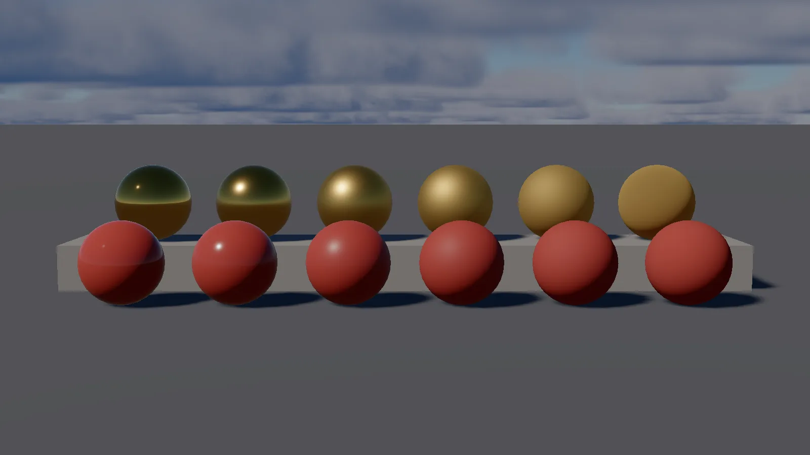

LAB uses a physically based (Cook-Torrance) shading model: GGX distribution, Smith
geometry, Schlick Fresnel. In practice that means you describe a surface by *what it is
made of* — its colour, how rough it is, whether it is metal — rather than by tweaking a
shininess number until it looks right.


*Roughness from 0 (left) to 1 (right). Back row: metallic gold. Front row: a red dielectric.*

A material is a component. Add it from **Properties → Add Component → Material Component**.

## Base colour

**Color** is an RGBA tint. If there is no albedo texture, this *is* the surface colour —
which makes an untextured material the fastest way to block out a scene. If there is a
texture, the two multiply, so white leaves the texture alone and a tint darkens it.

The alpha channel is currently a **binary coverage mask** in the deferred path: material
alpha multiplied by albedo-texture alpha below 0.5 is discarded in both the depth prepass
and G-buffer. Use it for foliage, grates, and cutout decals. For smooth translucent
blending, enable **Transparent** on the material instead.

## Textures

Assign a texture by dragging it from the Asset Browser onto the slot, or by typing a
project-relative path.

| Slot | What it holds |
|---|---|
| **Albedo** | Base colour. This is the one you almost always have |
| **Normal** | A tangent-space normal map. Tangents are generated at model load, so any `.obj` works |
| **Metallic-Roughness** | A packed map: **R = ambient occlusion, G = roughness, B = metallic** |

Any slot can be left empty. A material with no metallic-roughness map falls back to
AO = 1.0, roughness = 0.5, metallic = 0.0 — a neutral dielectric, which is a sensible
default for most things.

Textures are mipmapped automatically on upload.

### Getting the packing right

The metallic-roughness map is the one people get wrong. It is a single image whose three
colour channels each mean something different:

- **Red** — ambient occlusion. 1 is fully exposed, 0 is a crevice.
- **Green** — roughness. 0 is a mirror, 1 is chalk. (Clamped to a minimum of 0.04 in the
  shader; a perfectly smooth surface produces a singularity.)
- **Blue** — metallic. 0 is a dielectric (plastic, wood, stone), 1 is bare metal. Values in
  between are physically meaningless — use them only for blending at an edge.

This is the glTF convention, so a map exported from Substance, Blender or almost any PBR
authoring tool will already be packed this way.

### A note on metals

A metal has no diffuse colour: its albedo becomes the *reflection* tint. So a gold material
is `metallic = 1` with a yellow albedo, and it will look black in a scene with nothing to
reflect. If a metal looks wrong, the usual cause is that there is no environment for it to
reflect — give the scene a [Sky or HDRI](02-lighting.md).

## Emissive

**Emissive Color** and **Emissive Strength** make a surface give off light regardless of
what is shining on it. Screens, lava, glowing runes, indicator lamps.

Strength is separate from colour on purpose: an emissive that cannot exceed 1 is just a
colour. Push the strength above 1 and the surface stays the hue you picked while getting
brighter, rather than washing out to white.

**Emissive does not light other objects.** It is a surface property, not a light source. If
you want the glow to illuminate the room, put a point light inside it as well.

### Emissive textures

An emissive colour can be multiplied by a texture, texel by texel: a screen, a sheet of
glowing runes, a lit window pattern. The surface gives off the **Emissive Color** times the
**Emissive Strength** times the texture, so the colour and strength still scale it. A glTF
material's `emissiveTexture` imports this way, cooked as an sRGB texture beside the mesh, and
the extension `KHR_materials_emissive_strength` (which Blender writes when a material's
Emission Strength is above 1) becomes the Emissive Strength. A texture with no emissive colour
gives off nothing, as in glTF itself: exporters write a colour of white next to a texture.

For a material that is a `.Lmaterial`, the texture is the **Emissive Texture** row of the Material
Editor, under the other parameters.

### Render targets: live feeds on materials and the HUD

A **render target** is a `.Lrt` asset (New > Render Target in the Asset Browser, or
`render_target_create(path, w, h)` from a script) that a [Scene Capture](../02-building-worlds/02-components.md#scene-capture)
draws into. It is shared: the same asset can be a monitor in the world and a picture in a corner of the
HUD at once.

```yaml
RenderTarget:
  Width: 512
  Height: 512
  Format: LDR        # LDR: the tonemapped picture in RGBA8. HDR: the lit scene, linear, in RGBA16F
  Filter: Linear     # or Nearest, for a chunky low-resolution feed
  ClearColor: [0, 0, 0, 1]
```

Double-click the asset to edit it. The window shows a live preview while a capture draws into it, and
the asset's tile in the Asset Browser shows the picture too.

**Using one.** Set a Scene Capture's **Target** to the asset. Then name the same path anywhere a texture
is taken:

- a Material's **Albedo** or **Emissive Texture** (the Material Editor's texture rows take a dropped
  `.Lrt`; `entity:set_material_texture("emissive", path)` from a script),
- a material graph's **Texture** node or Texture Parameter (its path, or an instance override),
- a HUD Sprite's **Texture** ([HUD](../05-ui/01-hud.md#live-camera-feeds-and-the-cctv-look)).

For an in-world monitor give the screen an emissive material with the target as its Emissive Texture,
Emissive Color white and Emissive Strength around 1 to 2 (the picture is already tonemapped, so a
strength of 1 reads about right), and a dark Color so the screen does not also reflect the room.

**When the picture is drawn.** A capture renders before the main view in the same command buffer, so a
material samples *this frame's* picture, not last frame's. The image rests in a sampled layout between
renders; a capture that draws into the very target a material in its own view samples (a monitor that
can see itself) sees the previous render, since it only becomes an attachment for the final tonemap. At
most one capture renders per frame, so with several the rest keep their last picture.

**How it is read.** An LDR target is stored display-encoded and read by materials through an sRGB view,
so a texel arrives as linear light, the same as any colour texture. An HDR target is read as it is.
Resizing or changing the format replaces the image at the top of the next frame (`render_target_resize`
changes the running size without touching the file; `render_target_save` writes it). A file edited on
disk is picked up within half a second.

**Limits.** The image exists only while a capture targets it; until then, or if the file is missing, a
material shows the white default and a sprite draws nothing. Post Process Materials and particle
materials do not take render targets (they show the default). A capture does not draw material graph
meshes or transparent meshes, so a monitor's own picture cannot contain another graph monitor.

### Texture transform: tiling, offset and rotation

A material can carry one UV transform that applies to all of its textures, the albedo, normal,
metallic-roughness and emissive maps together: **UV Scale** (tiling), **UV Offset** and **UV
Rotation**. It is how a Blender Mapping node survives the trip: glTF stores it as
`KHR_texture_transform`, and the importer reads it. In a `.Lmaterial` they are rows of the
Material Editor (the rotation is shown in degrees, counter-clockwise).

A material has one transform, not one per texture. If a glTF gives its textures different
transforms the importer uses the first one it finds, looking at the base colour first, and logs a
warning naming the texture that disagrees. A scale of 2 repeats the texture twice across the
surface; the transform is `scale`, then `rotation`, then `offset`, the order glTF defines.

### Vertex colours

A mesh's vertex colours multiply the albedo, so a vertex-painted mesh needs no texture. A glTF's
`COLOR_0` attribute is imported (the mesh import setting **Import vertex colors**, on by
default). Turn it off for a file whose colour attribute is a paint layer that was not meant to
show: every vertex then cooks white. A mesh without the attribute is white, which leaves the
albedo as it was.

## Reusing a material

Right-click a Material component's header → **Copy Component**, then right-click on another
entity's Properties panel → **Paste Component**. Tuning a material once and pasting it is
much faster than retyping four paths.

The fixed Material component has no shareable form: each entity carries its own colour and
its own copy of the four texture paths. (A *material graph* does have one, the `.Lmaterial`
asset described below.) Entities *do* share the underlying GPU resources: one descriptor
set is cached per unique combination of albedo, normal and metallic-roughness textures, and
the Performance panel's *Material sets* counts those. Two entities with identical texture
sets cost one.

## Checking your work

The `Dev/Tests/assets/scenes/multimaterial_test.Lscene` sample has three entities with deliberately
different materials — textured, differently textured, and untextured. It is the fastest way
to confirm that materials are being applied per draw rather than all taking the last one
set.

**Windows → G-Buffer Inspector** shows the renderer's intermediate targets. If a surface
looks wrong, this tells you whether the problem is the albedo, the normals, or the lighting
— see [Troubleshooting](../07-projects-and-tools/05-troubleshooting.md).

### Transparency

Materials use alpha cutout by default, which is appropriate for foliage and fences. Enable
**Transparent** for glass, smoke, and other partially translucent surfaces. Transparent
materials render in a separate forward pass after deferred lighting and blend over the HDR
scene. They currently retain base colour and emissive contribution; physically lit
transmission and weighted blended OIT are future renderer work.

## Material graphs (node-based materials)

For anything the fixed Material component's four slots cannot express — procedural
patterns, blending two textures, math-driven colour — there is a second, separate node
editor: **Windows → Material Graph** (`Node Graph` is for scripts; do not confuse the two).
A material graph is authored as a `.Lshader` file with the same node-and-wire look as
visual scripting, but compiles to a real generated fragment shader rather than to Lua.

Assign one to an entity by setting **Material → Shader Graph** to the `.Lshader` path (or
`entity:set_shader_graph(path)` from a script). Once set, the graph's own outputs — not the
Material component's Color/textures — decide what the surface looks like.

**Per-entity overrides** are what let one graph serve many materials — "brick red" and
"brick old" from one graph. Any Scalar, Vector3 or Texture parameter the graph exposes can
be overridden per entity from the Properties panel, or from a script:
`entity:set_shader_graph_scalar(name, value)`, `set_shader_graph_vector3(name, value)`,
`set_shader_graph_texture(name, path)`. Two entities pointed at the same graph with
different overrides render as two different materials.

The whole material surface from a script, colour and alpha and emission included, is in
[Material](../06-scripting/02-lua/api/entity/04-material.md).

This feature is newer and rougher-edged than the fixed material pipeline:

- **No frustum culling.** A graph surface draws without a visibility test, so one far
  off-screen still costs a draw. Everything else a mesh gets, it gets: motion vectors come
  from the same `v_CurrentClip` every other vertex shader writes, and a shipped build
  carries the graph's SPIR-V baked by the packager under a hash of the graph, its shape
  and its static switches, so `glslangValidator` is an editor-time tool again.
- **A Texture node or Texture Parameter may name a render target** (`.Lrt`); it samples the live
  capture picture as linear light (see [Render targets](#render-targets-live-feeds-on-materials-and-the-hud)).
- **Every texture slot samples sRGB.** A graph used for something that should be sampled
  linear (a normal map, a roughness mask) will read wrong until per-slot colour-space
  control is added.
- Static switches (`Static Bool Parameter`) branch at *compile* time — the untaken side is
  never even built into the shader, unlike an ordinary Boolean value.

### Material Instances

A Material Instance (`.Lmaterial`) bundles a set of overrides for a parent graph into its own
shareable asset, instead of repeating the same per-entity overrides above on every entity
that wants them. Point `MaterialComponent`'s **Shader Graph** field at a `.Lmaterial` exactly
as you would a `.Lshader` — every entity that references the instance picks up its values,
and `set_shader_graph_scalar`/`set_shader_graph_vector3`/`set_shader_graph_texture` still
work on top of it and win by name, same as they would over a plain graph's own defaults.

Double-click a `.Lmaterial` in the Asset Browser to open the **Material Instance Editor**. Set
**Parent** to the `.Lshader` it inherits from — type a path or drag one from the Asset
Browser — and the panel lists every Scalar, Vector3 and Texture parameter (and Static
Switch) that graph exposes, one row each, with an override checkbox: unchecked shows the
parent's own default greyed out, checked exposes a value you can edit for this instance only.
**Save** writes the instance back to disk.

The Asset Browser's **New...** button makes one directly: **Material** writes a fresh
`.Lmaterial` and opens it here, the same reasoning the Properties panel's own **New Material**
button follows. A script can make one too, with
`create_material_instance(parentPath, outputPath [, settings])`, which answers `ok, error` and
is what a test or an importer uses; the file it writes opens here the same way.

### Post Process Materials

A graph can also root at **Post Process Output** instead of one of the surface Material
Output nodes — Unreal's own "Post Process Material," a full-screen effect rather than a
mesh's shading. A new graph seeds a Material Output node by default, so building one of
these means deleting that node and adding **Post Process Output** from the Add Node menu's
**Output** category instead; a graph compiles as one kind or the other, never both. Post
Process Output takes **Color** (the effect's result) and **Opacity** (default 1) — the pass
mixes the original scene colour and Color by Opacity, which is as close to a mask as a v1
gets: build an Opacity graph from a Scene Depth edge or a screen-space pattern to affect only
part of the frame.

The only thing such a graph can read is the frame that has already been rendered, through a
**Scene Texture** node (its own category in the Add Node menu). It takes no inputs and always
outputs a four-component **Color**: a single-value channel (Depth, Roughness, Metallic,
Ambient Occlusion) is splatted across all four components, Velocity sits in `.xy`, and
everything else sits in `.rgb` — pull out what you need with a Swizzle node, the same as you
would from a texture sample. The channels are Scene Color (the lit HDR image, before
tonemapping), Scene Depth, Normal, Roughness, Base Color, Metallic, Emissive, Ambient
Occlusion, Velocity, World Position (reconstructed from depth), Custom Depth and Custom Stencil.
The node has a channel dropdown next to its title, and a freshly placed node reads Scene Color.
Custom Depth and Custom Stencil are splatted across all four components and read zero where no
mesh is flagged; flag meshes with **Render Custom Depth** on the Mesh component, see
[Components](../02-building-worlds/02-components.md#custom-depth-and-stencil). The channel is also the node's saved value
in the `.Lshader` file; `assets/materials/postprocess_invert_test.Lshader` is a worked example (Scene Color →
Swizzle `rgb` → `1 - x` → Post Process Output). A Post Process Material graph also cannot
sample an artist texture at all — Texture Parameter, Sample Texture2D and Normal Map are all
rejected by the compiler in this graph kind, so Scene Texture is the only image input there
is.

Assign the compiled graph through `PostProcessMaterialPath` on the Renderer Settings
component (see [Components](../02-building-worlds/02-components.md#renderer-settings)) — a project-relative path,
empty by default, which is "off" with no separate enable checkbox. There is no
properties-panel row for it yet: set the key by hand under the scene's `PostProcessComponent`
block in the `.Lscene` file (see `Dev/Tests/assets/scenes/postprocess_material_test.Lscene` for the
shape) until an editor field ships. It is a v1 — one graph for the whole viewport, applied
over everything on screen at once, not a per-object or per-camera material.

See `docs/ROADMAP.md` section 8 and `docs/NEXT_STEPS.md` for the current node library and
what is still missing.
