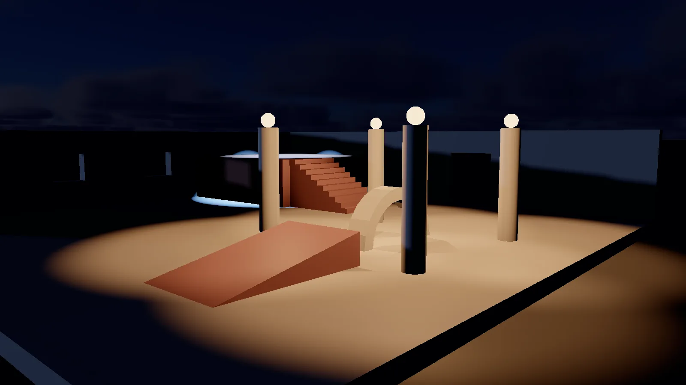
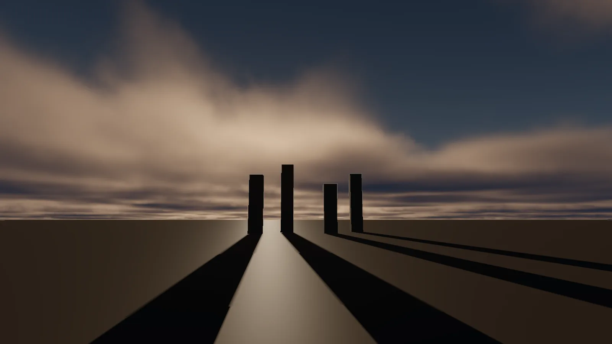

A scene with no lights renders black. The minimum useful setup is one **Directional Light**
plus an ambient source — either an **Ambient Light** component or a **Sky** with *Contribute
Ambient* on.

*A dim directional light for the night sky, four shadow-casting point lights with emissive lamp globes, and a blue spot light on the terrace.*

## Light types

Each is a component on an ordinary entity, so a light can be parented, moved by a gizmo,
animated by a script, and given a mesh so you can see where it is.

| Type | Behaves like | Cost |
|---|---|---|
| **Directional** | The sun. Parallel rays, no position, no falloff | Cheapest |
| **Point** | A bare bulb. Radiates in all directions, falls off with distance | Cheap unshadowed, expensive shadowed |
| **Spot** | A torch. A cone, aimed by the entity's rotation | Cheap |
| **Ambient** | A flat fill so nothing is pure black | Free |

### Limits

Per scene: **4 directional, 16 point, 8 spot.** Lights past those limits are silently not
lit — if a light stops working after you add several more, this is why.

### Aiming a light

A **directional** light has its own `Direction` field. A **spot** light is aimed by rotating
its entity. A **point** light has no direction at all — only a position.

> Everything in this chapter is the **raster** path, plus ReSTIR DI and DDGI. On a machine
> with hardware ray query the sun's shadows, ambient occlusion, reflections and the indirect
> bounce can all be traced instead — see [Hardware Ray Tracing](03-ray-tracing.md). Those
> settings replace the equivalents here rather than adding to them.

## Shadows

Shadows are off by default on every light. Turn them on per-light with **Cast Shadows**.

### The shadow budget

There is a scene-wide budget of **16 shadow views**, and different lights cost different
amounts:

| Light | Views |
|---|---|
| Spot | 1 |
| Directional | 1 per cascade (3 by default) |
| Point | 6 — it shadows in every direction |

So a shadowed sun with 3 cascades, one shadowed point light and one shadowed spot is
3 + 6 + 1 = 10 views. Exceed 16 and the engine says so in the log — it does not fail
silently.

### Directional shadows and cascades

**Only the first directional light with Cast Shadows on actually casts.** There is one sun.

| Setting | What it trades |
|---|---|
| **Shadow Distance** | Half-width of the area covered, in world units, centred on the camera. Double it and every shadow is half as crisp |
| **Shadow Cascades** | Splits that distance into nested boxes so near shadows get their own tight one. 3 is the default; 1 gives the old single-box behaviour |
| **Shadow Bias** | Depth slop, scaled by surface slope |
| **Shadow Strength** | How dark a shadow gets. 1 is fully occluded |

Cascades exist because one box covering everything spends the same texels on a wall two
metres away as on a hill forty metres off — which is why a single map is either sharp up
close or useful at range and never both. With three cascades, the nearest tenth of the
distance gets the resolution the whole range used to share.

Each cascade costs a shadow view, so this is the setting that most often exhausts the
budget.

### Point and spot shadows

Point and spot lights get **Shadow Bias** and **Shadow Strength**; spot lights also get
**Shadow Range**, which is how far the shadow frustum reaches. Raising the range costs depth
precision and does *not* make the light reach further — a spot light's reach comes from its
cone angles.

### Tuning bias

Bias is depth slop applied so a surface does not shadow itself.

- **Too little** — flat surfaces develop stripes ("shadow acne").
- **Too much** — shadows detach from what casts them ("peter-panning").

The defaults (0.0015 directional, 0.0025 spot, 0.0035 point) are tuned for scenes at roughly
human scale. If your scene is much bigger or smaller, expect to adjust.

## Sky and environment

*A physical sky with volumetric clouds and a low sun.*

### Sky (procedural)

A three-colour gradient — zenith, horizon, ground — with a falloff controlling how tightly
the horizon band is held. It needs no asset, reads well while blocking out a scene, and
gives the ambient term somewhere sensible to come from.

**Horizon Falloff** at 1 is a straight blend from zenith to horizon; higher values keep the
horizon band tight, which is what a clear day actually looks like.

Only the first Sky component in a scene is used.

### HDRI

An equirectangular HDR image as the background. **Rotation** turns it in yaw, which is the
adjustment every HDRI needs — the sun in the image is never where the scene wants it.

A `.hdr` file loads as float and gives you real range. An ordinary PNG works too and is just
less bright at the top end.

**An HDRI takes precedence over a Sky** when a scene has both.

### Ambient from the environment

Both Sky and HDRI have **Contribute Ambient**, and it gates real image-based lighting.
`IBLPass` bakes a cosine-convolved diffuse irradiance cube, a GGX-prefiltered specular mip
chain and the split-sum BRDF integration LUT from whatever supplies the background, and the
deferred pass evaluates all three per pixel, so metal and very smooth surfaces pick up the
environment they are actually standing in. The bakes run once per real sky or HDRI change and
never per frame, so there is nothing to switch off for performance. A `Reflection Capture`
component layers a baked cube pair over this for the scene's own half of the lighting, which
is what a mirror inside a room reflects. See [`docs/IBL.md`](../IBL.md).

Turn it off and the ambient term falls back to the flat colour of an Ambient Light component,
which is what a scene lit by something other than its own background wants.

One caveat: the ray-traced GI backends do not read those bakes. `Scene.cpp` hands them an
average of the environment as a stand-in, so a traced bounce can come back flatter than the
raster lighting beside it. See [Hardware Ray Tracing](03-ray-tracing.md).

The final HDR lighting result is tonemapped with AgX. Scene exposure is controlled by the
active Camera's **Exposure** field; editor-camera exposure is controlled from the viewport
Camera popup. Temporal AA runs before the final AgX display transform.

## ReSTIR direct illumination

The **Renderer Settings** component can enable **ReSTIR Direct Illumination**. It is off by
default. When enabled, the renderer keeps a small temporal light reservoir per lit pixel;
the next frame reprojects it using motion vectors and checks depth before reusing it. This
reduces direct-light work in scenes with many lights without blending a colour history over
the image. Each frame starts with four inexpensive visibility-free light candidates and
evaluates shadows only for the selected one, which reduces reservoir noise without multiplying
shadow-map work. One depth-rejected neighbouring history reservoir is also considered; its
light is re-evaluated at the current pixel, so spatial reuse never copies a neighbour's colour.

**ReSTIR Reservoir Samples** (1–255, default 32) caps how much temporal history a pixel
can retain. It is a stability/quality control, not a brightness control. New surfaces,
camera cuts, sky, fog boundaries, and depth discontinuities use the normal full direct
lighting path until a valid reservoir exists. That is why enabling it should not cause the
sky or fog to trail.

## DDGI probe volume

Add **DDGI Volume** to an entity and enable it to add dynamic diffuse bounce lighting inside
an axis-aligned volume centered on that entity. **Size** sets local coverage; the entity's
world scale expands that coverage and the lattice spacing on each axis. Rotation is currently
ignored. **Probes X/Y/Z** set a grid from 1 to 32 on each axis. A scene can use up to eight enabled
volumes, sharing a 65,536-probe pool. The renderer updates only **Probes per frame** each
frame, so a volume warms up over several frames instead of causing a hitch. If the enabled
volumes exceed the shared pool, the editor logs a warning and skips the excess volume rather
than silently truncating its grid.

**Rays per probe** trades trace cost for a steadier estimate. **Hysteresis** retains more of a
probe's prior estimate and reduces flicker, while **Intensity** scales the final indirect
diffuse contribution. It is off by default. Overlapping volumes blend their indirect result.

**Max ray distance** bounds the trace to local bounce. Keep it close to the volume's
coverage in large scenes: longer rays cost more and usually add only distant, weak diffuse
light. Increase it only when a meaningful emitter or bounce surface sits outside the volume.

### CPU and GPU tracing

**GPU Tracing** is on by default and is what runs on any device with hardware ray query. It
replaces the CPU ray cast with ray queries and shades each hit with the surface's own albedo
and emissive, so a red wall bounces red light. It updates far more probes per frame than the
CPU tracer — the ceiling is set by the device tier, not by the fields below — so volumes warm
up in a few frames.

Untick it, or run on a device without ray query, and the CPU tracer takes over. The two are
kept deliberately alike so that ticking the box does not change how a scene looks: neither
traces shadow rays, so neither darkens a probe that sits behind an occluder.

**The two fields below are CPU-tracer controls.** They are ignored while GPU tracing is
running, which is the usual case.

**Update budget (ms)** is the CPU tracer's hard time limit per frame. **Probes per frame**
remains a quality ceiling, but the update stops early when it reaches this budget. Start at
2 ms, lower it for multiple volumes, and use the Performance panel's DDGI line to tune the aggregate.

Ray-traced global illumination, where the device and the scene both enable it, **replaces**
this probe contribution rather than adding to it — they are two answers to the same question.
See [Hardware Ray Tracing](03-ray-tracing.md).

The inspector’s **Realtime**, **Balanced**, and **Quality** presets update the ray count,
probe cap, time budget, trace distance, and hysteresis together. They are ordinary authored
values after selection, so use a preset as a starting point and then tune individual fields.

Each probe also captures the nearest scene depth in the six axis directions. During lighting,
that depth rejects a probe whose irradiance would have to pass through a wall to reach the
current fragment. This is a compact wall-occlusion approximation: it substantially reduces
room-to-room leaking, but it is not a full directional depth atlas.

The runtime also applies a small wall-aware spatial filter between neighbouring valid probes.
It reduces low-ray speckle without firing additional rays, and refuses to blend across a
captured wall boundary.

Probes that begin inside or directly on a surface are automatically relocated a small distance
toward open space, clamped to one quarter of their cell. This makes an imprecisely placed volume
far less likely to produce black or unstable probes at room boundaries.

Use the viewport's **Overlays** popup's **DDGI volume and probes** to draw every active
volume and its probe state (red means not warmed up), and **DDGI contribution only** (under
*Debug views* in the same popup) to show indirect diffuse light alone. Entering or leaving
the contribution view resets temporal history, so its first frame cannot blend with the
regular lit viewport. These controls are diagnostic only and do not alter the scene's
lighting settings.

This fallback traces against the scene's mesh geometry on the CPU, so it works on GPUs without
ray-query support. It supplies broad diffuse bounce from ambient, lights, material colour and
emissive surfaces; it is not a replacement for glossy ray-traced GI.

For an HDR display, enable **HDR10 output** in the **Diagnostics** panel. When the monitor and Vulkan driver
advertise HDR10, the editor recreates its swapchain as 10-bit `HDR10_ST2084` and encodes the
AgX result as PQ (AgX white is 1000 nits). If that checkbox is disabled, Windows HDR being
on is not enough: the active surface did not expose HDR10 to Vulkan, so the editor remains
SDR rather than silently presenting an incorrect colour space.

**A scene with neither a Sky nor an HDRI keeps the flat clear colour**, which is how every
scene authored before those components existed behaves.

## Emissive surfaces

Emissive is a **material** property, not a light. It makes a surface glow directly. A DDGI
volume can capture some of that glow as broad diffuse bounce; without DDGI, put a point light
inside the object when it needs to light the room. See [Materials](01-materials.md).

## Test scenes

| Scene | Exercises |
|---|---|
| `Dev/Tests/assets/scenes/shadow_test.Lscene` | Basic shadow casting |
| `Dev/Tests/assets/scenes/shadow_lights_test.Lscene` | All three light types casting at once |
| `Dev/Tests/assets/scenes/cascade_test.Lscene` | Directional cascades |
| `Dev/Tests/assets/scenes/shadow_budget_test.Lscene` | What happens when views run out |
| `Dev/Tests/assets/scenes/sky_test.Lscene` | Procedural sky |
| `Dev/Tests/assets/scenes/hdr_test.Lscene` | HDRI environment |
| `Dev/Tests/assets/scenes/emissive_test.Lscene` | Emissive materials |
# Screen-space ambient occlusion

The **Renderer Settings** component includes GTAO controls. It darkens broad indirect diffuse
light at local contact points without changing direct lights or shadow maps. Ray-traced
occlusion, where it is enabled, *replaces* this rather than multiplying with it — see
[Hardware Ray Tracing](03-ray-tracing.md). **Radius** is
in world metres, **Intensity** controls the amount, and **Power** shapes the falloff.
Disable it for a neutral, fully unoccluded indirect-light baseline.

## Bloom

**Bloom** is an HDR bright-pass blur applied before exposure and the AgX display transform.
Use **Threshold** to choose which scene-linear highlights bloom, **Intensity** to control
their glow, and **Radius** to set the screen-space blur footprint. It works in both SDR and
HDR10 output because it is evaluated before either display encoding path.

## Fog

Add a **Fog** component to a scene settings entity for a simple distance fog, applied after
lighting: **Color**, **Start Distance** (where it begins) and **End Distance** (where it
reaches full strength). **The first Fog component in the scene wins** — like Sky, it is a
scene-wide setting rather than something several entities blend together. See
[Components](../02-building-worlds/02-components.md#fog).
