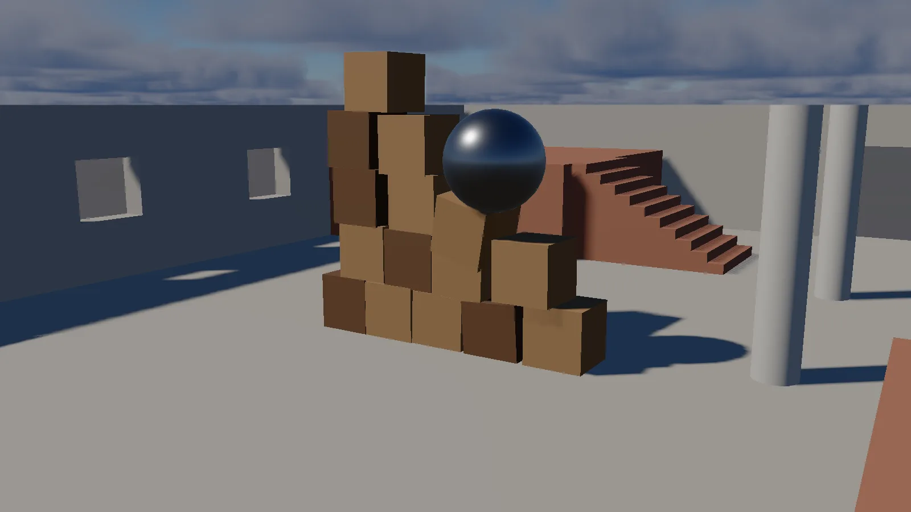

LAB uses Jolt Physics. The simulation runs **only while playing** — the physics world is
built when you press Play and torn down when you press Stop, on a *copy* of your scene, so
nothing that happens during a simulation touches what you authored.


*Fifteen dynamic crates and a 60 kg ball, about 1.7 seconds after pressing Play.*

## Making something physical

An entity is simulated when it has **both** a Rigid Body and a Collider. Either one alone
does nothing:

- A Collider with no Rigid Body is ignored entirely.
- A Rigid Body with no Collider has no shape to collide with, so it is ignored too.

### Body types

| Type | Moves | Collides | Use for |
|---|---|---|---|
| **Static** | Never | Yes | Floors, walls, level geometry |
| **Dynamic** | Simulated | Yes | Anything that should fall, roll, or be pushed |
| **Kinematic** | Only when you move it | Yes, and pushes dynamics | Platforms, doors, anything on rails |

Static is the default, which means a freshly added rigid body will not fall until you change
it. That is deliberate — most bodies in a level are scenery.

### Collider shapes

| Shape | Uses | Notes |
|---|---|---|
| **Box** | Size | The cheapest and most predictable |
| **Sphere** | Radius | The only shape that rolls convincingly |
| **Capsule** | Radius, Height | Stands up along Z. What characters use |
| **Mesh** | The entity's mesh | Exact but expensive; use it for static geometry |
| **Convex Hull** | A mesh's vertices, shrink-wrapped | A solid, so it works on a dynamic body too. By default the entity's own mesh; a smaller hand-made or Blender-made hull can be named under **Collision Mesh**. See [Blender](../02-building-worlds/06-blender.md#collision-hulls) |

Colliders draw as wireframe when **Colliders** is ticked in the viewport's **Overlays**
popup. While playing, what is drawn comes from Jolt's own live bodies — including any
clamping the shape builder applied to a degenerate size — coloured green (awake) or amber
(asleep); stopped, it previews the authored components instead, in blue, and the selected
entity's collider draws pink either way.

## Tuning a body

| Setting | Effect |
|---|---|
| **Mass** | Heavier bodies are harder to push and shove lighter ones aside |
| **Use Gravity** | Off makes a body weightless without making it kinematic |
| **Gravity Scale** | Per-body multiplier. 0 floats, 2 is heavy, negative falls upward |
| **Restitution** | Bounciness. 0 dead, 1 returns to drop height |
| **Friction** | 0 is ice. Values above 1 are legal and grip harder |
| **Linear Damping** | Speed bled off per second. This is drag, and it is the honest way to cap a fall |
| **Angular Damping** | The same for spin |
| **Lock Position / Rotation** | Per-axis constraints, solved properly rather than by zeroing velocity afterwards |

### Two things that catch everyone

**Surface properties combine between the two bodies in contact.** Jolt takes the geometric
mean, so a bouncy ball on a dead floor is only half as bouncy as the ball alone. Setting one
side is rarely enough.

**A sphere that will not roll is friction or a rotation lock, not a bug.** Rolling comes from
friction at the contact point — `Friction: 0` on *either* the ball or the ground makes it
slide — and locking any rotation axis stops the spin that a roll needs. The scene
`Dev/Tests/assets/scenes/roll_test.Lscene` runs the same push against all three cases if you want to see
it.

## Scene physics settings

Found in **Project Settings → Scene Physics**. These are stored in the scene, not the
project, and changes apply immediately while playing.

| Setting | Default | Meaning |
|---|---|---|
| **Gravity** | (0, 0, -9.81) | LAB is Z-up, so Earth gravity is negative Z |
| **Gravity Scale** | 1.0 | Scales the whole world, so a scene can be made floatier without retyping a direction |
| **Terminal Velocity** | 0 (off) | A hard speed cap applied after every step |

Terminal velocity is the blunt instrument. Real terminal velocity comes from drag, which a
body's **Linear Damping** models properly. Use the cap when something fast must not tunnel
through the level no matter what.

## Triggers

Tick **Is Trigger** on a Collider to turn it into a volume that detects what enters it
without stopping anything. Things pass straight through and you get *overlap* events instead
of *collision* events.

A trigger only notices **moving** bodies. A static wall sitting inside a trigger reports
nothing, because nothing ever happens there.

## Character controllers

A **Character Controller** component is what a player uses instead of a Rigid
Body/Collider pair. A dynamic capsule tips over, slides down ramps it should walk up,
bounces off steps, and accelerates on ice — all correct physics, and all wrong for
something a person is steering. A character controller sweeps a capsule through the world
under direct control instead, so it walks up **Step Height**-tall kerbs, slides rather than
climbs anything steeper than **Max Slope Angle**, and can shove dynamic bodies aside with
**Push Force** without ever being pushed back itself.

**It replaces the Rigid Body/Collider pair, not joins it.** An entity with both would have
two representations in the physics world fighting over one transform. See
[Components](../02-building-worlds/02-components.md) for every field.

Drive it from a script:

```lua
function on_update(dt)
    local move = vec3.new(input.get_key_axis("A", "D"), input.get_key_axis("S", "W"), 0)
    entity:move(move * speed)              -- horizontal only; gravity/jump own vertical

    if input.is_key_pressed("Space") and entity:is_grounded() then
        entity:jump(6)
    end
end
```

`entity:jump(speed)` returns whether it actually jumped — refused in mid-air, which is the
difference between a jump and flight. `entity:is_grounded()` and
`entity:get_ground_normal()` read the state the physics step already wrote, so they work
even outside Play mode (reporting the last thing the character stood on). See
[Lua Scripting](../06-scripting/02-lua/index.md) for the full character-controller API.

## Constraints and joints

A **Constraint** component physically links this entity's body to another one, or to the
world. Doors, lids, levers, swings, chains and rope are all this component with a
different **Type**: `Fixed` welds two bodies together, `Point` is a ball joint, `Hinge`
turns about one axis (optionally limited, in degrees), `Slider` travels along one axis
(optionally limited, in metres), and `Distance` keeps two bodies within a range of
distances apart — a rope or a spring.

Leave **Connected Entity** unset to attach to the world: a hinge with no partner is a door
mounted in a wall, which is the common case, not an error. See [Components](../02-building-worlds/02-components.md)
for every field, including **Anchor**/**Connected Anchor** (where the joint sits, in each
body's own local space) and **Axis** (what a Hinge turns about or a Slider travels along).

## Physics from scripts

The full API is in [Lua Scripting](../06-scripting/02-lua/index.md). The short version:

```lua
-- Forces and impulses
entity:add_force(vec3.new(0, 0, 500))       -- continuous, mass-dependent
entity:add_impulse(vec3.new(0, 0, 10))      -- instantaneous kick
entity:add_torque(vec3.new(0, 0, 5))

-- Velocity
local v = entity:get_velocity()
entity:set_velocity(vec3.new(0, 0, 5))

-- Sleeping
if entity:is_sleeping() then entity:wake_up() end

-- Raycast: origin, direction, max distance, [entity to ignore]
local hit = physics.raycast(entity:get_position(), vec3.new(0, 0, -1), 10, entity)
if hit.hit then
    log.info("hit " .. hit.entity:get_name() .. " at " .. hit.distance)
end

-- World gravity
physics.set_gravity(vec3.new(0, 0, -3))
physics.set_gravity_scale(0.5)
```

`physics.raycast` returns a table. On a miss it is just `{ hit = false }`; on a hit it also
carries `entity`, `position`, `normal` and `distance`. Outside play mode there is no world,
so it always misses.

### Shape casts and overlaps

A raycast is a line with no thickness, which misses a lot a real character or projectile
would not. Sweep a shape instead:

```lua
-- Swept shapes: same return shape as raycast
local hit = physics.sphere_cast(0.5, origin, direction, maxDistance, entity)
local hit = physics.capsule_cast(radius, height, origin, direction, maxDistance, entity)
local hit = physics.box_cast(halfExtent, origin, direction, maxDistance, entity)

-- Overlaps: everything touching a shape right now, as an array of entities
local touching = physics.overlap_sphere(radius, position, entity)
local touching = physics.overlap_capsule(radius, height, position, entity)
local touching = physics.overlap_box(halfExtent, position, entity)
```

The trailing entity argument on every one of these is the caster to ignore, same as
`raycast`'s fourth argument — leave it out and a shape cast starting inside its own caster
hits itself immediately.

### Collision layers

`entity:get_layer()` / `set_layer(layer)` read and write which collision layer a body is
on — what a layer collides with is the scene's own layer matrix, not something an entity
decides for itself. The layer is baked into the body at creation, so setting it on a live
body during Play rebuilds the body rather than silently doing nothing until the next run.

### Contact callbacks

A script on an entity with a body can define any of:

```lua
function on_collision_begin(other) end
function on_collision_end(other) end
function on_overlap_begin(other) end    -- triggers only
function on_overlap_end(other) end      -- triggers only
```

`other` is the entity on the far side of the contact.

### Moving a physics body by hand

If a script sets the position of an entity with a dynamic body, the engine records the
change so the next simulation step does not overwrite it. This works — but a dynamic body
that is also being teleported will fight the solver. For anything on rails, make the body
**Kinematic** instead.

## Test scenes

| Scene | Exercises |
|---|---|
| `Dev/Tests/assets/scenes/physics_test.Lscene` | Basic falling and collision |
| `Dev/Tests/assets/scenes/roll_test.Lscene` | Friction and rotation locks |
| `Dev/Tests/assets/scenes/trigger_test.Lscene` | Trigger volumes and overlap events |
| `Dev/Tests/assets/scenes/physics_script_test.Lscene` | Scripts moving physics-backed entities |
| `Dev/Tests/assets/scenes/physics_mesh_test.Lscene` | Mesh colliders |
| `Dev/Tests/assets/scenes/physics_convex_hull_test.Lscene` | Convex hull colliders: own mesh, a separate hull mesh, a missing one, a dense one |
| `Dev/Tests/assets/scenes/physics_api_test.Lscene` | Forces, impulses, raycasts, gravity |

An AI character moves through this same simulation: [Navigation and AI](03-navigation-and-ai.md)
covers the navmesh, the Nav Agent and the AI Controller, and how an agent is steered *through* a
character controller rather than around it.
