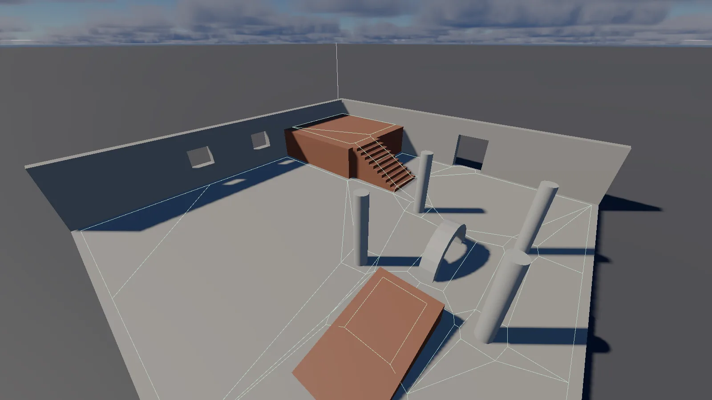

Two things make an entity go somewhere on its own: a **baked navmesh** that says where it can
walk, and a **behaviour tree** that decides where it wants to go.

Navigation is a **NavMesh Volume** placed over part of a level, a **Bake Navmesh** button, and
the `.Lnavmesh` file it writes. AI is an entity with an **AI Controller** whose tree of states,
tasks and transitions is authored in the editor. An entity that actually walks has a **Nav
Agent** as well: the tree, or a script, gives it a destination, the scene's own nav update
follows the navmesh to it, and the physics step pushes it through the world.

Everything here simulates **only while playing**, with one deliberate exception: the navmesh
itself stays loaded after Stop, so its wireframe can be drawn in the editor while you author.

## What navigation is not

The shape of it first, because these are the things people expect and do not get:

- **No dynamic obstacle avoidance.** An agent follows the corridor it planned; it does not see
  other agents, the player, or a door that just closed. A route planned through a space that
  is now occupied stays planned through it. A character-controller agent still collides with
  the world physically, so it can be stopped by something its plan did not know about.
- **Off-mesh links are authored, never found.** Two areas not joined by continuous walkable
  floor are joined only by a [Nav Link](#nav-links) someone placed. Nothing detects a jumpable
  gap on its own, and there are no doors that open and close a link.
- **No cost areas or per-polygon flags.** Every polygon a bake produces is plain walkable
  ground.
- **One volume, one navmesh.** A scene loads the first NavMesh Volume that has a baked asset;
  multiple volumes are not tiled or streamed terrain.
- **No navmesh queries beyond `move_to`.** No raycast against the mesh, no nearest-point
  query, no way to ask what path was planned. The calls that do exist are on
  [entity AI](../06-scripting/02-lua/api/entity/14-ai.md).
- **Agents move horizontally.** Only x and y are driven, so rising ground does not carry an
  agent up a slope by itself.
- **Trees cannot be authored from a script.** Lua and C++ can read a running tree and inject
  values into it; the structure is built in the editor.

## Placing a NavMesh Volume

Add a **NavMesh Volume** component to an entity (Add Component, or a new entity of your own).
The entity's position is the centre of the region, its **Extent** the half-size of the box
around it. Rotation and scale are ignored: the bake, and the green box the overlay draws, are
translation only.

| Field | Meaning |
|---|---|
| **Extent** | Half-extents around this entity's position. Static collision geometry inside the box is what bakes. Default `(20, 20, 10)` |
| **Cell Size** | Recast's horizontal voxel size in metres. Smaller samples detail more finely and costs more |
| **Cell Height** | The vertical voxel size |
| **Agent Radius** | How far the walkable area is eroded from every wall and edge, so a body this wide fits |
| **Agent Height** | Headroom an agent needs |
| **Agent Max Climb** | The tallest step it can step up |
| **Agent Max Slope** | The steepest floor it will walk on, in degrees |
| **Baked** | The `.Lnavmesh` last baked from this volume, or `never` |

The defaults describe a human-sized agent in a metres-per-unit scene and are right until they
are not. Two things are worth setting deliberately: **Agent Radius** must be at least as wide
as the widest character that walks here, or the bake leaves corridors a character cannot fit
through; and **Agent Max Slope** is what decides whether a ramp is floor or a wall.

Press **Bake Navmesh** to run the bake. It is synchronous, so a large volume can take a
moment. On success it:

- writes `navmeshes/<the entity's tag>.Lnavmesh` under the project's assets
- logs a line like `Baked navmesh 'navmeshes/NavMeshVolume.Lnavmesh': 214 vertices, 61 polygons`
- points this volume's **Baked** row at the file
- reloads the scene's navmesh from it, so the overlay updates immediately

A bake is never automatic. Nothing watches the level and re-bakes when you move a wall: unlike
a reflection capture, walking a whole volume's static geometry is a deliberate action. Move or
add geometry and press the button again. Re-baking overwrites the same file in place, so the
asset the scene ships with is always the last bake. Rename the entity first and you get a
second file beside the first, because the name comes from the tag.

Watch it with **Overlays → NavMesh** in the viewport toolbar. With the overlay on, every
NavMesh Volume draws its authored box (green, pink while selected), which is what a bake will
read, and once a navmesh is loaded its polygon wireframe draws over the floor. The wireframe
works in edit mode too, unlike the play-mode-only overlays.

## What gets baked


*A baked navmesh shown with the **NavMesh** overlay. The polygons step around each column (the agent radius) and climb the stairs to the terrace.*

The bake walks every entity in the scene with a **static Rigid Body and a Collider**, and
turns each collider into triangles:

| Collider shape | Baked as |
|---|---|
| **Box** | The box, at the entity's world transform |
| **Sphere** | The sphere |
| **Capsule** | The capsule, standing along Z |
| **Mesh** | The entity's mesh, transformed into the world, vertex for vertex |

The walk is the whole scene, not just what is inside the box: Recast clips against the
volume's own bounds for free, so geometry outside simply contributes nothing. That is fine at
level-test scale; it is not a hint to bake across an open world.

What is *not* read:

- **Dynamic and kinematic bodies.** Anything that moves is not level geometry. A dynamic
  prop that happens to be sitting on the floor at bake time is invisible to the bake, and so
  is a kinematic platform.
- **Colliders with no rigid body,** which physics ignores anyway.
- **A mesh collider with no mesh on the entity** (or an empty path), which contributes
  nothing.
- **The trigger flag.** A static collider marked **Is Trigger** is baked like any other
  static shape, so review your trigger volumes if a mysterious obstruction appears.

The volume's Recast parameters do the rest. The generated surface is a corridor grid of
polygons eroded by **Agent Radius**, with ledges below **Agent Height** and steps under
**Agent Max Climb** handled as Recast handles them, and everything steeper than **Agent Max
Slope** left out. Every polygon comes back flagged walkable, with no costs or special areas
to author.

Under the hood LAB is Z-up and Recast is Y-up. The conversion is a proper rotation about X,
not an axis swap, which is what keeps triangle winding intact so a floor reads as a floor
rather than a ceiling.

## Nav Links

A **Nav Link** joins two pieces of walkable ground the bake cannot join itself: a gap to jump,
a ledge to drop off, a ladder. Add it to any entity. The link starts at the entity's position
and ends at **End**, which is in the entity's own space, so moving or turning the entity moves
both ends.

| Field | Default | Meaning |
|---|---|---|
| **End** | (3, 0, 0) | Where the link lands, relative to the entity |
| **Bidirectional** | on | Off for a one-way link, such as a drop that cannot be climbed back up |
| **Radius** | 0.5 | How far from each end the bake looks for walkable ground to attach it to |
| **Arc Height** | 1 | How high a crossing rises above the straight line between the ends. 0 is a straight line, for a ladder |

A link is baked into the navmesh, so **re-bake after placing, moving or changing one**. Both
ends must be inside the NavMesh Volume and within **Radius** of walkable ground. A link with an
end outside the volume is left out of the bake with a warning in the log, and an end too far
from the ground is left unconnected, so no path uses it.

A path that uses a link walks to its start and then **crosses** it: the agent follows an arc
from one end to the other, at its own Speed, and walks on from where it lands. A Character
Controller agent is carried along the arc directly, so gravity and its collision with the
ledge do not cut the jump short. A script can ask `entity:is_on_nav_link()` to play a jump or
a climb for exactly as long as the crossing lasts. A crossing always finishes: a new
destination or `stop_moving` mid-jump takes effect when the agent lands.

With **NavMesh** on in the viewport's overlay menu, every link draws as the arc an agent
follows, in orange, with a post at each end. A one-way link's landing post is twice as tall.

## The Nav Agent

A **Nav Agent** is a mover, not a brain: it wants a destination, and something else provides
one. Its authored fields:

| Field | Default | Meaning |
|---|---|---|
| **Radius** | 0.4 | The agent's width. Must not exceed the volume's own Agent Radius, or the agent can be routed through gaps narrower than it is |
| **Height** | 1.8 | The agent's height |
| **Speed** | 3.5 | Metres per second |
| **Acceleration** | 8 | Metres per second squared |
| **Stopping Distance** | 0.15 | Arrived once within this of the final corner |

A live **State** row under them reads Idle, Moving, Arrived or Failed while playing. Nothing
about the current path is saved with the scene: a destination without the path that produced
it is meaningless in a file, so `Target`, the corner list and the state start fresh every run.

Two things set a destination. A script calls `entity:move_to(target)` (see
[entity AI](../06-scripting/02-lua/api/entity/14-ai.md) for the full call), or a behaviour tree's **Move
To** task asks for one. Either way the planning happens at that moment and the movement
happens later, in the scene's own update: once per frame, before the physics step, every agent
with an active path is steered toward its next corner.

- **Following:** advance past a corner once within 0.3 m of it, brake over the final approach,
  and report Arrived within **Stopping Distance** of the last corner. Nothing re-plans along
  the way.
- **With a Character Controller**, the agent is moved by setting the controller's move
  velocity, and the physics step that follows resolves the actual motion, collisions included.
- **Without one**, the entity's transform is advanced directly. That is a teleporting mover,
  not a physically simulated one: it can be steered through anything.
- An entity with no Nav Agent at all gets one with its defaults the moment a Move To task or
  `move_to` call targets it.

For the script calls that read and cancel a move, `is_move_complete` and `stop_moving`, see the
same page. What no call does is change Radius, Speed or the other authored fields: those are
edited in the Properties panel.

## The AI Controller and the AI State Tree

An entity with an **AI Controller** component runs a behaviour tree: states it sits in, tasks
it performs while there, and conditioned transitions that move it between them. The component
shows a **Current** line while playing (`Current: MoveToTarget (tasks complete)`), an **Asset**
field, the asset buttons, and **Open State Tree Editor**.

The tree the entity runs is **inline component data**, saved in the `.Lscene` with everything
else. The **Asset** field and its buttons are how a tree is shared with other entities:

- **New Behavior Tree...** creates a blank `.Lbehavior` under `behaviors/` and points the
  field at it. This entity's own tree is untouched until the next button.
- **Load From Asset** overwrites this entity's tree with the file's, and resets its current
  state.
- **Save To Asset** writes this entity's tree out to the file.

Loading is a **copy**, not a live link: two entities loaded from one asset start from the same
tree and then own separate trees, blackboards included. Editing the asset changes nothing
until an entity loads it again. That is deliberately unlike an Animator, which references its
`.Lanimgraph` and shares it outright.

The **AI State Tree** panel is a window bound to one entity's component, and it closes by
itself if that entity or component goes away. There is no menu entry for it: it opens from
**Open State Tree Editor** on the AI Controller.

The panel is three columns. On the left, the **outliner** lists every state (the entry state is
marked `*`), with that state's own outgoing transitions nested under it and a summary of their
conditions, plus a synthetic **[Any State]** group at the bottom for transitions that can fire
regardless of the active state. Right-click a state to **Set As Entry** or **Delete**; **+ Add
State** adds one. In the middle, the **inspector** for the selected state has its name and four
lists:

| List | When it runs |
|---|---|
| **Enter Tasks** | Once, on the way into the state |
| **Tick Tasks** | Every tick while the state is active, all of them, in list order |
| **Exit Tasks** | Once, on the way out |
| **Enter Conditions** | All must hold, in addition to a transition's own conditions, for a transition to be allowed to land here |

Below those, the transitions out of this state, each with a destination dropdown and its own
conditions list (**+ Add Transition**, **+ Add Condition**). On the right, the **Blackboard**
sidebar holds the tree's named parameters, with **+ Add Parameter**.

Two things the panel does not do: it has no undo stack of its own (Ctrl+Z is ignored while it
is focused, rather than undoing an unrelated entity edit), and it edits the tree in place, so
what you keep is what the scene saves, or what you press **Save To Asset** to write out.

A tree with no states does nothing at all. Add at least one before wondering why an AI
Controller is silent.

## Tasks, conditions and the blackboard

A **task** is one step in a state. Every built-in task is in the task list's dropdown, with its
parameters laid out under it:

| Task | Parameters | What it does |
|---|---|---|
| **Wait** | Seconds | Running until the state has been active that long, then Succeeded |
| **Move To** | Target | Plans a path to the target and follows it. Succeeded on arrival, Failed if no navmesh is loaded or no path exists |
| **Rotate Towards** | Target, Speed (deg/s) | Turns the entity toward the target at that rate, Succeeded within a degree of it |
| **Set Blackboard Value** | Parameter, Value | Writes a blackboard parameter |
| **Set Anim Parameter** | Parameter, Value | Writes an animation graph parameter on the entity's Animator, the bridge to its locomotion/attack states. Failed with no Animator |
| **Play Sound** | Clip | Plays a clip at the entity, once. A blank Clip uses the entity's own Audio Source clip |
| **Stop Moving** | none | Cancels the agent's path, and zeroes a character controller's horizontal velocity so it does not coast on |
| **Teleport To** | Target | Writes the position in one tick. No navmesh needed; a discontinuity, for spawns and snaps |
| **Custom Script** | Graph | The task is a `.Lgraph` or `.lua` file. See below |
| **Native Script** | Function | The task is a function this project's native module exported, called every tick with the entity and the frame's delta time, answering a status as a number (0 Running, 1 Succeeded, 2 Failed). An unknown function is a failure, logged |

A **target** parameter takes a point in the world, or a reference to an entity whose current
position is read fresh every tick. In the panel a target slot is a vector field; pointing it
at an entity is done by binding it (next section) to an `EntityRef` parameter.

A **condition** is what lets a transition fire: all of a transition's conditions must hold, and
so must the destination state's own Enter Conditions.

| Condition | Parameters | True when |
|---|---|---|
| **Compare Blackboard** | Parameter, Operator, Threshold | the named parameter compares true against the threshold |
| **Timer Expired** | Seconds | the state has been active at least that long |
| **Random Chance** | Probability | rolled fresh every time it is checked, so 0.1 is a per-tick chance rather than one coin flip |
| **State Tasks Complete** | none | every Tick Task in the state finished (Succeeded or Failed), as of the previous tick |
| **Distance To** | Target, Operator, Threshold | the distance from this entity to the target compares true |
| **Entity In Range** | Radius, Write To | something is within the radius; optionally writes the first entity found into the named parameter, so a later task can act on who it was |

Operators are `==`, `!=`, `>`, `<`, `>=`, `<=`, picked from a dropdown in the two conditions
that have one.

Transitions are checked in the order they were added, and the first one whose source state
matches (or is **Any State**) and whose conditions all hold wins. A wildcard only gets its turn
after the transitions authored before it, so add specific ones first and catch-alls last.

### The blackboard

Blackboard parameters are named, typed values (Float, Bool, Vec3, EntityRef, String), each with
a default. They are the tree's memory and its wiring:

- **Compare Blackboard** reads one; **Set Blackboard Value** writes one; **Entity In Range**
  can write the entity it found into one.
- Every parameter field on a task or condition can be a fixed value (the default) or
  **bound** to a blackboard parameter. The small `=` button next to a field toggles it to `P`
  and turns the field into a parameter picker. A bound field is re-read fresh every tick, so
  it tracks a moving target or a value another task just set, instead of freezing at whatever
  it held when authored.
- Scripts read and write the same values with `entity:ai_get_blackboard` and
  `entity:ai_set_blackboard`, which is how a perception script outside the tree tells it
  something. See [entity AI](../06-scripting/02-lua/api/entity/14-ai.md).
- An `EntityRef` parameter holds an entity's stable id, and the panel's field takes that
  number directly (there is no picker yet; a script reads the id with `entity:get_id()`).
  **Entity In Range** is what fills one with an entity it found.

A parameter name that does not exist is never an error: reads answer 0 and writes answer false.
A typo in a Compare Blackboard condition is therefore a condition that quietly never holds.

### Custom Script tasks

**Custom Script** is the escape hatch. Instead of a built-in behaviour it names a **`.Lgraph`**
or a plain **`.lua`** file, and that script *is* the task: it is loaded when the task first
ticks, its `on_update(dt)` runs every tick while the state is active, and it decides when the
task is done by calling `ai.set_task_status("succeeded")` or reporting through the node
editor's **Task Succeeded** / **Task Failed** nodes (node category **AI**). Reporting a
terminal status unloads it, and re-entering the state loads a fresh copy rather than resuming.

The full lifecycle, the status values and the escape hatches around it are on
[Behaviour trees](../06-scripting/02-lua/api/ai/01-behaviour-trees.md). The module-side twin of a Custom
Script task is **Native Script**; the module API around it is on
[Navmesh and behaviour trees (C++)](../06-scripting/03-cpp/api/ai/01-navmesh-and-behaviour-trees.md).

## Running it in Play mode

The tick order is the whole story of how a tree drives an agent, and it is worth knowing:

1. **Behaviour trees tick**, at the top of the frame's runtime update. Every entity with an AI
   Controller evaluates its own tree.
2. **Nav agents are steered**, immediately after. A Move To task that planned a path in step 1
   is followed here.
3. **Physics steps**, consuming the character-controller moves the agents just set.
4. **Scripts run.** Every `on_update` in the scene comes after all of the above.

On a tree's first tick it enters its entry state (running that state's Enter Tasks), then every
tick: check transitions in order, and if one fires, run the current state's Exit Tasks, switch,
and run the new state's Enter Tasks; then run every Tick Task in the current state. **State
Tasks Complete** is computed from the Tick Tasks, and it reflects the tick *before*, because
transitions are checked before the current tick's tasks run: a Move To that arrives this frame
moves the tree on the next one.

Because that condition treats Succeeded and Failed alike, a movement state can be left as
easily by a failure as by an arrival. And because Enter Tasks and Exit Tasks are run for their
side effects only (their status is discarded, and they are not polled by State Tasks Complete),
a **Move To parked in Enter Tasks will never hold its state open**; put it in Tick Tasks if the
tree is supposed to wait for the arrival.

That gives the one ordering trap this subsystem is really made of:

> **The tree ticks on frame one, before anything in the frame, and before any script's
> `on_update`.** A scene whose navmesh is only loaded or baked later in the frame has a Move To
> in the entry state ask for a path on frame one, find no navmesh, fail immediately, and satisfy
> State Tasks Complete with that failure. The tree walks straight past the movement state and
> the agent never moves, while the tree looks like it worked.

The fix is to have the navmesh ready before the first tick: ship the scene with **Baked** set
(press Bake and save), or bake from `on_create`, which runs on the way into play, before frame
one. Scripts can bake too, with `scene.bake_navmesh(volume)`, which writes the file on disk
like the button does. The subsystem's own tree tests bake in `on_create` for exactly this
reason; the navmesh test, which has no tree to race, bakes later on purpose.

## A worked example

The engine's own scenes are the worked example, and they cover the pieces separately (see the
tests table below). The short form, from an empty scene:

1. **Make the floor walkable.** An entity with a **Rigid Body** (Static) and a **Collider**
   (Box, sized to the floor). A wall is another static box. The bake reads these colliders, not
   the visuals, so a mesh without a collider under it is invisible to navigation.
2. **Place a NavMesh Volume** at the middle of the play area, with an **Extent** that covers
   the floor and the wall. Leave the rest at their defaults, but note that the volume's Agent
   Radius is the width the corridors will be carved at.
3. **Bake.** Press **Bake Navmesh**, read the log line, and turn on **Overlays → NavMesh** to
   see the polygon wireframe coincide with the floor.
4. **Build the agent.** An entity with a mesh, a **Character Controller** (so it collides),
   a **Nav Agent**, and an **AI Controller**.
5. **Author the tree.** **Open State Tree Editor** on the AI Controller. **+ Add State** twice,
   naming the first `MoveToTarget` and the second `Done`. In `MoveToTarget`, **+ Add Task** →
   **Move To**, and set its Target vector. In `Done`, add a **Set Blackboard Value** writing
   `1` into a parameter you add in the Blackboard sidebar. Back in `MoveToTarget`, **+ Add
   Transition** with destination `Done`, and give it a **State Tasks Complete** condition.
6. **Save the scene and press Play.** The agent walks the corridor, the AI Controller's
   Current line reads `MoveToTarget`, the Nav Agent's State goes Moving, then Arrived, and the
   tree moves to `Done`.
7. **Share the tree** if a second agent needs the same behaviour: **Save To Asset**, then
   point the second entity at the file and **Load From Asset**.

A script can drive an agent without any tree, which is the other half of
[entity AI](../06-scripting/02-lua/api/entity/14-ai.md):

```lua
function on_create()
    -- This runs before frame one, so the path is ready when the nav update first fires.
    entity:move_to(vec3.new(8, 0, 0.4))
end

function on_update(dt)
    if entity:is_move_complete() then
        log.info("arrived")
    end
end
```

With a tree on the entity as well, `entity:ai_current_state()` and the blackboard calls are how
a script watches what the AI decided, or tells it something new.

### Test scenes to read

| Scene | Test | Exercises |
|---|---|---|
| `Dev/Tests/assets/scenes/navmesh_test.Lscene` | `Dev/Tests/assets/tests/navmesh_pathfind.lua` | A bake, then a script-steered agent detouring around a wall |
| `Dev/Tests/assets/scenes/navmesh_test.Lscene` | `Dev/Tests/assets/tests/navmesh_volume_overlay.lua` | The volume's own box drawn before any bake, and the overlay switching off |
| `Dev/Tests/assets/scenes/navlink_test.Lscene` | `Dev/Tests/assets/tests/navmesh_links.lua` | A one-way Nav Link across a gap and up a ledge: the crossing's arc, the landing, and the refused way back |
| `Dev/Tests/assets/scenes/behaviortree_test.Lscene` | `Dev/Tests/assets/tests/behaviortree.lua` | A two-state tree moving an agent, transition on State Tasks Complete, blackboard write |
| `Dev/Tests/assets/scenes/ai_preset_tasks_test.Lscene` | `Dev/Tests/assets/tests/ai_preset_tasks.lua` | Set Anim Parameter, Play Sound, an interrupted Move To, Stop Moving, Teleport To |
| `Dev/Tests/assets/scenes/custom_script_task_test.Lscene` | `Dev/Tests/assets/tests/ai_custom_script_task.lua` | A Custom Script task reporting its own success |
| `Dev/Tests/assets/scenes/native_ai_task_test.Lscene` | `Dev/Tests/assets/tests/native_ai_task.lua` | A Native Script task answered by a compiled module |
| `Dev/Tests/assets/scenes/allcomponents_test.Lscene` | `Dev/Tests/assets/tests/ai_state_tree_panel.lua` | The AI State Tree panel opened on a real tree |

## Troubleshooting

**Bake Navmesh reports no walkable polygons.** Recast found no floor it would call walkable
inside the volume's box. In rough order of likelihood: nothing inside the box is a static
rigid body with a collider; the volume does not cover the floor (Extent is a *half*-size, and
the entity's position is the centre); the floor is steeper than Agent Max Slope; the only
colliders there belong to dynamic bodies. The log line says which of these, or
`volume extent / cell size produces an implausible grid` if the volume is more than 8000 cells
across at the current Cell Size.

**`move_to` answers false, or a Move To task fails immediately.** Either no navmesh is loaded
(the volume's **Baked** row says `never`, or its file is missing from `navmeshes/`), or the
destination is nowhere near the mesh (both ends snap to the nearest polygon within a metre
horizontally and four vertically, and a destination nowhere near one fails), or no path
connects the two points. Turn on the NavMesh overlay and look: separate islands show as
separate wireframes, and a gap the bake eroded away is exactly what Agent Radius does.

**The tree walks past its movement state and the agent never moves.** The frame-one trap
above. It is almost always a navmesh that is loaded later than the tree's first tick, whether
because the scene was never shipped with a bake or because the bake happens from an
`on_update`.

**The tree sits in a state forever.** Look for a Tick Task that never finishes: a Wait with a
long countdown, a Move To whose agent is physically stuck against geometry the plan did not
know about, or a Custom Script that never reports a status. Then look at the transition: a
condition comparing a blackboard parameter that does not exist (a renamed or mistyped name)
reads 0 and simply never holds, silently.

**The agent arrives, then nothing happens.** The transition probably expects something the
tree never gets: check the destination's **Enter Conditions** as well as the transition's own,
and remember State Tasks Complete only watches **Tick Tasks**, not Enter or Exit tasks.

**The agent stops slightly short of where you sent it.** That is **Stopping Distance** doing
its job: arrival is judged at the final corner within that distance, and the agent brakes over
the final approach so it does not overshoot. Tighten it on the Nav Agent if you need the stop
to be neater.

## See also

- [Components](../02-building-worlds/02-components.md) — every component and its fields
- [Physics](01-physics.md) — colliders, bodies and character controllers, which is where the
  bake's geometry comes from and what a moving agent collides with
- [Play Mode](../01-getting-started/04-play-mode.md) — what starts and stops on Play
- [Behaviour trees (Lua)](../06-scripting/02-lua/api/ai/01-behaviour-trees.md) — `ai.set_task_status`,
  task scripts and their lifecycle
- [entity AI (Lua)](../06-scripting/02-lua/api/entity/14-ai.md) — `move_to` and the tree inspection calls
- [Navmesh and behaviour trees (C++)](../06-scripting/03-cpp/api/ai/01-navmesh-and-behaviour-trees.md) —
  the same ground from a native module
