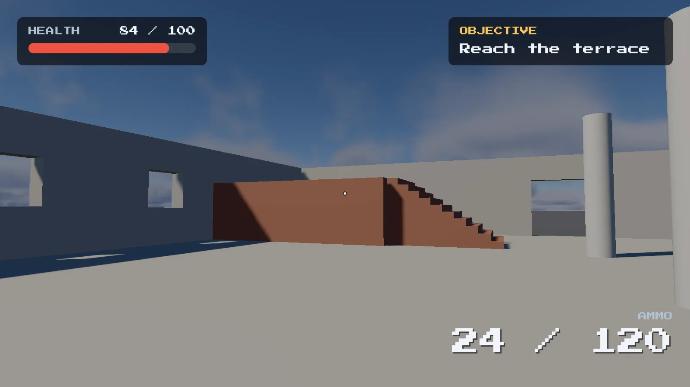

A HUD in LAB is **screen space**: every element is pinned to the viewport, or to another
element's rectangle, and drawn over the finished image. Nothing in it follows the camera, and
nothing in it is lit or tonemapped — it is composited after tonemapping, so a colour you author
is the colour you see, and its pixels are not fed into TAA history either.


*A HUD of panels, labels and a bar. The objective panel and ammo counter are anchored to the right, so they stay in the corner at any resolution.*

**The HUD is always drawn at the display's own resolution**, on top of the finished image. Retro
resolution ("Yvann mode") and `render.scale` upscaling change what the 3D scene is rendered at and
how it is stretched to the screen; the HUD is laid out and drawn afterwards, at the size of the
window or viewport, so it stays sharp under a 480p retro look and is never blurred by TAAU. It also
means the HUD scale (viewport height over the UI reference height, below) does not shrink when the
internal render resolution does, and `ui.size()`, `get_ui_rect` and `measure_text` report
display-resolution numbers.

An entity becomes a HUD element by carrying a **UI Transform plus a Sprite or a Text**, and that
pairing is the single rule the rest of this chapter rests on. A Sprite or a Text without a UI
Transform is authored but never drawn; a bare Sprite on its own is reserved for a future
world-space billboard path that does not exist yet.

The editor's viewport composites the HUD too, not only Play mode, so you can place an element
and watch where it lands without pressing Play.

## What a HUD is not

- **No layout engine.** There is no flow and no auto-size to content. An element can stretch
  with its parent (see [Anchors](#anchors-points-and-stretching)), but every element still gets
  its own anchors, offsets and size, and relative parenting moves a group rather than arranging
  one. Sizing a panel around its text is a call, not a layout: `measure_text` reports the size,
  `set_ui_size` applies it.
- **No world-space UI.** Nothing anchors to a 3D position, and nothing rotates or scales with the
  scene. The HUD is one flat layer drawn over the frame.
- **Colour is the only rich text.** With Rich Text on, a Text can colour spans, and a terminal
  can make them clickable links (see [Rich text](#rich-text)). There is still one font size and
  one font (and its fallbacks) for the whole project: no bold, italic or size changes inside a
  string.
- **No shaping.** Characters are drawn one glyph each, left to right: no ligatures, no kerning,
  no right-to-left or complex scripts (Arabic, Hebrew, the Indic scripts, Thai). Latin, Greek,
  Cyrillic, Chinese, Japanese and Korean draw correctly this way.
- **No shape masking**, with one exception: a relative parent with **Clip Children** cuts its
  children to its own rectangle, which is what a scrolling list is built from.
- **No animation of its own.** A HUD changes only because something writes it: a script while
  playing, or you in the Properties panel.

## Building an element

Start from any entity and add, from the bottom of the **Properties** panel:

1. **Add Component → UI Transform.** This is the component that places the element on screen.
2. **Add Component → Sprite** for a panel, bar, icon or plain rectangle; **Add Component → Text**
   for text. Both on one entity is a panel with its text directly on it.

The element's ordinary **Transform** is not read for the HUD; placement is the UI Transform's
business alone, so there is no reason to move the world transform of a HUD entity.

If a Sprite or a Text finds itself on an entity with no UI Transform, its own panel says so and
nothing draws.

The three panels that matter:

- **UI Transform** opens with the **anchor preset** picker (a grid of sixteen presets), then
  Anchor Min, Anchor Max, Pivot, the offsets and sizes that go with them, Layer, and the Visible,
  Relative, Clip Children and Interactive toggles.
- **Sprite** holds Color, Texture (drag an image from the Asset Browser, or type an
  asset-relative path), Corner Radius, Border Width, Border Color and Softness.
- **UI Line** holds the From and To (an element or a point each), Thickness, Softness and Color,
  see [Lines](#lines).
- **Text** holds the multi-line Text box (Enter starts a new line), Color, Font Size, Alignment,
  Vertical, Wrap, Rich Text, Line Spacing, Outline, Outline Color, Shadow Offset and Shadow Color.

## UI Transform

| Field | Default | Meaning |
|---|---|---|
| Anchor Min | (0, 0) | Where in the viewport the element is pinned, as a fraction: x 0 left to 1 right, y 0 top to 1 bottom. Saved in scene files as `Anchor` |
| Anchor Max | (0, 0) | The far corner of the anchor rectangle. Equal to Anchor Min on an axis: a point there. Different: the element stretches on that axis |
| Pivot | (0, 0) | Which point of the element sits at the anchor, as a fraction of its own Size: (0,0) the top-left corner, (0.5,0.5) the centre. Point axes only |
| Offset | (0, 0) | On a point axis, from the anchor point to the pivot; on a stretched one, from Anchor Min to the left/top edge. UI units |
| Offset Max | (0, 0) | On a stretched axis, from Anchor Max to the right/bottom edge (negative pulls it inward). UI units. The inspector shows it as the Right and Bottom insets |
| Size | 100 × 100 | The element's rectangle, in UI units. On a stretched axis only a cache of the resolved size |
| Layer | 0 | Paint order among HUD elements; a higher Layer draws on top and wins an overlapping pointer hit |
| Visible | on | Off draws nothing and takes no pointer hits |
| Relative | off | Anchor against the parent entity's UI rect instead of the screen; inherits the parent's visibility and layer |
| Clip Children | off | Cut relative descendants to this element's rectangle |
| Interactive | on | Off lets the pointer pass through to whatever is underneath |

**The anchor convention is UI's, not the world's: y runs down.** Anchor (0, 0) is the top-left
corner of the screen, (0.5, 0.5) its centre and (0.5, 1) bottom centre. A positive Offset y moves
the element **down**; a negative one moves it up. The world's +y is forward, and the two are
unrelated.

Read together: the engine takes the anchor point (a fraction of the viewport, or of the parent's
rect for a relative element), moves it by Offset, and places the element so that the point named
by Pivot lands exactly there. Placements worth copying:

- A bar in the top-left: Anchor (0, 0), Pivot (0, 0), Offset (24, 24). The element's own top-left
  corner sits 24 units in from the screen's corner.
- A subtitle at bottom centre: Anchor (0.5, 1), Pivot (0.5, 1), and a negative Offset y to float
  it a little above the edge.
- Something dead centre at any resolution: Anchor (0.5, 0.5), Pivot (0.5, 0.5), Offset (0, 0).
  `hud_test.Lscene`'s sprite is exactly that, so the test can read the centre pixel whatever the
  viewport size.
- A badge in a panel's bottom-right corner that travels with the panel: a **relative** child with
  Anchor (1, 1), Pivot (1, 1), Offset (-20, -20), the shape `ui_layout_test.Lscene` asserts.

## Anchors: points and stretching

The anchor is a rectangle, **Anchor Min** to **Anchor Max**, in fractions of the reference rect
(the viewport, or the parent's rect for a Relative element). Each axis is judged on its own:

- **Point axis** (Anchor Min equals Anchor Max there). One anchor point, and everything above
  applies: Offset from it to the Pivot, an explicit Size. This is the only kind of anchor there
  was before stretching, and what every existing scene loads as.
- **Stretched axis** (they differ). The element's edges are pinned to two anchors, so it grows
  and shrinks with its reference rect:

  ```
  min = ref.min + AnchorMin * ref.size + Offset    * scale
  max = ref.min + AnchorMax * ref.size + OffsetMax * scale
  ```

  Size and Pivot are not used to place it on that axis (the pivot is kept for anything that
  later rotates or scales the element). `scale` is the UI reference height
  factor described below. If the two insets cross, the axis collapses to zero width rather than turning inside out.

A point axis is `min = ref.min + Anchor * ref.size + Offset * scale - Pivot * size`, `max = min + size`.
The two cases mix freely: a bar that spans the screen but is a fixed 40 units tall has Anchor Min
(0, 0), Anchor Max (1, 0), Offset (left inset, 8), Offset Max (minus the right inset, 0) and Size y 40.
A **full-rect** panel, Anchor Min (0, 0) and Anchor Max (1, 1) with zero offsets, always fills its
reference rect. `ui_stretch_test.Lscene` and `ui_stretch_anchors.lua` cover these shapes.

**Size on a stretched axis** is not read for placement, but it is not left to rot either: whenever
the editor or a script writes a placement, Size on a stretched axis is set to what the axis resolves
to. Switching the axis back to a point then leaves the element the size it was on screen.

### Anchor presets

The button at the top of the UI Transform panel shows the element's current anchors as a small
icon; clicking it opens the sixteen presets: nine points (corners, edge middles, centre), three
wide bars (top, vertical centre, bottom), three tall bars (left, horizontal centre, right) and
Full Rect. Hover one for its name. What choosing a preset does depends on the mode picked under
the grid, which is remembered between elements:

| Mode | The element | Anchors | Pivot | Offsets |
|---|---|---|---|---|
| Keep rect | stays exactly where it is on screen | preset's | unchanged | recomputed to compensate |
| Keep rect + set pivot | stays where it is | preset's | preset's | recomputed |
| Snap | moves to the preset | preset's | preset's | zeroed; a point axis keeps its Size, a stretched one fills the anchor span |

The **Anchor Min** and **Anchor Max** fields below are the raw route: they change the anchors and
nothing else, so an element with offsets jumps, exactly like Godot's own fields. Raising Anchor Min
past Anchor Max on an axis drags Anchor Max along, so one anchor point stays a point. To stretch an
axis, raise Anchor Max. A stretched axis shows **Left/Right** (x) or **Top/Bottom** (y) instead of
Offset and Size: the insets from the two anchors, positive inward. The right and bottom insets are
Offset Max negated, so a margin reads as a margin.

### Older scenes

Nothing changes for a scene that never stretches. The file keeps `Anchor` as the key for Anchor Min,
and `AnchorMax` and `OffsetMax` are written **only** when some axis stretches, so an existing scene
saves byte for byte what it did before. A scene with no `AnchorMax` loads with Anchor Max equal to
Anchor Min, a point on both axes.

**UI units and the reference height.** Offsets, sizes, font sizes, corner radii and outlines are
in **UI units**: the pixels a HUD is authored in. **Project Settings → General → UI reference
height** is the viewport height those units were authored for; with it set, everything above is
scaled by the viewport height divided by it, so a layout written for a 1080p reference looks the
same in a small editor viewport and in a 4K window. Left at 0, HUD units are display pixels
(the size of the viewport or window, whatever internal resolution the scene renders at). Scripts always work in UI units, and `ui.size()` hands you the viewport in UI units plus
the scale factor.

## Relative elements

Relative switches an element's reference rectangle from the viewport to its parent entity's own
UI rect, so a panel and everything on it behave as one object:

- **It moves with the parent**, because its anchor fraction is measured against the parent's
  rectangle instead of the screen.
- **It hides with the parent**: visibility is inherited, which is the mechanism a menu is built
  from.
- **Its layer is added to the parent's**, and at the same layer a relative child paints over its
  parent, so a badge lands on top of the panel it is pinned to. Raising the panel's Layer brings
  its whole contents forward.
- **Clip Children** cuts relative descendants to this element's rectangle. Slide the contents by
  offset while the parent clips, and that is a scrolling list.

An element with no parent, or a parent that has no UI Transform, simply anchors against the
screen, so Relative can be left on while the hierarchy is rearranged.

## Layer, depth and draw order

Everything gathers into one draw list each frame, sorted by **Layer** and, at the same layer, by
hierarchy **depth**, then drawn in that order over the tonemapped image with alpha blending.
Later draws sit on top, so:

- A higher Layer wins, always.
- At the same Layer, a relative child paints over its parent.
- There is no depth test for the HUD. Overlap is decided entirely by this order.
- The same order breaks hit-test ties, so whatever is visibly on top is what the pointer hits.

Text follows the same rules with one wrinkle: every glyph is its own quad at the element's layer,
and a text shadow is drawn before the glyphs so it sits underneath them.

## Text

HUD text draws with **one font for the whole project**: the engine's built-in font, baked into a
signed-distance-field atlas (so any Font Size stays sharp, and the outline comes from the same
field), or a `.ttf`/`.otf` named by **Project Settings → General → UI font**. An empty or
unreadable path falls back to the built-in font with a line in the log. A project can give that
font **fallback fonts** for the scripts it does not cover; see [Languages](#languages).

| Text field | Default | Meaning |
|---|---|---|
| Text | "Text" | UTF-8; a newline starts a new line |
| Color | white | |
| Font Size | 24 | In UI units; the atlas is scaled to it at draw time |
| Alignment | Left | Each line's horizontal placement in the element: Left, Center, Right |
| Vertical | Middle | Where the block of lines sits: Middle, Top, Bottom |
| Wrap | off | Break lines at the element's width |
| Rich Text | off | Colour spans in the text, see [Rich text](#rich-text) |
| Line Spacing | 1.0 | Multiplies the line height |
| Outline | 0 | Width in UI units around the glyphs; 0 draws none |
| Outline Color | black | |
| Shadow Offset | (0, 0) | In UI units; zero draws no shadow |
| Shadow Color | black, 50% alpha | |

Animating **Font Size** grows the glyphs in place; animating the element's **Size** moves the
layout instead. A pop or a scale effect wants the first.

Text is laid out inside the element's rectangle every frame, and `measure_text` reports that
layout's size, which is how a script sizes a panel around a line of text it is about to set.

### Rich text

Turn on **Rich Text** and the text can carry colour spans:

```
<c=#ff4040>ERROR</c> connection to <c=#40ff80>10.0.0.7</c> refused
```

- `<c=#rrggbb>` starts a span and `</c>` ends it. `<c=#rrggbbaa>` adds an alpha, which is
  multiplied with the text's own alpha.
- Spans nest: `</c>` goes back to the colour of the span around it.
- `<<` is a literal `<`.
- Anything that is not one of these stays in the text as written. A misspelt tag, `<b>`, a
  `</c>` with nothing to close, shows up on screen instead of silently eating the text. A span
  that is never closed runs to the end.
- Text outside any span uses the element's Color. The outline and the shadow keep their own
  colours, so a coloured span does not recolour them.
- `<l=payload>text</l>` is a link span, which a [terminal](03-ui-widgets.md#links) turns into a clickable
  link (`\>` is a `>` and `\\` a backslash in the payload). It nests with colour spans. A Text element
  strips the tags and draws the text plain: links are for terminals.

The tags take no room: layout, wrapping and `measure_text` all work on the text with them taken
out. Rich Text applies to a Text element, not to the text of a Text Field. Turn it on from a
script with `entity:set_text_rich(true)`.

## Languages

Everything in this section is optional, set in the project's `.lab` file, and changes nothing for
a project that does not use it: Latin text lays out exactly as it always has (the engine's
`tests/text_layout.lua` holds it to the bit).

**What the font bakes.** The atlas holds, of what the UI font has: ASCII, Latin-1, Latin
Extended-A (French œ, Polish, Czech), Greek, Cyrillic, general punctuation, super- and subscripts,
arrows, maths operators, a few symbol blocks, CJK punctuation, hiragana, katakana and the
fullwidth forms. Anything else draws as `?`, and the log names it once. A subscript digit the font
lacks is drawn as a smaller, lowered digit of its own, so `H₂O` reads correctly in any font, and a
missing no-break space is drawn as a space.

**Fallback fonts.** `UIFontFallbacks` lists fonts for the characters the UI font does not have. A
character comes from the UI font if it has one, else from the first fallback that does:

```yaml
Project:
  UIFont: fonts/teen_bold.otf
  UIFontFallbacks: [fonts/MPLUSRounded1c-Bold.ttf, fonts/ResourceHanRoundedCN-Bold.ttf]
```

A fallback is sized to sit beside the UI font rather than at its own design size: its letters
(Cyrillic, say) are scaled so their capitals stand as tall as the UI font's, and its ideographs,
kana and fullwidth forms so its em square is the UI font's em. Every glyph shares the UI font's
baseline, line height and outline, so a mixed line reads as one line. A pairing that wants a
nudge takes a multiplier on top: `{ Path: fonts/x.ttf, Scale: 1.05 }` in place of the bare path.
The UI font keeps what it has, including the digits it draws `H₂O`'s subscripts from, so adding
fallbacks never changes a character that already drew.

**Per-language order.** Chinese and Japanese share most ideographs as the same Unicode
characters but draw them differently (直, 骨, 角, 今...), so the font that draws them has to
follow the language being shown. `UIFontFallbacksByLanguage` gives a language fonts that come
before `UIFontFallbacks` while it is the text language, which a script sets with
[`ui.set_text_language`](../06-scripting/02-lua/api/ui/02-text-language.md):

```yaml
  UIFontFallbacksByLanguage:
    ja: [fonts/MPLUSRounded1c-Bold.ttf]
    zh-Hans: [fonts/ResourceHanRoundedCN-Bold.ttf]
```

A language's fonts come first for everything they have, not only ideographs: with the lists
above, a Chinese session also draws Cyrillic and kana from the Chinese font. They also draw the
punctuation that CJK type sets a full em wide, where a Latin font draws it narrow:
`“ ” ‘ ’ … ‥ — ― ·`, so Chinese quotes and ellipses look Chinese. The UI font keeps everything
else it has.

**Charsets.** There are some 20,000 CJK ideographs, too many to bake, so a project lists the ones
its text uses. `UIFontCharset` names UTF-8 files whose every character is baked (from whichever
font has it) in addition to the ranges above; `UIFontCharsetByLanguage` adds more only while
that language is the text language. A file can be one line or many; line breaks, a byte-order
mark and characters already in the ranges cost nothing, so an ASCII comment line is fine. A game
generates these from its translation files, one per language, plus a small always-baked one for
the language names on its settings screen (日本語, 简体中文). A character in a charset that no
font has is reported in the log when the font is baked; one that is in no charset draws as `?`
and is reported the first time it is drawn. The files are read when the font is baked (the
project opening, a font setting changing, the text language changing), so a regenerated charset
shows up at the next of those.

```yaml
  UIFontCharset: data/lang/charset.txt
  UIFontCharsetByLanguage:
    ja: data/lang/charset_ja.txt
    zh-Hans: data/lang/charset_zh-Hans.txt
```

All of these are found and shipped by **Build Standalone** with the rest of the project, every
language's, whatever language the build starts in.

**Line breaking.** Latin, Greek and Cyrillic break only at spaces, as always. Chinese and
Japanese have no spaces, so a wrapped line may also break between any two ideographs, kana or
fullwidth characters, following the basic kinsoku rules: a line never starts with closing
punctuation (`、。，．」』）〕！？` and their kin), a small kana (`っゃゅょァィゥェォッャュョ`...)
or the prolonged sound mark `ー`, and never ends with an opening bracket (`「『（〔`). `……` and
`——` are never split, a no-break space (U+00A0) never breaks, and a zero-width space (U+200B) is
a break a translator can place by hand in a long word.

**What it costs.** The atlas is pages of 1024 × up to 4096 single-byte texels (4 MB each at most),
added as the glyphs need them; a Latin font fits one page, as it always has, and the whole of it
is kept on the GPU and in memory. Baking runs when the project opens and again whenever the text
language changes which fonts or characters are needed, spread over every core. Measured on a
16-thread desktop CPU with Tiny Lab's fonts (`tests/_text_bake_bench.lua`):

| Bake | Glyphs | Atlas | Time (all cores) | Time (one core) |
|---|---|---|---|---|
| Teen Bold alone | 207 | 0.5 MB, 1 page | 30 ms | 0.2 s |
| + M PLUS Rounded 1c fallback (Cyrillic, kana, fullwidth: the ranges) | 1,274 | 4 MB, 1 page | 125 ms | 1.0 s |
| + 2,965 kanji (JIS level 1) | 4,239 | 12 MB, 3 pages | 0.57 s | 4.6 s |
| Teen Bold + Resource Han Rounded + 3,500 hanzi | 4,533 | 13 MB, 4 pages | 0.59 s | 4.7 s |
| Both CJK fonts + JIS level 1 ∪ GB2312 level 1 (5,009) | 6,418 | 18 MB, 5 pages | 0.78 s | 6.8 s |

About a millisecond of one core per ideograph, so a four-core Steam Deck should take a second or
so over a few thousand. That is a start-up and settings-screen cost, which is why charsets are
worth splitting per language: an English session then bakes no ideographs at all.

## Sprites and textures

A Sprite draws a tinted rectangle, an icon, or both.

| Sprite field | Default | Meaning |
|---|---|---|
| Color | white | Multiplied into the texture; with no texture, the colour itself |
| Texture | empty | An asset-relative image path such as `textures/icons/potion.png`; empty draws a plain quad |
| Corner Radius | 0 | UI units, drawn in the shader from a signed distance field, so a pill or a circle (radius = half the size) needs no art and stays crisp at any size |
| Border Width | 0 | UI units; 0 draws no border |
| Border Color | black | |
| Softness | 0 | UI units of feather on the edge; a drop shadow is a dark sprite behind the panel with Softness set |
| Slice Left / Top / Right / Bottom | 0 | [9-slice](#9-slice-sprites): the border widths, in **texels of the image**. All four at 0 is off |
| Slice Scale | 1 | The on-screen size of one border texel, before the HUD scale |
| Slice Fill | Stretch | How the edges and the centre fill: Stretch, Tile or Tile Fit |
| Draw Center | on | Off leaves the middle out: a hollow frame |
| Capture | none | A [Scene Capture](../02-building-worlds/02-components.md#scene-capture)'s live picture instead of the texture ([below](#live-camera-feeds-and-the-cctv-look)). The Texture field may also name a render target asset (`.Lrt`) |
| CCTV Look | off | Scanlines, grain and a vignette; Noise, Scanlines, a tint and Pixelated come with it |

Assign a texture by dragging an image from the Asset Browser onto the field, or by typing the
path. It loads through the texture cache on first draw, and **a path that fails to load draws the
plain white fallback rather than skipping the draw**, so a typo is a white rectangle, not a hole.

### Live camera feeds and the CCTV look

A sprite can show what a camera in the scene sees, live. Put a **Scene Capture** component on a
camera entity, then point a sprite at it:

```lua
local cam = scene.find("LobbyCam")
local monitor = scene.find("Monitor1")
monitor:set_ui_capture(cam)            -- the sprite now shows the camera's picture
monitor:set_ui_cctv(true, 0.2, 0.4)    -- grain 0.2, scanlines 0.4
cam:set_capture_active(false)          -- freeze the feed on its last frame
cam:capture_now()                      -- render it once, now
monitor:set_ui_capture(nil)            -- back to the sprite's texture
```

or fill in the sprite's **Capture** field in the inspector. It works in Play, in the runtime and in
the editor viewport, so a designer sees the feed while laying the HUD out. The picture is already
tonemapped, so the sprite's tint multiplies it and nothing re-encodes it, and it is drawn as a
single quad: Corner Radius, Border and Softness work, 9-slice does not.

**A render target instead of a capture entity.** Name a render target asset (`.Lrt`) in the sprite's
Texture (`set_ui_texture("rendertargets/cam.Lrt")`) and the sprite shows whatever Scene Capture draws
into that target, the same picture a 3D monitor material shows when it samples the same asset (see
[Render targets](../03-rendering/01-materials.md#render-targets-live-feeds-on-materials-and-the-hud)). The CCTV look
and Pixelated work on it. The target's own Filter setting picks nearest filtering too. An HDR target is
encoded for the screen here, since it holds linear light. Until a capture draws into the target the
sprite draws nothing.

The capture renders at its own size (320 x 240 by default) and at its own rate (12 Hz), however
big the sprite is, so a small feed stays cheap and looks like a camera. Turn on **Pixelated** to keep
the pixels hard when the sprite is bigger than the image. A capture that is not rendering yet (its
first frame, or a frame after a resize) draws nothing.

**The CCTV look** is a cheap shader effect and works on any sprite, texture or capture:

| Field | Default | What it does |
|---|---|---|
| CCTV Look | off | Turns it on |
| Noise | 0.15 | Grain that changes 24 times a second |
| Scanlines | 0.35 | A dark line per image row, plus a slow dark band rolling up the picture |
| CCTV Tint | white | Multiplied in, for a green or blue monitor cast |
| Pixelated | off | Nearest filtering |

It also takes a little colour out and darkens the corners. A timestamp over the feed is an
ordinary Text element on a higher layer. See `tests/scene_capture.lua` and
`tests/ui_cctv_demo.lua`.

### 9-slice sprites

A panel frame stretched to a size it was not drawn at smears its corners and thickens its
outline. A 9-slice sprite cuts the image into a 3x3 grid by four border widths and treats the
cells differently, so one small image serves a panel of any size:

```
            left         middle          right
         +---------+----------------+---------+
  top    | corner  |   top edge     | corner  |   corners: natural size, never stretched
         +---------+----------------+---------+   edges:   fill the space between the corners
  middle | left    |     centre     | right   |             along their long axis only
         | edge    |                | edge    |   centre:  fills whatever is left
         +---------+----------------+---------+
  bottom | corner  |  bottom edge   | corner  |
         +---------+----------------+---------+
```

Set **Slice Left / Top / Right / Bottom** in the Sprite's 9-slice section to the widths of the
frame **in texels of the image** (the inspector prints the texture's size above them). Any border
above 0 turns slicing on; all four at 0 is an ordinary stretched sprite. A corner is drawn
`border * Slice Scale * HUD scale` pixels wide, so a 16-texel corner at Slice Scale 2 is a 32-pixel
corner, which is how a small pixel-art frame is shown at a larger, crisp size.

- **Slice Fill** chooses what the edges (along their length) and the centre do. *Stretch* draws each
  cell as one quad. *Tile* repeats the image's cell at its natural size (`cell texels * Slice Scale`),
  starting at the cell's top-left, with the last repeat cropped. *Tile Fit* rounds the repeat count to
  the nearest whole number (at least 1) and stretches the tiles so the last one is whole.
- **Draw Center** off leaves the middle cell out, so the sprite is a frame you can see through.
- **When the rect is smaller than its borders**, both borders of that axis shrink by the same factor
  until they just fit, so corners never overlap or invert. The same applies to borders wider than the
  image itself.
- **The shape effects do not apply.** Corner Radius, Border Width and Softness are ignored on a
  sliced sprite (the inspector greys them out), and a sliced sprite needs a texture: with none it
  draws as a plain quad. The Color tint still multiplies the texture.
- **A sliced sprite is several quads.** Stretch is at most nine; Tile costs one quad per repeat, so
  a tiny tile over a big rect adds up. A sprite that would need more than 1024 quads draws as Stretch
  instead, with one warning in the log per entity.
- **Seams.** Sprite textures are filtered linearly, so each cell boundary blends half a *source* texel of
  its neighbour, which on a stretched edge is half a stretched texel. Draw the image so the texels
  either side of a border line match in colour, as for any nine-patch, and the seam is invisible. Sprite textures are edge-clamped, so the outermost pixels of
  the sprite are never blended with the opposite edge of the image.

From a script: [`set_ui_slice`, `get_ui_slice` and `set_ui_slice_fill`](../06-scripting/02-lua/api/entity/10-hud.md#set_ui_slicel-t-r-b--scale--get_ui_slice).

## Lines, circles and rings

### Lines

A **UI Line** draws a straight line with round ends. Like a Sprite it needs a UI Transform on the same
entity, which gives it its layer, its visibility and its clip; its own rect is otherwise not used, so
switch **Interactive** off or the empty rect swallows clicks.

| UI Line field | Default | Meaning |
|---|---|---|
| From Entity / To Entity | none | An element. The line ends at the centre of its rect, so it follows the element when it moves or resizes |
| From / To | (0, 0) / (100, 0) | Used for an end that has no entity: a point in UI units from the **top-left corner of the line entity's own rect** |
| Thickness | 2 | UI units |
| Softness | 1 | UI units of feather on the edge. 1 is a clean anti-aliased line, more is a glow |
| Color | white | |

The line is drawn from a distance to the segment in the shader, so it is crisp at any angle and
thickness and costs one quad. The quad is the box around the segment, so a long diagonal line is a
large quad but only the pixels near the line are drawn. At one layer a line paints over sprites and
under text.

Setting an end to an element whose entity is gone falls back to that end's From / To point. Entity
ends are stable ids, so they survive a save and are remapped when a prefab or a paste makes new ids.

Make the line entity cover the screen (anchors 0,0 to 1,1, no offsets) to draw in screen pixels.

```lua
local line = scene.create_entity("Link")
line:add_component("UI Transform")
line:add_component("UI Line")
line:set_ui_anchors(0, 0, 1, 1)
line:set_ui_offsets(0, 0, 0, 0)
line:set_ui_interactive(false)
line:set_ui_line(nodeA, nodeB, 3)            -- two elements
line:set_ui_line_color(0.2, 1, 0.4, 0.8)
-- or two points: line:set_ui_line({ 100, 100 }, { 400, 250 }, 3)
```

### Circles and rings

There is no circle component. A Sprite with **Corner Radius** at half its size is a circle, and
a ring is the same sprite with a transparent fill and a border:

- circle: Size 40 x 40, Corner Radius 20, Color set
- ring: Size 40 x 40, Corner Radius 20, Color alpha 0, Border Width 3, Border Color set
- ring with a filled centre: a ring, with a smaller circle sprite on top

Both stay crisp at any size, and Softness feathers them for a glow.

## Making it interactive

The hit test runs **once per frame** from the pointer position, by whichever layer owns the game
viewport: the editor's Play viewport, or the runtime's window. It tests every visible,
interactive element, and where two overlap the same order that draws them decides who wins:
higher Layer, and at the same layer the deeper element. A click is a press and a release that
both landed on the same element, so pressing one element and releasing on another is a click on
neither.

From a script, read these every frame:

- `ui.hovered()`, `ui.pressed()`, `ui.clicked()` — the element entity, or `nil`.
- `ui.is_hovered(name)`, `ui.is_pressed(name)`, `ui.is_clicked(name)` — the same three by the
  element's **tag**, the lookup `scene.find` uses. An unknown name answers `false` rather than
  raising, so a button that never fires is usually a name that does not match.
- `ui.pointer_over()` — `true` while the pointer is over any interactive element at all, the
  guard a world click wants before it acts. `scene.pick()` already honours it.
- On the element itself, `entity:ui_hovered()`, `entity:ui_pressed()` and `entity:ui_clicked()`
  count its own relative children, so a button reports the click that landed on its label.

Every signature, and the scripted pointer a test or a replay drives, is in
[HUD interaction](../06-scripting/02-lua/api/ui/01-hud-interaction.md); the element's own calls are in
[HUD](../06-scripting/02-lua/api/entity/10-hud.md). Two shapes worth knowing before writing a button:

- **A click is a flag you ask about**, `true` for exactly one frame, so a button is an `if` in
  `on_update`, not a callback. For a queue of everything that happened to a button this frame
  (hover in and out, press, release, click) and a button that tints itself, see
  [UI Widgets](03-ui-widgets.md): it is opt-in, and a button built by hand from these flags keeps
  working beside it.
- **Decorative elements should have Interactive off.** That is what lets a label sit on a button
  without stealing its hits, and what stops a decorative panel spanning the screen from
  swallowing every click behind it.

The calls exist only for a running script, which in the editor means Play mode. See
[Play Mode](../01-getting-started/04-play-mode.md).

## Driving the HUD from a script

The `set_ui_*` family on an entity is the whole authoring surface from Lua: `set_ui_anchor`,
`set_ui_anchors`, `set_ui_pivot`, `set_ui_offset`, `set_ui_offsets`, `set_ui_size`, `set_ui_layer`, `set_ui_visible`, `set_ui_color`,
`set_ui_alpha`, `set_ui_radius`, `set_ui_border`, `set_ui_slice`, `set_ui_texture` and `set_ui_interactive`, plus
the getters. Each one is listed with its signature in [HUD](../06-scripting/02-lua/api/entity/10-hud.md),
and every call is a silent no-op on an entity missing the component it wants, so a dispatcher
script can ask any element anything without guards.

### A health bar

Two sprites: a dark plate and a fill. The fill's pivot is its own top-left, so shrinking its
width leaves its left edge in place and the bar drains rightwards against the plate it sits on.

```lua
local MAX_HEALTH = 100
local BAR_WIDTH, BAR_HEIGHT, PAD = 320, 24, 4

local health = MAX_HEALTH
local fill = nil

function on_create()
    local plate = scene.find("HealthBar")
    plate:set_ui_anchor(0, 0)
    plate:set_ui_pivot(0, 0)
    plate:set_ui_offset(24, 24)
    plate:set_ui_size(BAR_WIDTH, BAR_HEIGHT)
    plate:set_ui_radius(BAR_HEIGHT / 2)
    plate:set_ui_color(vec3.new(0.08, 0.08, 0.10), 0.85)

    fill = scene.find("HealthFill")
    fill:set_ui_anchor(0, 0)
    fill:set_ui_pivot(0, 0)
    fill:set_ui_offset(24 + PAD, 24 + PAD)
    fill:set_ui_size(BAR_WIDTH - PAD * 2, BAR_HEIGHT - PAD * 2)
    fill:set_ui_radius((BAR_HEIGHT - PAD * 2) / 2)
    fill:set_ui_layer(1)
    fill:set_ui_color(vec3.new(0.85, 0.20, 0.20))
end

function on_update(dt)
    if ui.is_clicked("DamageButton") then
        health = math.max(0, health - 10)
    end

    local width = (BAR_WIDTH - PAD * 2) * (health / MAX_HEALTH)
    fill:set_ui_size(width, BAR_HEIGHT - PAD * 2)
end
```

The fill sits one layer above the plate so it draws over it, and both are simply pinned to the
screen's top-left; neither knows the other exists. A heal, a poison tick or a networked value
changes only what `on_update` writes.

### A tooltip

An element that follows the pointer without ever tracking it: when `ui.hovered()` names a slot, a
hidden panel is moved under that slot, sized around its text, and shown. The panel's text is its
**relative child**, so hiding the panel hides the label with it, and the label is
non-interactive so it never steals the hover from the slot it describes.

```lua
local tooltip = nil
local tooltipText = nil

local SLOT_TEXT = {
    SlotA = "Rusty sword",
    SlotB = "Health potion",
}

function on_create()
    tooltip = scene.find("Tooltip")
    tooltipText = scene.find("TooltipText")
    tooltip:set_ui_layer(10)
    tooltip:set_ui_visible(false)
end

function on_update(dt)
    local hovered = ui.hovered()
    local label = hovered and SLOT_TEXT[hovered:get_name()] or nil

    tooltip:set_ui_visible(label ~= nil)
    if not label then
        return
    end

    local x, y, width, height = hovered:get_ui_rect()
    local textWidth, textHeight = tooltipText:measure_text(label)
    tooltip:set_ui_size(textWidth + 24, textHeight + 16)
    tooltipText:set_text(label)
    tooltip:set_ui_offset(x, y + height + 8)
end
```

`get_ui_rect` is the element's final on-screen rect, and the tooltip panel is authored with
Anchor (0, 0) and Pivot (0, 0), so the offset above is simply its top-left position: under the
hovered slot, with eight units of air between them. Reading `get_ui_rect` resolves the whole HUD,
so read it when something changes rather than for every element every frame.

## What it costs

- **A sprite is one quad.** Quads are drawn in batches: neighbouring quads (in paint order) that
  use the same texture are one draw call, so a screen of coloured panels is a handful of draws, not
  one per panel. Only a change of texture (or of font page) starts a new draw call, so
  alternating between two textures layer by layer costs more than grouping them. A 9-slice sprite
  is one quad per cell: nine at most when stretched, one per tile when tiled.
- **Text is one quad per glyph**, plus a second set of quads when a shadow is on. All glyphs of a
  font page that sit next to each other in paint order are one draw call, but each is still a
  quad the GPU shades and the CPU shapes: a paragraph is hundreds of quads while a bar stays at
  one. Keep HUD strings short.
- **Text is shaped once and kept.** A Text element is laid out again only when its string, font
  size, wrap width, line spacing or the font changes. Changing its colour, alpha, position,
  alignment, outline or shadow does not lay it out again, and an element whose rect and look did
  not change reuses last frame's quads. A screenful of prose that stays put costs a copy, not a
  layout; text that changes every frame (a clock, a counter) is laid out every frame.
- **Textures load through a cache keyed by path.** Flipping between a small icon set is fine; a
  path built fresh every frame is a disk and upload cost.
- The UI pass shares a fixed pool of **128 texture slots**, one per distinct HUD texture. A
  project that ever exhausts it gets one log warning, and later HUD textures stop drawing.

## Troubleshooting

**The element never appears.** The entity has no **UI Transform**; that is the pairing rule, and
it is the first thing to check. Its own Sprite or Text panel tells you the same thing. After
that: Visible off on the UI Transform, a hidden parent if the element is relative, or a Text
element whose Text is empty.

**It appears in the wrong place.** The usual cause is world habits: y here runs down, so Anchor
(0, 1) is the bottom-left and a positive Offset y pushes the element down, not up. The Pivot is
the second suspect, since it decides which point of the element sits at the anchor: a top-left
pivot where a centre was meant leaves the element down and to the right of where it was expected.
And if the project sets a **UI reference height**, numbers are UI units scaled to the viewport
rather than raw pixels, so a layout tuned with it off will look different with it on.

**Clicks land on the wrong element.** Overlap is settled by Layer and then by depth, the same
order the elements draw in, so raise the Layer of the element that should win (or lower the one
in the way). A decorative element with Interactive still on is the other usual culprit,
especially a panel spanning the screen: it silently swallows every click meant for a button
under it.

**It stopped responding.** The hit test runs once a frame and the click flag is cleared at the
start of each one, so a click must be read every frame: an `if` in `on_update` catches it, a
check on some rarer occasion does not. Nothing is hovered while the pointer is outside the
viewport (in the editor, over another panel), a hidden element takes no hits, and a press that
began on a different element never completes a click on this one.

**A white rectangle where an icon should be.** That is the failed-load fallback, not a rendering
bug: check that the texture path is asset-relative and that the image imported.

## Test scenes

`assets/scenes/` has scenes for this chapter, each driven by a test named at the top of the
script:

| Scene | Test | What it proves |
|---|---|---|
| `hud_test.Lscene` | `hud_sprite.lua` | A sprite reaches the screen (a red one dead centre), and `set_text` / `set_ui_visible` round-trip through the API |
| `hud_texture_test.Lscene` | `hud_sprite_texture.lua` | A textured HUD sprite shows its texture's own bytes |
| `ui_layout_test.Lscene` | `ui_layout.lua` | Relative rects, inherited visibility, rounded panels, wrapped UTF-8 text |
| `ui_stretch_test.Lscene` | `ui_stretch_anchors.lua` | Stretched anchors under the viewport and a relative parent, and the `set_ui_anchors` / `set_ui_offsets` calls |
| `ui_nine_slice_test.Lscene` | `ui_nine_slice.lua` | 9-slice sprites read back pixel by pixel: corners at their natural size, Stretch, Tile and Tile Fit, a hollow frame, a rect smaller than its borders, and a plain sprite beside them |
| `hud_texture_test.Lscene` | `ui_nine_slice_math.lua` | The 9-slice quad math as numbers through `nine_slice_quads` (counts, UV cuts, the squeeze, tile cropping and the cap) |
| `ui_button_test.Lscene` | `ui_button.lua` | The widget event queue and the Button: events, tints, disabled buttons, see [UI Widgets](03-ui-widgets.md) |
| `ui_toggle_test.Lscene` | `ui_toggle.lua` | Toggles, radio groups and a toggle's Graphic |
| `ui_containers_test.Lscene` | `ui_containers.lua` | HBox, VBox and Grid layout containers, see [UI Widgets](03-ui-widgets.md#layout-containers) |
| `ui_richtext_test.Lscene` | `ui_richtext.lua` | Rich text colour spans read back from the frame, literal `<<`, tags that stay as text, and `measure_text` leaving the tags out |
| `ui_richtext_test.Lscene` | `ui_line.lua` | UI lines on the frame: horizontal and diagonal, on and just off the line, round caps, and a line between two elements following one that moves |
| `scene_capture_test.Lscene` | `scene_capture.lua` | Live camera feeds on sprites: the picture and a skinned mesh reach the sprite, Active freezes a feed, `capture_now` forces one, one render a frame, the main view untouched |
| `ui_slider_test.Lscene` | `ui_slider.lua`, `ui_widget_prefab.lua` | Sliders: press, drag, directions, steps, the driven Fill and Handle, and a slider object instantiated twice |

[Testing](../07-projects-and-tools/02-testing.md) explains how to run them.

## See also

- [Components](../02-building-worlds/02-components.md) — the component reference the three HUD components live in
- [Play Mode](../01-getting-started/04-play-mode.md) — what Play does to scripts and to physics
- [Lua Scripting](../06-scripting/02-lua/index.md) — the script API and when scripts run
- [HUD](../06-scripting/02-lua/api/entity/10-hud.md) — every element method for text, layout and interaction
- [HUD interaction](../06-scripting/02-lua/api/ui/01-hud-interaction.md) — the `ui` table: hover, press, click, and the virtual pointer
- [UI Widgets](03-ui-widgets.md) — the event queue, the Button, Toggle and Slider, and the layout containers that place elements in rows, columns and grids
- [UI Designer](02-ui-designer.md) — laying the HUD out on a canvas, including the 9-slice margin editor
