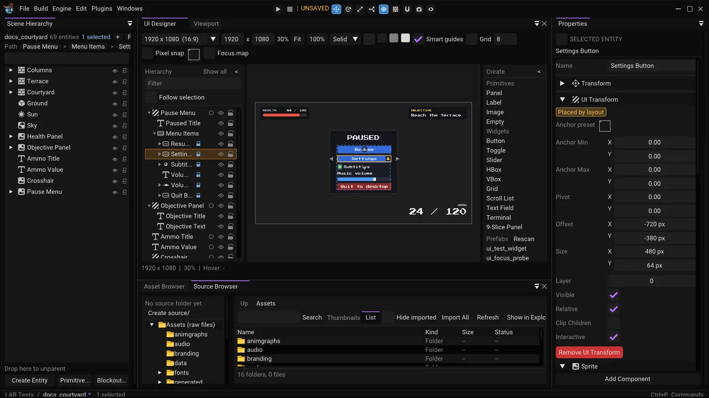

The UI Designer is a panel for laying out the HUD ([HUD](01-hud.md)) and its widgets
([UI Widgets](03-ui-widgets.md)) by hand, the way you would in a 2D design tool, on a canvas that shows
what the game will draw. It edits the same components the inspector does -- UI Transform, Sprite, Text and
the widget components -- so there is no separate UI file: what you make here is entities in the scene,
saved with it, undone with `Ctrl+Z`.

*The UI Designer: the toolbar along the top, the Hierarchy on the left, and the canvas showing a title screen with one button selected.*

Two rules explain most of how it behaves:

- **The canvas is the game's own HUD.** The engine renders the HUD into an image at the canvas's
  resolution with the same shader, layout and hit test it uses in the game; the panel places that image and
  draws outlines and handles over it. What you see cannot drift from what ships.
- **One gesture is one undo step.** A drag, a nudge, a preset, a creation, a margin drag: however many
  frames it took, `Ctrl+Z` takes it back whole, and `Esc` during a drag puts everything back and records
  nothing.

## Opening and docking

**Windows → UI Designer** opens it. The first time, with no saved layout for it, it opens as a tab beside
the 3D **Viewport**; once you have docked or floated it somewhere, that is where it stays. It draws only
while it is on screen (not a background tab): a hidden panel costs nothing.

The toolbar, left to right:

| Control | What it does |
|---|---|
| Resolution | The size the HUD is laid out and drawn at: a list of common sizes (1920 x 1080, 2560 x 1440, 1280 x 720, ultrawides, Steam Deck, 4:3, portrait), **Match Viewport** (the game viewport's output size; it waits for a dock drag to settle) and **Custom** (the width and height fields, applied on Enter or when you leave the field) |
| Zoom, **Fit**, **100%** | The zoom, fit the canvas to the panel, actual size (one canvas pixel to one screen pixel) |
| Backdrop | **Solid** (a colour, and three quick swatches) or **Checker**, which shows where the HUD is transparent. The checker is part of the preview image, not drawn behind it, so semi-transparent sprites blend as they do over a scene |
| **Smart guides**, **Grid** (size), **Pixel snap** | Snapping, below |
| Anchor button | The anchor preset picker, below |
| **Apply overrides in Play**, **Playing - read-only** | While the game is playing: whether this panel's hidden and isolated screens apply to it, and a reminder that nothing is edited |

The resolution, backdrop, follow, snapping switches, the two side panes' open state and the Hierarchy's width are
saved with the editor's preferences. Scripts and tests that drive the panel (`editor.ui_designer_*`) change a session copy
only, so they never overwrite yours.

## The canvas

| Input | Does |
|---|---|
| Mouse wheel | Zoom about the pointer |
| Middle-drag, or **Space** + left-drag | Pan |
| **Home** | Fit the canvas to the panel |
| **1** | Actual size (100%) |
| **F** | Frame the selection (zoom to it); with nothing selected, fit the canvas |

Anything that moves the view leaves the fit modes, so resizing the panel does not snap it back from under
you. The status bar shows the canvas size, the zoom, the element under the pointer and the pointer's
position in UI units (the numbers the inspector's Offset and Size are written in).

## The Hierarchy

The pane on the left is a tree of every UI element in the scene (the play copy, with whatever the game spawned, while it
is playing). A **screen** -- an element that is not Relative, or whose parent is not a UI element -- is a top-level row;
everything Relative under it is nested below, to any depth. Non-UI children of a UI element are not shown. The pane
is as wide as you drag it (the splitter on its right edge), collapses to a strip with **<**, and keeps its width
and open state in the editor's preferences. Open and closed rows are remembered per element for the session; a
selection made anywhere else (the canvas, the viewport, the Scene Hierarchy) opens the rows above the element and
scrolls to it.

**Order.** The tree lists children in the order that matters for their parent (hover the title for the same
words):

- inside a layout container (HBox, VBox, Grid), by **Order**, ties by id -- the order the container lays them out in,
  the first slot first. A child the container ignores (Ignore Layout) comes after them;
- everywhere else, and for the screens, in **paint order, back to front**: ascending Layer, then the scene's own order
  (the order the hit test breaks ties in). What is lower in the list is drawn on top, as in Godot's tree.

**A row**, left to right: an arrow, a kind glyph (Panel, Image, Label, Button, Toggle, Slider, Scroll List,
Scrollbar, Text Field, HBox, VBox, Grid, Empty -- what the element's components make it), the name, small badges
and, on the right, three toggles. Hover any of them for what it means.

| Badge | Means |
|---|---|
| closed eye | Its Visible flag is off (the row is dimmed too); blue: hidden by the Scene Hierarchy's eye |
| padlock | Placed by a container / driven by a widget: the reason the canvas will not move it (below) |
| `#2` | Its slot in the container that lays it out |
| 9-grid | A 9-sliced sprite |
| star | The default-focus widget |
| clipped box | It clips its children |

| Toggle | Does |
|---|---|
| radio (screens) | **Isolate**: every other screen is hidden in the preview |
| eye | A preview-only override for this element: as authored, hidden, shown (even if its own `Visible` is off). Never saved; in Play off unless *Apply overrides in Play* is on. It never touches `Visible` |
| padlock | The editor's **lock**, the very flag the Scene Hierarchy's lock sets: nothing in the Designer edits a locked element (or one inside a locked element) |

Above the rows: **Show all** drops every eye and the isolation, the **filter** shows the elements whose name or
kind matches ("button", "slider", "hbox"), with the ones they are in (Esc clears), and **Follow selection** makes
selecting a UI element anywhere isolate its screen.

**Selecting.** Click selects, **Ctrl**+click toggles, **Shift**+click selects the rows between the last click and this
one (as they are listed). The selection is the editor's own, so the canvas, the viewport and the Scene Hierarchy
agree. The arrow keys move it (**Left** closes an open row, else goes to the parent; **Right** opens a closed row, else
goes to its first child), **Enter** frames it on the canvas. Hovering a row outlines the element on the canvas, and
hovering an element on the canvas lights its row.

**Renaming.** Double-click the name, or press **F2**: an edit box takes its place; **Enter** (or leaving the box)
keeps the name, **Esc** drops it. One undo step, *Rename UI Element*.

**Drag and drop.** Drag a row -- or all the selected rows -- and drop it:

| Drop | Does |
|---|---|
| **on** a row (the middle half) | Re-parents into it. Into a layout container: the last slot. Into any other element: it keeps its rect on the canvas, as a move-out does |
| **between** rows (a line) | Under a container: reorders -- Order is rewritten 0..n-1 over its laid-out children, as a drag on the canvas does. Under any other parent: re-parents there and, if a change of its **Layer** alone puts it between the two neighbours, sets that Layer; if the neighbours share a Layer that would need them moved too, it keeps its own (so it may not land where the line was -- set Layers to order such siblings) |
| on empty space | A top-level element, keeping its rect |
| a Create palette item, or a UI prefab from the Asset Browser | Creates it inside the row (from the line above or below a row: beside it) |

One drop is one undo step. A line or an outline shows where it lands (red when it cannot), and a tooltip at the pointer says
why not: into itself or one of its own children, onto or out of a locked element, a slider's Fill or Handle
(driven), and anything in Play.

**Context menu** (right-click a row; it acts on the selection): *Rename*, *Duplicate*, *Delete*; *Create child*
(the palette's items); *Wrap in* an Empty group, an HBox, a VBox, a Grid or a Scroll List: the container is made at
the selection's bounds and the selection moves into it, one undo step (an Empty keeps their rects; a container lays them
out in the order shown; elements to wrap must share a parent; the wrapper takes the lowest Layer of its members so paint order
holds); *Unwrap* (moves the children to the parent keeping their rects and deletes the wrapper; refused if it carries anything
beyond a UI Transform, a Sprite and a Layout); *Select parent* / *Select children*; *Bring forward*, *Send backward*, *Bring to
front*, *Send to back* (they edit Layer, one step each: forward and backward change it by what it takes to pass the next
sibling, front and back put it past all of them); *Isolate this screen*; *Expand all* / *Collapse all*.

With the pane focused, **Del** and **Ctrl+D** delete and duplicate, **F2** renames, **Ctrl+A** selects every row that is
showing, and **Esc** clears the filter; the editor's **Ctrl+Z** / **Ctrl+Y** keep working throughout.

Only the rows on screen are drawn, and the tree is built once a frame, so a HUD of hundreds of elements costs no
more than a small one.

## Selecting

| Input | Selects |
|---|---|
| Click | The topmost element under the pointer, including the non-interactive ones a game's pointer would let through. Empty canvas clears |
| **Ctrl** or **Shift**-click | Toggles the element in the selection |
| **Alt**-click | Steps down through everything under the pointer, topmost first, wrapping: the way to an element that is covered |
| Drag from empty canvas | A marquee: what is **fully inside** (with **Alt**, anything it touches; Ctrl/Shift adds). A screen only counts when wholly inside, so sweeping over the background does not select it |
| **Ctrl+A** | The selected element's siblings (every screen with nothing selected), not the whole scene. In the Hierarchy: every row that is showing |
| Right-click | Selects the element under the pointer if it was not selected and opens the context menu |

A click over the body of an element that is already selected keeps the selection, so an element under
another can still be dragged; a click on a child of the selected element selects the child. The last
element selected is the **primary**: handles, anchors and the 9-slice pane belong to it.

## Moving and resizing

Drag the body of a selected element to **move** the selection; drag one of the eight handles of the primary
to **resize** it.

| Modifier | Move | Resize |
|---|---|---|
| **Shift** | Keep to the axis the pointer has gone further along | Keep the aspect ratio |
| **Alt** | | Resize about the centre |
| **Ctrl** | No snapping for the whole drag | No snapping |

Every edit is made in canvas pixels and solved back to the element's own fields, so **anchors and pivot are
never touched**: a stretched axis rewrites Offset and OffsetMax, a point axis Offset and Size. The selection
moves by one delta, each element solved against its own parent; an element whose Relative chain reaches a
selected ancestor is left to that ancestor, so nothing moves twice. A size stops at one UI unit and never
flips. A readout follows the pointer ("+12, -4", "240 x 96").

**Arrow keys** nudge the selection one UI unit, ten with Shift, one undo step a press.

## Snapping

While a move or a resize is dragged:

- **Smart guides** snap to the edges and centres of the element's siblings, its parent and the canvas,
  within 6 *screen* pixels (so zooming in makes it more exact, not stickier), and to **equal spacing**: a
  gap to a neighbour snaps to one that already exists. Magenta lines and gap readouts show what matched.
- **Grid** snaps the top-left corner (a resize: the edge it drags) to multiples of the grid size, counted
  from the canvas's corner, and is drawn once its lines are four screen pixels apart.
- **Pixel snap** rounds to whole UI units counted from the parent's corner.
- Smart guides win within reach; the grid takes what they leave; whole units last.

**Ctrl** held through the drag turns all of it off. Nudges ignore guides and the grid but respect Pixel snap.

## Anchors and pivot

The primary selection shows four **anchor petals** (triangles at the corners of its anchor rectangle, in its
parent) and its **pivot** (a circle; only a point axis has one). Dragging a petal moves that corner of the
anchor rectangle **while the element stays where it is drawn**: anchors and offsets change together
(`SetAnchorsKeepingRect`). Anchors clamp to 0..1 and keep min <= max; with smart guides on they snap to 0,
0.25, 0.5, 0.75, 1 and the element's own edges (Ctrl turns it off). A point anchor's four petals are one
place: dragging it moves the point. Dragging the pivot changes `Pivot` and re-solves `Offset`, so the rect
stays; it snaps to 0, 0.5, 1 and **Alt** drags it freely.

Holding **V** over the canvas takes the pivot from anywhere over the primary's rect -- a press there puts
the pivot at the pointer, and dragged it follows it. That is how a pivot that sits under a resize handle
(the default, top-left, is the NW handle) is reached.

The pointer prefers resize handles, then the pivot, then the petals, then the body.

**Anchor presets**: the toolbar's anchor button, and **Anchors** in the canvas's right-click menu, apply a
preset (corners, edges, centres, stretches, Full Rect) to every editable selected element, with a mode --
*Keep rect* (the element stays), *Keep rect + set pivot* (and the pivot becomes the preset's) or *Snap*
(anchors and pivot set, offsets zeroed). Parents are done first, so a child in *Snap* mode is placed in the
rectangle its parent ended up with. One undo step.

The context menu also has **Select parent**, **Frame selection**, **Isolate this screen** and **Delete**.

## Creating

The **Create** palette on the canvas's right lists what can be made. Hover an item for what it makes.

| Section | Items |
|---|---|
| Primitives | **Panel** (rounded sprite, 200 x 120), **Label** (text, 240 x 48), **Image** (a sprite with no texture yet, 128 x 128), **Empty** (fills its parent: a group) |
| Widgets | **Button**, **Toggle**, **Slider**, **HBox**, **VBox**, **Grid**, **Scroll List**, **Text Field**, **9-Slice Panel** |
| Prefabs | Every object under `assets/objects/` (any depth) that contains a UI Transform; **Rescan** refreshes the list |

**Drag** an item onto the canvas, or **double-click** it. A drop creates a Relative child of the element under
the drop point (top level over empty canvas), with its **top-left at the point**; a double-click creates it
inside the selection (else the isolated screen, else at the canvas's corner). It is named uniquely ("Panel",
"Panel 2", ...), selected, and the whole thing -- the element and every child -- is **one undo step**; redo
brings it back under the same ids. Prefabs are instantiated as prefabs, so they stay linked to their
`.Lobj`. Nothing is created in Play, or inside a locked element.

The widgets are entities you could have built by hand, wired up:

| Widget | What it makes |
|---|---|
| **Button** | A blue sprite (200 x 56) with a UI Button component and a *Label* child (centred text, stretched over it, not interactive so the click is the button's) |
| **Toggle** | A 36 x 36 box with a UI Toggle component, a *Checkmark* child set as its **Graphic** (drawn only while the toggle is on), and a *Label* to the box's right. It starts on, so the checkmark shows |
| **Slider** | A 300 x 24 track with a UI Slider component (0 to 1, value 0.5), a *Fill* child (stretched) and a *Handle* child (24 wide), both wired as the slider's **Fill** and **Handle** |
| **HBox**, **VBox**, **Grid** | A 432 x 72, 160 x 240 and 240 x 240 container with a UI Layout (padding 8, spacing 8, the Grid two columns) over a subtle background sprite. Create elements inside one and it places them |
| **Scroll List** | A 360 x 260 rounded window with a UI Scroll component, over a *Content* VBox (Fit Content on Y, stretched across, padding and spacing 8) of six sample rows -- a Panel with a Label each, 344 tall together, so it overflows by 84 -- and a vertical *Scrollbar* (a track sprite with a *Handle* child, minimum handle 24, hidden when the content fits). The list's **Content** and **VScrollbar** and the bar's **Handle** are wired by id, like a slider's Fill |
| **Text Field** | A 320 x 44 dark rounded field (a 1 unit border) with a UI Text Field component (Placeholder "Type here...", select all on focus) and two Relative children, *Text* and *Placeholder*, each Full Rect with 8 units in from the left and right, not interactive, 20 unit text left / middle (the placeholder grey), wired as its **TextEntity** and **PlaceholderEntity**. The children's own text is ignored at draw time: the field's **Text** and **Placeholder** are what show, so those are edited on the field. A selected or hovered child carries a small blue **i** badge and a tooltip saying so |
| **9-Slice Panel** | A sprite (240 x 160) in the Panel's grey with no texture: select it and the 9-Slice tab opens on an empty slot waiting for one. The grey goes back to white when a texture is assigned there, so it does not tint the texture |

A widget's children are named after it ("Slider 2 Fill", "Slider 2 Handle") so two of a kind never share a
name, and the references between a widget and its children are entity ids, which an undo and a redo keep: a
redone slider still drives its own Fill and Handle. An element created inside a container takes the next
**Order**, so it goes last; a hierarchy keeps no sibling order of its own (see
[UI Widgets](03-ui-widgets.md#layout-containers)).

## Scroll lists

Select a scroll list -- or anything inside one: its content, a row, a row's label, its scrollbar -- and the
toolbar shows a **scroll preview** beside the other controls: a slider per axis the list scrolls on (0 to how far
it can go, in UI units; hover it for what it does) and **Show overflow**. The preview scrolls *the Designer's
picture of the list*, so what is further down can be reached and edited:

- It is **designer-only**. The offset is held by the panel, goes into the preview and the panel's own layout as an
  override beside the per-element eyes (`Scene::UIPreviewOverrides::ScrollOffset`), and is read by the one place
  the game reads its own scroll offset. It is never written to the scene, so it is not saved, not an undo step,
  not what the game's `get_scroll` returns, and not in a play-mode copy.
- Because the canvas, the click and drag hit tests and the edit maths all resolve against that one layout,
  **what you see is what you hit**, and an edit made while the list is scrolled writes **the same fields as at
  offset 0**: the content is solved against the list's rect moved by the offset, and everything inside it
  against its parent's scrolled rect.
- It belongs to **one list and the selection in it**: moving the selection to another element of the list keeps
  the offset; selecting anything outside it, or another list, starts it over at 0.
- **In Play** the sliders show the game's live offset and are read-only.

**Show overflow** outlines what the window clips away -- each overflowing element's frame, the part outside the
window shaded, the window itself dashed -- and lets a click, an Alt-click and the marquee reach it, so a row
that is below the window can be selected and edited without scrolling to it. It affects the Designer's layout
only: the preview image and the game keep the clip.

## Focus map

Keyboard and gamepad focus moves between a project's widgets by the rules in
[UI Widgets](03-ui-widgets.md#focus-and-navigation): an explicit neighbour named in a widget's UI Focus component
if it can take focus, otherwise the nearest widget in that direction. The Designer draws that, **whether or not the
project has focus navigation on** (the toolbar tooltip says when it is off, since the game then ignores it):

- With a widget selected its **explicit neighbours** are drawn as solid arrows from the edge it leaves by to the
  widget they name, and its **default focus** gets a small gold **star** at its corner. A modal **focus scope**
  gets a dashed magenta outline.
- The toolbar's **Focus map** toggle adds the **automatic neighbours of every focusable widget** in the isolated
  screen as dashed green arrows (a widget's own explicit ones solid), a star on every default-focus widget and an
  outline on every scope. It is `Scene::ComputeUIFocusMap` -- the same `UIFocusMath` the game calls, over the
  Designer's layout -- so the picture cannot disagree with what a gamepad does.
- A selected Button, Toggle, Slider or Text Field has an **arrow handle** outside the middle of each edge. **Alt+drag** from one
  onto another widget (a button's own label counts as the button) and release: that widget becomes the neighbour
  in that direction, **one undo step** (*Set focus neighbour*), shown by the solid arrow and a lit handle. A drag
  that ends over nothing sets nothing; `Esc` cancels. Hover a handle for what it does.
- **Right-click** a widget with explicit neighbours: **Focus neighbours** lists *Clear Up (Name)* ... to take one
  back to automatic.

Setting a neighbour edits the UI Focus component (added when missing) and nothing of the widget's placement, so it
works on a container's child as well. It is refused in Play and on a hierarchy-locked widget.

## Layout containers

A container (an HBox, VBox or Grid, anything with a UI Layout) places its children itself, so what the Designer
offers on it and on them is different from any other element.

**Reordering.** A child a container places is not moved: a drag on it is a **reorder**. A blue **insertion
line** between two siblings (in a Grid, a caret between cells in reading order) follows the pointer, the child
follows it as a ghost, and the container's slots, padding and gaps are outlined while you drag. Releasing drops
it there: **Order is rewritten 0..n-1 over every laid-out child in the new order** (a UI Layout Element is added
where a child had none), as one undo step, *Reorder*. `Esc` cancels; a drop where it already was records
nothing. A container sorts its children by Order and then by id, and an id is random, so Order is the only
order there is -- which is also why an element created inside a container takes the next Order.

**Moving out.** Drag the child **more than about 24 screen pixels outside its container** and the drag becomes
a move out: drop it on another container (or on something in one) to re-parent it there at the slot shown, or
on any other element to re-parent it as a Relative child at the drop point, at the size it had, no longer laid
out, or on empty canvas for a top-level element. One undo step, *Reparent*, which puts the parent, the Order
and the fields back.

**Container handles.** With a container selected the canvas shows:

- **Padding bars**: four small bars on the inward edges of the padding band (a quarter and three quarters along,
  clear of the resize handles). Drag one to change Padding left, top, right or bottom; the **padding band** is
  shaded while one is hovered or dragged.
- **Spacing grips** in the gaps between children: drag to change Spacing on the main axis (a Grid has column
  grips along its first row and row grips down its first column, for Spacing x and y).
- On a Grid, a **columns chip** above its top-right corner: `3 cols` with **-** and **+** buttons; a click
  steps the column count (never below one).
- A thin **outline round each slot**, so the cells the container has made are visible.

Padding and spacing move in whole UI units and never go below 0, from the values at the start of the drag; a
readout ("Padding 12, 10, 10, 10") follows the pointer. Each drag is one undo step (*Container padding*,
*Container spacing*, *Grid columns*), `Esc` puts it back.

**Fit Content.** A container that sizes itself from its children (Fit Content, on an axis its anchors do not
stretch) has **no resize handle on that axis**: a dim empty mark shows where it would be, with a tooltip saying
why, and a resize of it is refused. Moving it is unaffected.

## Elements something else places

A child of an HBox, VBox or Grid, a slider's Fill and Handle and a toggle's Graphic are not placed by their
own fields: the container or the widget places them at layout time, and their anchors, pivot and offsets
are not read. The Designer says so instead of letting you drag values nothing reads:

- a small **padlock** badge on the element (selected, or under the pointer);
- **no resize handles, anchor petals or pivot** on it, and no presets or nudges; a drag on a container's child
  reorders it (above), a drag on a slider's Fill or Handle or a toggle's Graphic **selects it and moves nothing**,
  with a note at the pointer;
- a **tooltip** after a moment's rest: *Placed by <container>* or *Driven by <slider / toggle>*.

What is placed follows its container or widget: change the container's padding, spacing or the child's Order,
the slider's value, the toggle's state. The widget's own root -- the slider's track, the button -- is an
ordinary element and moves and resizes as any other, taking its parts along. A container that is itself placed
by another keeps its own padding, spacing and column handles.

## The 9-slice pane

Select a **sprite with a texture** (or a sliced one, or a 9-Slice Panel just created) and the right-hand
column gets two tabs, **Create | 9-Slice**. The panel switches to 9-Slice by itself when a sliced sprite is
selected -- until you click a tab yourself, after which it leaves the choice to you for the session -- and the
column widens for it. The tab shows the
sprite's texture at a whole-number zoom (nearest sampling, upright whatever row order the image is stored
in, over a checkerboard) with **four margin lines** -- left, top, right, bottom, in texels -- and the
texture's size beneath.

- **Drag a line** to cut the texture there. It moves in whole texels and stops at the opposite line (left +
  right never exceed the width, top + bottom the height). A line sitting on another (a cut with no middle)
  is told apart by the direction of the first movement. A drag is one undo step and `Esc` puts it back.
- The four fields **L T R B** take the same margins by number (drag or double-click to type); **Scale** is
  the on-screen size of one border texel (2 draws a 16-texel corner 32 pixels wide, before the HUD scale),
  **Fill** is how edges and centre fill (stretch, tile, tile fit) and **Centre** off leaves the middle out.
  Each field edited is one undo step.
- **Enable 9-slice** starts an unsliced sprite with a quarter of the texture each way; **Turn off** zeroes
  the margins. On a sprite with no texture the pane is an **Assign texture** slot: drop an image from the
  Asset Browser on it (or set Texture in the inspector).

On the canvas the selected sliced sprite shows **dashed yellow lines** where the renderer cuts it into
cells, at the margin times the slice scale times the HUD scale, squeezed the way the renderer squeezes them
when the borders are wider than the rect. They move with your edits: the preview is the real draw. See
[HUD → 9-slice sprites](01-hud.md#9-slice-sprites) for what the cells do.

## Play, locks, undo and prefabs

- **Play is read-only.** You can select and look, but every edit -- a drag, a nudge, a preset, a creation, a
  margin -- is refused with a note, because Play simulates a copy of the scene that is thrown away. The same
  goes for anything locked in the hierarchy.
- **Undo** is the editor's own history: each gesture records the entities it touched, and the Edit menu
  names the step (*Move UI*, *Resize UI*, *Nudge UI*, *Move anchors*, *Move pivot*, *Anchor preset*,
  *Create UI Element*, *Edit 9-Slice*, *Reorder*, *Reparent*, *Container padding*, *Container spacing*,
  *Grid columns*, *Set focus neighbour*, *Rename UI Element*, *Wrap in <kind>*, *Unwrap*, *Bring Forward* / *Send Backward* / *Bring to Front* / *Send to Back* / *Set Layer*). The scroll preview, Show overflow and the Focus map are not steps: they
  are views of the document, never part of it. `Ctrl+Z` pressed in the middle of a drag ends the drag first, so it
  is the drag that is undone.
- **Prefabs.** Editing the *root* of a placed object records the components you changed as overrides, so
  saving the source object later does not overwrite them; elements below the root are rebuilt from the file
  (see [Objects](../02-building-worlds/03-objects.md)). The Designer records overrides exactly as the inspector does.

## The Designer is where game UI is authored

The Designer is the **source of truth for a game's UI**: the HUD a game ships is the entities and components
you lay out here and save with the scene, and agents author it the same way, through the editor's MCP tools
([AI Agents](../07-projects-and-tools/04-editor-ai-agents.md)), so an agent and a person edit one document with one undo history. A project
may still generate UI from scripts -- a generator that writes `.Lscene` files, or Lua that builds elements at
runtime -- and that stays supported, but a generated file is regenerated from its script, so a hand edit made
in the Designer to a generated scene belongs in the generator. For everything else, lay the UI out here. The
Designer writes ordinary UI Transform, Sprite, Text and widget fields, never a layout of its own, so what it
leaves in a scene file is a few readable values and nothing to maintain beside the scene.

## Agents

An AI agent connected through MCP authors the same document with the same code: `ui_tree` reads the HUD,
`ui_create` is the Create palette, `ui_set_rect`, `ui_set_anchors`, `ui_nudge`, `ui_align` and `ui_distribute`
are the drag, the anchor picker and the align commands with exact numbers, `ui_reorder` and `ui_reparent` are
the drop in a container and onto another element, `ui_rename`, `ui_wrap`, `ui_unwrap` and `ui_set_layer` the Hierarchy's rename, Wrap in, Unwrap and layer menu entries,`ui_slice` is the 9-Slice tab, `ui_set_neighbour` is the Alt+drag from a widget's arrow handle, `ui_focus_map` is the
Focus map as data, `ui_pick` is a click and `ui_preview` is the canvas's picture. They refuse what the canvas refuses (Play, a locked entity, a container's
child, a widget's Fill) and each call is one undo step in the history you see in Edit. They work at a design
resolution of their own (1920 x 1080 unless a call says otherwise), whether or not this panel is open, so an
agent never disturbs your canvas size or what you have isolated. See
[AI Agents -- Authoring game UI](../07-projects-and-tools/04-editor-ai-agents.md#authoring-game-ui).

## Keyboard and mouse reference

| Input | Action |
|---|---|
| Click | Select the topmost element; empty canvas clears |
| Ctrl / Shift-click | Toggle in the selection |
| Alt-click | Select the next element down under the pointer |
| Drag empty canvas | Marquee (Alt: anything touched; Ctrl/Shift: add) |
| Drag body | Move the selection (Shift: one axis; Ctrl: no snap) |
| Drag handle | Resize the primary (Shift: aspect; Alt: about the centre; Ctrl: no snap) |
| Drag a container's child | Reorder it: a blue insertion line follows the pointer, release to drop (Esc cancels) |
| Drag a container's child 24+ px out of it | Move it out: onto another container (inserted there), onto another element (a Relative child at the drop point) or onto empty canvas (top level) |
| Drag a container's padding bar / spacing grip | Change Padding / Spacing in whole UI units (Esc cancels) |
| Click a Grid's columns chip - / + | One column fewer / more |
| Drag anchor petal | Move that corner of the anchor rectangle, element stays (Ctrl: no snap) |
| Drag pivot circle | Move the pivot, rect stays (Alt: free) |
| **V** + press / drag | Take the pivot from anywhere over the primary's rect |
| Arrow keys | Nudge 1 UI unit (Shift: 10) |
| Right-click | Context menu (Anchors, Select parent, Frame, Isolate, Focus neighbours, Delete) |
| Scroll slider in the toolbar (a scroll list, or anything in one, selected) | Preview the list scrolled: designer-only, resets when the selection leaves the list |
| Alt+drag from an arrow handle beside a selected widget onto another widget | Make it that direction's focus neighbour (one undo step) |
| Mouse wheel | Zoom about the pointer |
| Middle-drag, Space + drag | Pan |
| Home / 1 / F | Fit / 100% / frame selection |
| Ctrl+A | Select the element's siblings (every screen when nothing is selected) |
| Delete, Ctrl+D | Delete / duplicate the selection |
| Hierarchy: click, Ctrl+click, Shift+click | Select, toggle, select the rows between |
| Hierarchy: Up / Down (Shift extends) | Previous / next row |
| Hierarchy: Left / Right | Close an open row, else go to the parent / open a closed row, else go to the first child |
| Hierarchy: Enter | Frame the selection on the canvas |
| Hierarchy: F2, double-click a name | Rename (Enter keeps it, Esc drops it) |
| Hierarchy: Ctrl+A | Select every row that is showing |
| Hierarchy: drag rows | Re-parent (on a row), reorder / re-parent (between rows), top level (empty space); one undo step |
| Hierarchy: right-click a row | Rename, Duplicate, Delete, Create child, Wrap in, Unwrap, Select parent / children, layer order, Isolate, Expand / Collapse all |
| Hierarchy: type in the filter, Esc | Show the elements whose name or kind matches / clear it |
| Esc | During a drag: put everything back, record nothing |
| Ctrl+Z, Ctrl+Y | Undo, redo (Ctrl+Z during a drag ends it first) |
| Drag a palette item onto the canvas, or double-click it | Create it |
| Drag a margin line in the 9-Slice tab | Cut the texture there (Esc cancels) |
| Click the Create / 9-Slice tab | Choose the right-hand column's pane (the panel stops choosing for you) |

## Driving it from a script

Every gesture above has a call in the editor API (`editor.ui_designer_*`, see
[Editor API](../06-scripting/02-lua/api/editor/01-editor-api.md#ui-designer-panel)), so a test exercises the code a
hand does. `ui_designer_mouse` is a virtual pointer that runs the per-frame mouse path, not ImGui's own
pointer (which the operating system overwrites whenever the window has the focus); a test that wants exact
landings turns snapping off first. The working examples are `tests/ui_designer_panel.lua`,
`ui_designer_edit.lua`, `ui_designer_snap.lua`, `ui_designer_anchors.lua`, `ui_designer_palette.lua`,
`ui_designer_slice.lua` (the 9-slice pane, against `ui_nine_slice_test.Lscene`),
`ui_designer_widgets.lua` (the widget palette, including the Text Field's children and its placeholder-then-text preview, and the locks, against `ui_designer_widgets_test.Lscene`) and
`ui_designer_containers.lua` (reorder, move out, padding, spacing, columns and Fit Content, against
`ui_designer_containers_test.Lscene`), `ui_designer_hierarchy.lua` (the Hierarchy: order, selection, drops, wrap, layers, the filter, Play and the MCP tools, against `ui_designer_hierarchy_test.Lscene`) and `ui_designer_scroll_focus.lua` (the Scroll List palette entry, the
scroll preview and Show overflow, the focus map against `UIFocusMath`, and neighbour editing by hook, by the
Alt+drag and by MCP, against `ui_designer_widgets_test.Lscene`). `ui_mcp_tools.lua` drives the agents' `ui_*` tools through `editor.mcp_call` and checks them against the Designer's own
hooks (same layout, one undo step per call, the same locks).
