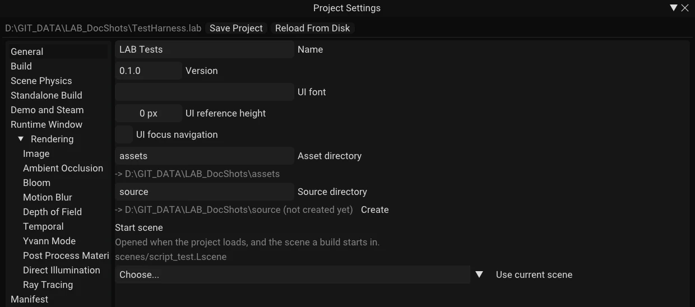

## What a project is

A project is a `.lab` manifest plus an asset folder beside it. Everything the editor
treats as content lives under the asset folder, and scenes store paths relative to it — which
is what makes a project folder self-contained and movable.

```yaml
Project:
  Name: LAB Samples
  Version: 0.1.0
  AssetDirectory: assets
  StartScene: scenes/script_test.Lscene
  Build:
    ExecutableName: LABSamples
  Window:
    Title: LAB Samples
    Width: 1280
    Height: 720
    Fullscreen: false
    FixedResolution: false
    Icon: icons/MadLab-Icon.png
```

Create one with **File → New Project…**, open one with **File → Open Project…**, and edit its
settings in **Windows → Project Settings**.

Without a project open, LAB falls back to the `assets/` folder beside the executable —
fine for poking at the samples, not for real work.

## Project Settings

| Field | Notes |
|---|---|
| **Name** | Used as the default window title and executable name |
| **Version** | Free-form. Recorded in the manifest and carried into a build; the engine never parses it |
| **Asset directory** | Relative to the project folder. The panel warns if it does not exist |
| **Start scene** | Opened when the project loads, and the scene a build starts in. **Use current scene** sets it to what you have open (save it first) |
| **Scene Physics** | Gravity, gravity scale, terminal velocity — **saved in the scene, not here**. See [Physics](../04-gameplay/01-physics.md) |
| **Executable name** | Without `.exe`. Empty uses the project name |
| **Window title** | Empty uses the project name |
| **Width / Height** | The runtime window size |
| **Fullscreen** | Borderless fullscreen at the monitor's own resolution; width and height are ignored |
| **Fixed resolution** | The window cannot be resized. Independent of fullscreen |
| **VSync** | The *runtime* window only — the editor has its own toggle in the Diagnostics panel. Off is what you want when measuring anything |
| **Icon** | Project-relative path to a window icon |
| **UI font** | The `.ttf`/`.otf` HUD text draws with; empty uses the built-in font. Its fallback fonts for other scripts, their per-language order and the extra characters to bake (`UIFontFallbacks`, `UIFontFallbacksByLanguage`, `UIFontCharset`, `UIFontCharsetByLanguage`) are set in the `.lab` file itself, and the panel keeps them when it saves: see [HUD → Languages](../05-ui/01-hud.md#languages). A build ships all of them |
| **Save location / Save folder** | `SaveLocation` and `SaveFolder` in the `.lab`, each written only when it is not the default. `project` (the default) keeps save slots in `<project>/Saves`. `user` makes a **packaged game** write them to `<user data dir>/<SaveFolder>/Saves` instead, where the user data dir is `%APPDATA%` on Windows and `$XDG_DATA_HOME` (else `~/.local/share`) on Linux, for a game installed somewhere it cannot write. `SaveFolder` empty uses the project name. The editor and its Play mode always use `<project>/Saves`, whatever this says. `LAB_USER_DATA_DIR` overrides the user data dir. `game.save_directory()` returns the folder in use |
| **UI reference height** | The viewport height HUD units were authored for; see [HUD](../05-ui/01-hud.md) |
| **UI focus navigation** | Off by default. On, the arrows, d-pad and left stick move focus between HUD buttons, toggles and sliders, Enter / Space / A activate and Escape / B cancel, the focused widget is tinted and ringed, and `ui.focused()` and friends work; off leaves the HUD exactly as it was. Turning it on adds the missing `ui_*` input actions. **Wrap**, **Ring width / gap / radius / colour** appear with it (`UIFocusWrap`, `UIFocusRingWidth`, `UIFocusRingGap`, `UIFocusRingRadius`, `UIFocusRingColor` in the `.lab`, each written only when it is not the default). See [UI Widgets → Focus and navigation](../05-ui/03-ui-widgets.md#focus-and-navigation) |
| **Package only referenced content** | Off by default. On, the build walks the start scene, every other scene, and **Additional Includes** below, and packages only what that walk actually finds — off ships everything under the asset directory, cooked |
| **Strip editor data from assets** | On by default. Drops thumbnails and import metadata from `.Lmesh`/`.Ltex` files in the build — nothing at runtime reads them, so shipping them is dead weight |
| **Additional Includes** | Asset-relative files or folders to package regardless of whether a scene references them. For anything a script builds a path to at runtime — which the dependency walk cannot see — when **Package only referenced content** is on |
| **Rendering** | The project-wide default for every Renderer Settings field: tonemapping, TAA, GTAO, Bloom, Motion Blur, Depth of Field, Retro Resolution, ReSTIR direct illumination, and the whole Ray Tracing section. A scene's own Renderer Settings component (see [Components](../02-building-worlds/02-components.md#renderer-settings)) only overrides the fields it has explicitly checked; an unchecked field keeps tracking whatever is set here, including later edits — the way to tune quality once for a whole project instead of re-tuning every scene by hand. A component added fresh from the Add Component menu starts at whatever this section currently says, with nothing overridden |


*Project Settings (Windows → Project Settings).*

Recent projects are stored per user in `%APPDATA%/LAB/editor.yaml`, deliberately not in
any `.lab` — a recent-projects list is a property of your installation, not of the
project, and putting it in the manifest would check one developer's history into the
repository.

## Standalone builds

**Build → Build Standalone…** packages your project into a folder that runs without the
editor:

```
Output/
  MyGame.exe          the runtime, renamed after your project
  MyGame.lab       the manifest
  assets/             your content
  Engine/Shaders/     compiled SPIR-V
  Engine/Content/     the engine content your scenes refer to, and only that
```

Things to know:

- **The output folder must not be inside the project**, or the asset copy would recurse into
  its own destination. The editor refuses.
- **`LABRuntime.exe` must exist.** The editor looks beside itself and in a sibling
  `LABRuntime` folder. If it is missing, build the `LABRuntime` project first.
- **Shaders are resolved the same way the engine resolves them at load**, so a build picks up
  exactly what the editor would have used. Compile them first if you have edited any.
- The executable is renamed after your project. That is safe because the runtime finds its
  project by scanning for a `.lab` beside itself, not by its own name.
- **Every source asset is cooked, not copied.** A model or image ships as the native
  `.Lmesh`/`.Ltex` the loaders look for when the source is gone — no raw `.obj`/`.gltf`/
  `.png` ever reaches the output unless cooking it is impossible (a skinned glTF cooks too,
  and its `.Lskel` and `.Lanim` files ship beside the mesh; a file that will not cook ships as
  source and the build report warns). See
  [Importing Assets](../02-building-worlds/04-importing-assets.md).
- **The build is staged, never partial.** Everything is written to `<output>.staging` and
  renamed into place only once every step has succeeded, so a build that fails partway
  through leaves whatever was there before untouched.
- **`BuildManifest.yaml`** lands in the output alongside your game, listing every file the
  build shipped, where it came from, and the dependency report that decided it belonged —
  useful when a build is missing something and you need to know why.

The build reports success or the specific failure in the log.

### Build options: demo and Steam

The dialog has two switches for what the build is, saved per project in the `.lab`
(**Windows → Project Settings → Demo and Steam** edits the same fields):

| Option | What it does |
|---|---|
| **Demo build** | The packaged game knows it is the demo: `game.is_demo()` answers `true`. Off, it answers `false`. The editor previews the demo with **Editor Settings → Demo build**, which is what `game.is_demo()` reads in Play. See [The build](../06-scripting/02-lua/api/game/05-build.md) |
| **Steam build** | On: the Steamworks library (`steam_api64.dll`, or `libsteam_api.so` for Linux) ships beside the executable and the game starts Steam. Off: no Steam library ships, the game never loads one or calls `SteamAPI_Init`, there is no ownership check, and every `steam_*` call answers as it does on a machine without Steam |

With **Steam build** on the dialog also shows:

| Field | Notes |
|---|---|
| **Steam app id** | The game's app id. A shipped game gets its id from Steam, so no `steam_appid.txt` is ever shipped. This is what **Require ownership** checks and what the buy-the-game screen links to |
| **Steam demo app id** | A Steam demo is its own app. A demo build uses this id instead of the app id when it is set |
| **Require ownership** | The game asks Steam whether the account owns the app id and shows a buy-the-game screen five minutes in when it does not. A demo build is never checked |
| **Website URL** | The second button on the buy-the-game screen |
| **Steam Input manifest** | A `.vdf` under the asset directory. A Steam build ships it |

The line under the **Build** button says what you are about to make, for instance
`Builds: Windows, Steam (app 123456), demo`. A Steam build whose Steamworks library cannot be
found (see [Steam integration](../STEAM.md#get-the-steamworks-sdk)) fails with a message saying
so, instead of producing a game without Steam. The build target is written into the shipped
`Game.lab` as a `Packaged:` map, so the game runs as it was built whatever the project file
says later.

```yaml
Project:
  Build:
    Demo: false
    Steam: true
  Steam:
    AppId: 1234567
    DemoAppId: 1234568
    RequireOwnership: true
    WebsiteUrl: https://example.com/
    InputManifest: steam_input.vdf
```

A `.lab` from before these options has no `Build: Steam` key. It loads as a Steam build when it
has `Steam:` settings (a project that asked for an ownership check was a Steam project) and as a
plain build when it does not. The old `RequireOwnership: <app id>` spelling still loads, as
`RequireOwnership: true` and `AppId`.

From a test, or an agent through the MCP `run_lua` tool, `editor.build_standalone` takes `demo`, `steam`, `steam_app_id`,
`demo_app_id` and `require_ownership` in its options table for a single build, without
touching the project (see [Testing](02-testing.md)).

### Engine content

The engine ships a small set of content of its own, referred to as `engine:<path>`:
the primitives (`engine:Primitives/Cube.Lmesh`, `Sphere`, `Plane`, `Cylinder`, `Capsule`,
`Cone`: 1 m, centred, Z-up), a few textures (`engine:Textures/Checker.Ltex`, `White`,
`Black`, `MidGrey`, `FlatNormal`, `UVGrid`), the default materials
(`engine:Materials/Default.Lmaterial`, `DefaultGrey`, `Checker`) and the default scene. They
live in the engine's `Engine/Content` folder, are read-only, and are never copied into your
project: a scene stores the reference. The Asset Browser's **Engine** tab shows them; **Duplicate to
Project** there makes a copy of your own to change (see [The Editor](../01-getting-started/02-editor.md#asset-browser)).

- **A build ships the engine content your game references, and only that.** A game that uses
  the engine's cube and checker gets those two files at `Engine/Content/...` beside the
  executable (or inside `Game.Lpak`); the sphere, plane and everything else stay behind.
- **Old scenes keep working.** The old names `models/cube.obj`, `models/ball.obj`,
  `textures/checker.png` and `materials/_builtin/default_pbr.Lshader` still resolve to the
  engine's copies in a project that has no file of that name. A file of your own with the
  name always wins. Saving the scene stores the `engine:` reference in place of the old name.
- **The editor finds the content from where it is, not from where it was started.** A zipped
  editor carries `Engine/Content` beside the executable. `LAB_ENGINE_ROOT` can point at a
  folder that holds one.

### Native gameplay modules

A project can carry C++ gameplay code as a **native module**: a shared library built against
only the engine's ABI headers, loaded at play time. Two entries under **Build** cover it:

- **Build → Game Module…** compiles the project's own `Source/` module with the engine's
  premake5 and MSBuild (or make on Linux), in the configuration the editor was built in, and
  parses any compiler errors into a clickable list. When a project has no module source yet,
  the same modal writes one — `Source/` with a premake script, a sample behaviour and a
  `.gitignore`. Creating a project writes those files too.
- Once built, the modal offers to set the project's **Native Module** setting to the library it
  produced, which is what play mode and a standalone build load. Attach the sample to an entity
  with **Add Component → Native Script** and pick a class the module registered.

This is the game developer's own code, run in-process; it is not a mod and is never distributed
through Steam Workshop. See [C++ Scripting](../06-scripting/03-cpp/index.md) for how a module is
written and the whole module API, and [Native scripting](../NATIVE_SCRIPTING.md) for the ABI and the
boundary rules behind it.

### What the runtime does differently

The standalone runtime opens the window described in Project Settings, loads the project's
**start scene**, and begins simulating immediately — there is no Play button. It has no
editor UI at all.

This is the only way to exercise startup ordering, the real window, and the start scene, so
build one before you believe a game is finished.

## Command line

Both the editor and the runtime accept:

| Option | Meaning |
|---|---|
| `<path>` | A bare path is the project to open |
| `--project <path>` | The same, explicitly |
| `--scene <path>` | Open this scene instead of the project's start scene |
| `--test <path>` | Run a Lua test script. See [Testing](02-testing.md) |
| `--frames <n>` | Run this many frames and exit. 0 means run until closed |
| `--headless` | Run without showing a window |
| `--mcp` | Editor only: start the AI agent server on port 7801 for this session. See [AI Agents](04-editor-ai-agents.md) |
| `--mcp-port <n>` | Editor only: the same, on another port |

```bash
LAB.exe MyGame.lab --scene scenes/level2.Lscene
```

`--test` implies `--frames 120` if you do not give a frame budget, so a failing test cannot
hang a build waiting for a window nobody is watching.

With `--test` given, assertion and crash dialogs are suppressed: the process aborts with a
non-zero exit code instead of waiting for someone to click OK. An automated run must never
stop and wait.

An unknown option is reported as an error rather than ignored.

## Shipping the editor itself

A built editor is not a single exe. `scripts/Package-Editor.ps1` assembles the folder that runs on
another machine:

```
LABEditor.exe, LABRuntime.exe, the FidelityFX library (LABEditor and LABRuntime on Linux)
README.txt, THIRD_PARTY_LICENSES/
Engine/Content/          primitives, default textures and materials, default scene, font
Engine/Shaders/          compiled SPIR-V and the shared GLSL
Engine/Plugins/Terrain/  the plugin that ships with the editor
Editor/Icons/, Editor/Branding/
```

It leaves out everything that is only for developing LAB: the tests, the sample plugins, the test
modules, logs and debug files, and the Steamworks library (`-IncludeSteam` adds it). `-Platform Linux`
packs the Linux editor, built in the Steam Runtime container, into a `.tar.gz`; `-Symbols` writes the debug
symbols beside the archive. `-Zip` also writes the archive and `-Verify` runs it from a temp
folder and checks that the editor starts, finds its own files and lists only the Terrain plugin.
Build Standalone from that editor needs nothing else: the runtime is beside it.

The Windows zip has its files at the root (`LABEditor.exe` is a top-level entry): Explorer's Extract All
already makes a folder named after the zip. The Linux `.tar.gz` keeps a single top folder instead, because
`tar xzf` extracts into the current directory.

### One command for a release

`scripts/Release.ps1` builds both platforms, packages and verifies them, and writes down what to ship:

```powershell
scripts/Release.ps1                    # Windows and Linux into D:\Builds\Lab_Engine
scripts/Release.ps1 -Tag v0.2.0        # tag HEAD first, so the package version is exactly the tag
scripts/Release.ps1 -Platforms Windows -OutputRoot D:\Builds\Try
```

It starts only from a clean commit on a branch and checks everything it can before the slow part: Visual
Studio and the Vulkan SDK, WSL with a container engine that answers (Linux), free disk space, writable output
folders, that the tag is new and that this version is not already in the output folder. Then it builds
Windows, packages and verifies it, builds the Linux editor and runtime, and packages and verifies that.
It stops at the first failure and says which step and which exit code.

Packages are built in a staging folder and only moved to `Win` and `Linux` after they passed, so a failed
run leaves earlier releases alone. `-Force` replaces the archives of the same version; without it the run
refuses. `SHA256SUMS.txt` in each folder keeps the lines of earlier versions. `-NoVerify` skips running the
packages and says so loudly in the summary; do not ship a release made that way. `-Tag` creates an annotated
tag before the build (and removes it again if the release fails). Nothing is pushed unless you pass
`-PushTag`, which pushes only that tag after every step passed.

The log is `<OutputRoot>\logs\release-<version>-<time>.log`. `<OutputRoot>\RELEASE-<version>.txt` lists the
commit, branch, tag, archive names, sizes and SHA256 of each platform, the total time, which files to ship, and
which to keep private (the symbols archives). The exit codes are in the script's header
(`Get-Help scripts/Release.ps1`).

## Steam integration

Launching the editor, or a standalone build made with **Steam build** on (see
[Build options](#build-options-demo-and-steam)), while Steam is running and a `steam_appid.txt`
sits beside the executable connects rich presence and screenshot upload automatically —
nothing to enable in a scene or a project setting. `F12` posts to the Steam screenshot
library instead of `<project>/screenshots/`, and rich presence is pushed on every change,
though what a friend actually *sees* depends on that app's own localisation table on the
Steamworks partner site. Everything behaves identically without Steam running; check the
**Diagnostics** panel's *Steam* section for connection status. Full details, including how
to set up the localisation table, are in [`docs/STEAM.md`](../STEAM.md).

## Moving a project

Zip the folder. Because every content path in every scene is relative to the asset directory,
a project opens the same anywhere — a different drive, a different machine, a colleague's
checkout.

The one thing that does not travel is your recent-projects list and editor preferences, which
live in `%APPDATA%` by design.
