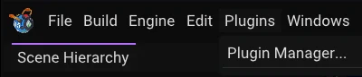

A plugin adds something to the editor: a command, a panel, a new kind of data on an entity, a
tool you use in the viewport. Plugins are installed deliberately, turned on and off from one
window, and loaded without restarting the editor. This chapter covers using them. Writing one is
in [`docs/PLUGINS.md`](../PLUGINS.md).

One plugin comes with the editor: **Terrain** sculpts and paints a heightmap terrain, and has its
own section at the end. **Hello Plugin** is a small sample that shows what a plugin can do; it adds
a few harmless commands and a panel, and a Spinner behaviour a game can use. It is in the LAB
source tree (`Dev/Tests/plugins/HelloPlugin`) and the editor lists it only when it runs a test, so
an installed editor does not have it.

> **A plugin is native code that runs with the full trust of the editor.** It can read your files
> and use your network the way any program you start can. Install plugins only from people you
> trust, and only on purpose. LAB never downloads a plugin by itself, and plugins are not shared
> through Steam Workshop.

## Where plugins live

The editor looks in three folders:

| Folder | For |
|---|---|
| `Engine/Plugins/` in the LAB folder | The plugins that come with LAB (Terrain) |
| `%APPDATA%\LAB\plugins` (Linux: `~/.config/LAB/plugins`) | Plugins you installed for yourself, in every project |
| `Plugins/` inside a project folder | A plugin that belongs to one project, loaded when you open it |

To install a plugin, put its folder (the one containing `Plugin.yaml`) in one of these, then press
**Rescan** in the Plugin Manager. If two plugins have the same Id, the one found first in the
order above is used and the other is listed as Failed with the reason.

A plugin has to be built for the version of LAB it runs in, in the same configuration (Debug or
Release) as the editor. A plugin that was built for a newer LAB than yours, or whose library is
missing, is not loaded and says why in the Plugin Manager.

## The Plugin Manager

**Plugins > Plugin Manager...** lists every plugin the editor found.

| Column | Meaning |
|---|---|
| On | Untick to turn the plugin off. Its commands, panels and tools go away at once. Your choice is remembered. |
| Name, Version | From the plugin's `Plugin.yaml`. |
| Source | Engine, User or Project: which folder it came from. |
| In game | Ticked when this project loads the plugin's runtime module in play mode and in a built game. Only shown for plugins that have one. See below. |
| State | **Loaded**, **Disabled**, **Not built** (the library is not there yet), **Failed** with the reason, or **No editor module**. |

The buttons on each row:

- **Reload** shuts the plugin down and loads it again from disk.
- **Open folder** shows the plugin's folder in your file manager.
- **Build** appears for a plugin in the project's `Plugins` folder, and builds it. See "Making your own".

Above the table, **Reload when rebuilt** (on by default) reloads a plugin by itself when its
library file changes on disk, so you can rebuild a plugin you are writing and see the result
without touching the editor. **Rescan** reads the folders again, loads anything new and retries
plugins that failed.

Select a row to see the plugin's description, how many commands, panels, tools and components it
registered, where its library is and when it was built.

### When a plugin breaks

A plugin that crashes or throws is switched off, not the editor: you get a message, the plugin's
state becomes Failed with the reason, and everything it added is removed. Fix or rebuild it and
press Reload. On Windows this covers crashes such as a bad pointer; on Linux it covers exceptions
only, so a plugin that crashes outright can still bring the editor down there.

### Plugins in a game

Most plugins only change the editor and never go into a game. A few also carry a **runtime
module**: gameplay code the game itself loads. Hello Plugin has one, a Spinner behaviour that
turns an entity. Terrain does not, and does not need one (see its section).

For a plugin with a runtime module, tick **In game** (or **Used by this project at runtime** in
the details pane). That adds the plugin to the project's `Plugins` list and saves the project.
After that:

- Add Component > Native Script offers the plugin's behaviours in its class list, and Play runs
  them.
- Build Standalone copies the plugin's `Plugin.yaml` and runtime library into the build under
  `plugins/<id>/`. The editor part and the plugin's source files are not copied.
- Building fails if a plugin you listed has no runtime library built for the platform and
  configuration you are packaging, so you do not ship a game that silently lacks it.

If the library goes missing from a finished game folder, the game logs an error naming the plugin
and starts without it.

## The Plugins menu

*The Plugins menu with no plugins loaded, so only Plugin Manager... is there.*

**Plugins** in the menu bar holds **Plugin Manager...**, then every command a plugin put in the
menu (grouped by plugin: Terrain, Hello and so on), then **Tools** (the viewport tools, with a
tick on the active one) and **Panels** (the plugin windows, ticked when open).

Plugin commands and panels are also in the command palette. Asset actions appear when you right
click a matching file in the Asset Browser or Source Browser: Terrain adds **Import as Terrain**
to `.png` and `.r16` files.

A plugin's own data shows up in the Properties panel after the built-in components, as its own
collapsible block, and the types are listed under **Add Component > Plugins**.

If a scene has data for a plugin you do not have installed, the entity shows a read-only
**Missing plugin: <id>** block. The data is kept and saved back unchanged. Install the plugin and
it is live again.

## What a plugin can do for a tool

A plugin that is a whole tool (a mission editor, say) has a few more things it can ask the editor
for, from plugin API 1.1:

- **Own the keyboard.** A panel can claim Ctrl+Z, copy and paste, Ctrl+S, Delete and the other
  editing shortcuts while it has focus. The editor's own scene undo, clipboard and save then stay
  out of the way, and Ctrl+Z in the plugin's window undoes the plugin's work, not an unrelated
  entity edit. The Edit menu still works when clicked.
- **Press Play.** A plugin can start and stop Play, optionally on another scene. If the open scene
  has unsaved changes it will not swap it out; you get a message instead.
- **Open its own files.** Double-clicking a file the plugin registered for (for example every
  `.yaml` in `assets/data/missions`) opens it in the plugin. Right click > **Open as text** gets
  you the editor's normal behaviour back.
- **Ask before you lose work.** A plugin that keeps data outside the scene shows up in the quit,
  close project and open project confirmations with its name and the number of unsaved items, and
  Save there saves it too.
- **Know where saves go, and run Lua.** A plugin can find the project's save folder and run a
  Lua snippet in the script console (outside Play there is no running scene, so the snippet sees
  the editor's state and the open scene only).

[`docs/PLUGINS.md`](../PLUGINS.md) has the exact calls.

## Making your own

**Plugins > Plugin Manager... > New Plugin...** (needs an open project) asks for a name and writes
a starter plugin under the project's `Plugins` folder: a manifest, a short C++ file with a command
and a panel, and the build script. It appears in the list as Not built. Press **Build**.

Building needs LAB's source tree: it runs the tree's premake5 and Visual Studio's MSBuild, in the
same configuration as the editor. The button is greyed out in an editor that was installed away
from the source. The result of the build, and any compiler errors (click one to reveal the file),
show above the plugin list. When it succeeds the plugin loads, or reloads if **Reload when
rebuilt** is on.

Edit `Plugins/<Name>/Source/<Name>.cpp`, press Build again, and watch the change land. The file
explains each call; [`docs/PLUGINS.md`](../PLUGINS.md) lists everything a plugin can do.

## Terrain

The Terrain plugin gives you a heightmap terrain you sculpt and paint directly in the viewport.

### Making a terrain

**Plugins > Terrain > New Terrain** adds a flat terrain at the origin and selects it. It has a
mesh, a material and a collider already, so it can be played on straight away. A terrain is an
ordinary entity with a **Terrain** block in the Properties panel, and you can add that block to any
entity from Add Component > Plugins > Terrain.

You can also right click a grayscale `.png` or a `.r16` file and choose **Import as Terrain** to
make a terrain from an existing heightmap.

### Sculpting

Open **Plugins > Terrain > Terrain Panel** and press **Start sculpting** (or **Plugins > Terrain >
Sculpt Tool**). With a terrain selected, a circle follows the mouse over it. Drag with the left
mouse button to apply the brush. The right and middle buttons keep moving the camera.

The panel has six brushes, also on the keys **1** to **6**:

| Key | Brush | Does |
|---|---|---|
| 1 | Raise | Pushes the ground up. Shift pushes it down. |
| 2 | Lower | Pushes the ground down. Shift pushes it up. |
| 3 | Smooth | Blends each point towards its neighbours. |
| 4 | Flatten | Pulls the ground to the height where the stroke started. |
| 5 | Noise | Adds rough, repeatable bumps. |
| 6 | Paint | Paints the chosen layer. Shift takes it away. |

Three sliders shape the brush. **Radius** is in metres, and **Ctrl + mouse wheel** in the viewport
changes it (so do **[** and **]**). **Strength** is how fast the brush works, independent of frame
rate. **Falloff** goes from a hard edge (0) to a fade from the centre (1); the inner ring in the
viewport is where full strength ends. **Esc** leaves the tool.

One stroke, from pressing the button to releasing it, is one undo step. Ctrl+Z puts the ground
back and the mesh follows.

### Paint layers and auto-paint

A terrain has four paint layers: Grass, Dirt, Rock and Snow. Click a swatch in the panel to paint
with that layer, and change a layer's colour in the Terrain block of the Properties panel. The
terrain is coloured with these through its vertex colours, so a plain white material shows the
paint.

While you have not painted by hand, **Auto Paint** (a switch in the Terrain block, on by default)
colours the ground for you: rock on steep ground, snow up high, dirt low down and in patches, grass
elsewhere. It follows the shape as you sculpt. The panel's **Auto-paint now** applies those rules
once and keeps the result as paint you can work over. The first stroke with the Paint brush turns
the automatic colouring into your own.

### Size, height and resolution

The Terrain block has:

- **Size**: width and depth in metres (default 64).
- **Height Scale**: the metres from the lowest to the highest possible point (default 16).
- **Resolution**: the vertices per side, 65, 129 (default), 257 or 513. Changing it, in the block
  or with the panel's **Resample** button, keeps the shape and the paint and changes how fine the
  brush detail can be. 513 is a quarter of a million vertices, so sculpting is slower there.
- **Collision**: on by default; gives the terrain a static mesh collider so bodies rest on it in
  Play.
- **Flatten all** sets every point to one height, from the slider next to it. It replaces the
  sculpting, and Undo brings it back.

### Import and export

**Import heightmap** in the panel reads a grayscale `.png` (8 or 16 bit; a colour image is reduced
to its brightness) or a raw 16-bit `.r16` file into the selected terrain. White is the highest
point. The terrain takes the nearest resolution it offers to the image. **Export heightmap** writes
the heights as a 16-bit grayscale PNG under `terrain/exports` in the asset folder, which any
heightmap tool can open.

### What ships in a game

A packaged game needs **no plugin**. The terrain is stored in files in the asset folder and in
ordinary components:

- the heights and paint in `terrain/*.Lheight`, which only the editor reads,
- the mesh in `terrain/*.Lmesh`, which the scene, physics and the game load like any other mesh,
- a material component and, with Collision on, a static collider on the entity.

Build Standalone follows the mesh path and ships the `.Lmesh`. The Terrain block's data rides along
in the scene and the game keeps it without reading it. That is why Terrain is an editor-only
plugin and its **In game** box does not exist. The consequence is that a built game cannot sculpt:
terrain is authored in the editor and fixed in the game.

Every stroke writes a new `.Lheight` file, which is how undo works: the Terrain block's Heightmap
field is just the name of the file to go back to. The plugin keeps the newest 128 per terrain and
deletes older ones that no saved scene names. Files left over from earlier sessions can be deleted
by hand once no scene uses them.
